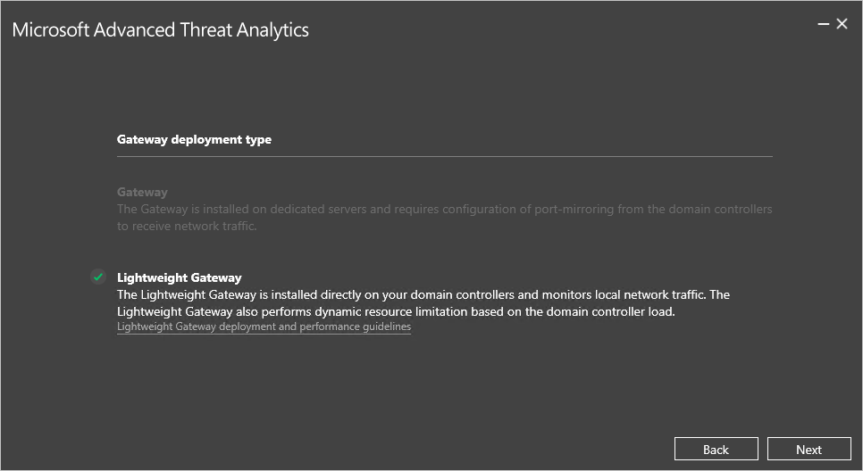
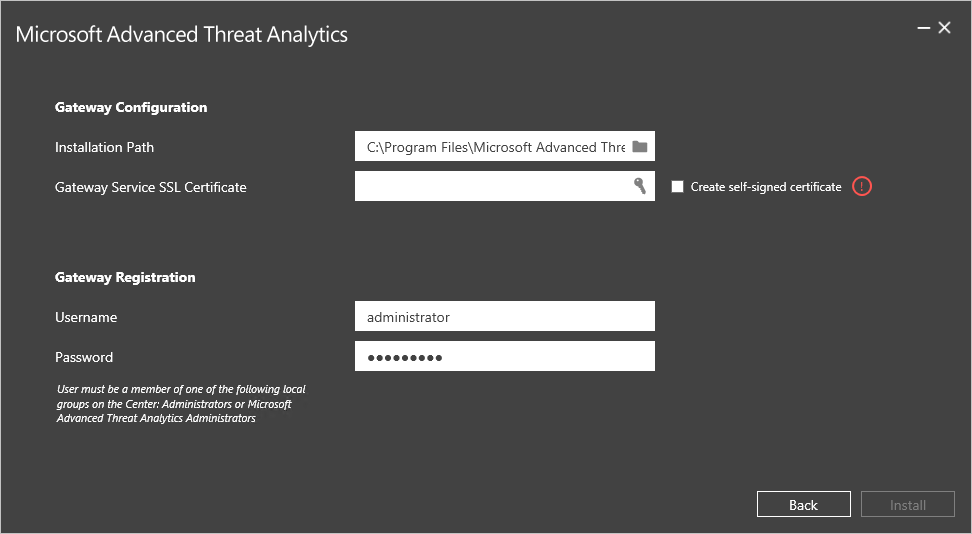

---
# required metadata

title: Install ATA - Step 4 | Microsoft ATA
description: Step four of installing ATA helps you to install the ATA Gateway.
keywords:
author: rkarlin
manager: mbaldwin
ms.date: 04/28/2016
ms.topic: get-started-article
ms.prod:
ms.service: advanced-threat-analytics
ms.technology:
ms.assetid: 6bbc50c3-bfa8-41db-a2f9-56eed68ef5d2

# optional metadata

#ROBOTS:
#audience:
#ms.devlang:
ms.reviewer: bennyl
ms.suite: ems
#ms.tgt_pltfrm:
#ms.custom:

---

# Install ATA - Step 4

>[!div class="step-by-step"]
[« Step 3](install-ata-step3.md)
[Step 5 »](install-ata-step5.md)

## Step 4. Install the ATA Gateway

Before installing the ATA Gateway on a dedicated server, validate that port mirroring is properly configured and that the ATA Gateway can see traffic to and from the domain controllers. See [Validate port mirroring](validate-port-mirroring.md) for more information.

> [!IMPORTANT]
> Make sure that [KB2919355](http://support.microsoft.com/kb/2919355/) has been installed.  Run the following PowerShell cmdlet to check if the hotfix is installed:
>
> `Get-HotFix -Id kb2919355`

Perform the following steps on the ATA Gateway server.

1.  Extract the files from the zip file. 
> [!NOTE] 
> Installing directly from the zip file will fail.

2.  Run **Microsoft ATA Gateway Setup.exe** and follow the setup wizard.

3.  On the **Welcome** page, select your language and click **Next**.

4.  The installation wizard will automatically check if the server is a domain controller or not. The result of this check whether an ATA Gateway or Lightweight Gateway (on a domain controller) will be installed. 
    
    For example, in the case of a Lightweight Gateway you will see:
    
    
    Click **Next**.

> [!NOTE] 
> If the domain controller does not meet the minimum hardware requirements for the Lightweight Gateway, a yellow text message will appear. This message does not prevent you from clicking **Next**, for example if you wish to test ATA in a small lab environment. For production environments, it is highly recommended to work with ATA's [capacity planning](PlanDesign\ata-capacity-planning.md) guide.

4.  Under **ATA Gateway Configuration**, enter the following information based on your environment:

    

    |Field|Description|Comments|
    |---------|---------------|------------|
    |Installation Path|This is the location where the ATA Gateway will be installed. By default this is  %programfiles%\Microsoft Advanced Threat Analytics\Gateway|Leave the default value|
    |Gateway Service SSL Certificate|This is the certificate that will be used by the ATA Gateway.|Use a self-signed certificate for lab environments only.|
    |Gateway Registration|Enter the Username and Password of the ATA administrator.|For the ATA Gateway to register with the ATA Center, enter the user name and password of the user who installed the ATA Center. This user must be a member of one of the following local groups on the ATA Center.  -   Administrators -   Microsoft Advanced Threat Analytics Administrators **Note:** These credentials are used only for registration and are not stored in ATA.|
    The following components are installed and configured during the installation of the ATA Gateway:

    -   KB 3047154 (for Windows Server 2012 R2 only)

        > [!IMPORTANT]
        > -   Do not install KB 3047154 on a virtualization host (the host that is running the virtualization, it is fine to run it on a virtual machine). This may cause port mirroring to stop working properly. 
        > -   Do not install Message Analyzer, Wireshark, or other network capture software on the ATA Gateway. If you need to capture network traffic, install and use Microsoft Network Monitor 3.4.

    -   ATA Gateway service

    -   Microsoft Visual C++ 2013 Redistributable

    -   Custom Performance Monitor data collection set

5.  After the installation completes, for the ATA Gateway, click **Launch** to open your browser and log in to the ATA Console, for the ATA Lightweight Gateway, click **Finish**.

>[!div class="step-by-step"]
[« Step 3](install-ata-step3.md)
[Step 5 »](install-ata-step5.md)

## See Also

- [Check out the ATA forum!](https://social.technet.microsoft.com/Forums/security/home?forum=mata)
- [Configure event collection](configure-event-collection.md)
- [ATA prerequisites](/advanced-threat-analytics/plan-design/ata-prerequisites)

