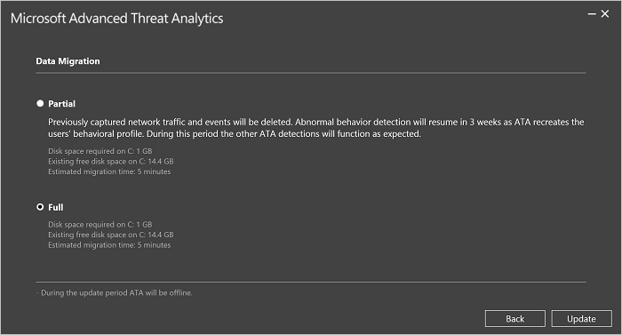
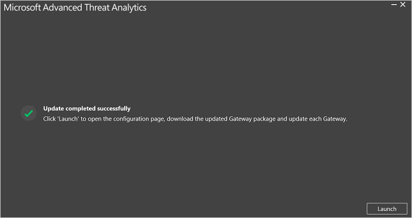
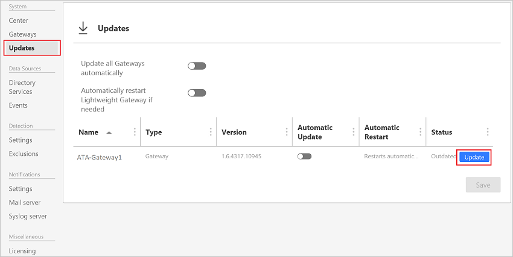

---
# required metadata

title: ATA update to 1.7 migration guide | Microsoft ATA
description: Procedures to update ATA to version 1.7
keywords:
author: rkarlin
manager: mbaldwin
ms.date: 08/24/2016
ms.topic: article
ms.prod:
ms.service: advanced-threat-analytics
ms.technology:
ms.assetid: fb65eb41-b215-4530-93a2-0b8991f4e980

# optional metadata

#ROBOTS:
#audience:
#ms.devlang:
ms.reviewer: bennyl
ms.suite: ems
#ms.tgt_pltfrm:
#ms.custom:

---

# ATA update to 1.7 migration guide
The update to ATA 1.7 provides improvements in the following areas:

-   New detections

-   Improvements to existing detections

-  

## Updating ATA to version 1.7
> [!NOTE] 
> If ATA is not installed in your environment, download the full version of ATA which includes version 1.7 and follow the standard installation procedure described in [Install ATA](/advanced-threat-analytics/deploy-use/install-ata).

If you already have ATA version 1.6 deployed, this procedure will walk you through the steps necessary to update your deployment.

> [!NOTE] 
> You cannot install ATA version 176 directly on top of ATA version 1.4 or 1.5. You must install ATA version 1.6 first. If you accidentally attempted to install ATA 1.7 without installing ATA 1.6, you will get an error telling you that **A newer version is already installed on your machine.** You must uninstall the remnants of ATA 1.7 that will remain on your computer - even though the installation failed - before you install ATA version 1.6.

Follow these steps to update to ATA version 1.7:

1.  [Download update 1.7](http://www.microsoft.com/evalcenter/evaluate-microsoft-advanced-threat-analytics) 
In this version of, the same installation file (Microsoft ATA Center Setup.exe) is used for installing a new deployment of ATA and for upgrading existing deployments.

2.  Update the ATA Center

4.  Update the ATA Gateways

    > [!IMPORTANT]
    > Update all the ATA Gateways to make sure ATA functions properly.

### Step 1: Update the ATA Center

1.  Back up your database: (optional)

    -   If the ATA Center is running as a virtual machine and you want to take a checkpoint, shut the virtual machine down first.

    -   If the ATA Center is running on a physical server, follow the recommended procedure to [back up MongoDB](https://docs.mongodb.org/manual/core/backups/).

2.  Run the installation file, Microsoft ATA Center Setup.exe, and follow the instructions on the screen to install the update.

	5.  On the **Welcome** page, select your language and click **Next**.

		7.  It is now possible to use Microsoft Update for ATA to remain up-to-date.  In the Microsoft Update page, select **Use Microsoft Update when I check for updates (recommended)**.
    
     This will adjust the Windows settings to enable updates for other Microsoft products (including ATA), as seen here. 
    

	8.  In the **Data migration** screen, select whether you want to migrate all or partial data. If you choose to migrate only partial data, your previously captured network traffic and behavior profiles will not be migrated. This means that it will take three weeks before the abnormal behavior detection has a complete profile to enable anomalous activity detection. During those three weeks, all other ATA detections will function properly. The **Partial** data migration necessitates less available disk space on your ATA Center server. If you select **Full** data migration, you will need more disk space for the installation. The required disk space, which is listed on the **Data Migration** screen, depends on the amount of previously captured network traffic you had saved in previous versions of ATA. Before selecting **Partial** or **Full**, make sure that you have the necessary amount of available disk space as listed on the screen.  
    

	3.  Click **Update**. After you click Update, ATA is offline until the update procedure is complete.

4.  After the ATA Center update completes successfully, click **Launch** to open the **Update** screen in the ATA console for the ATA Gateways.
    

5.  In the **Updates** screen, if you already set your ATA Gateways to automatically update, they will update at this point, if not, click **Update** next to each ATA Gateway.
  

> [!IMPORTANT] 
> Update all the ATA Gateways to make sure ATA functions properly.

 
    > [!NOTE] 
    > To install new ATA Gateways, go the **Gateways** screen and click **Download Gateway Setup** to get the ATA 1.7 installation package and follow the instructions for new Gateway installation as described in [Step 4. Install the ATA Gateway](/advanced-threat-analytics/deploy-use/install-ata-step4) .

You will know that all the ATA Gateways have been successfully updated when all the ATA Gateways report that they are successfully synced and the message that an updated ATA Gateway package is available is no longer displayed.

## See Also

- [Check out the ATA forum!](https://social.technet.microsoft.com/Forums/security/home?forum=mata)
