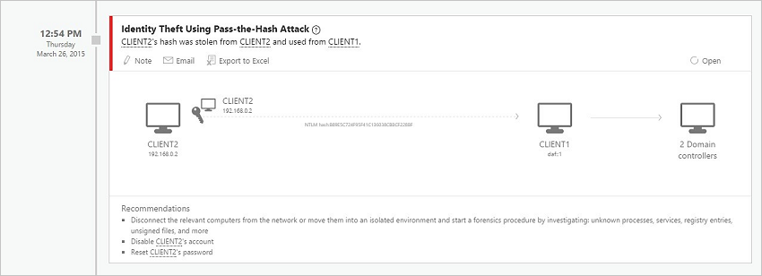
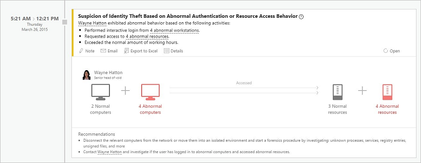
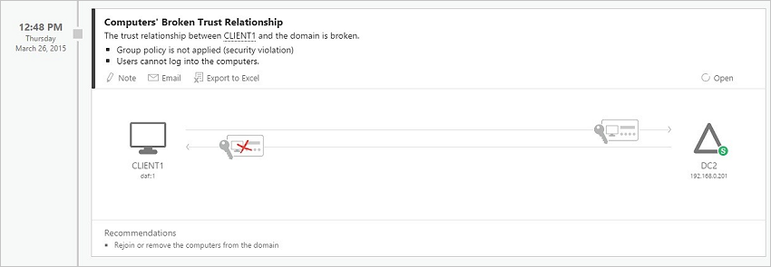

---
# required metadata

title: What is Microsoft Advanced Threat Analytics (ATA)? | Microsoft Docs
description: Explains what Microsoft Advanced Threat Analytics (ATA) is and what kinds of suspicious activities it can detect
keywords:
author: rkarlin
ms.author: rkarlin
manager: mbaldwin
ms.date: 01/23/2017
ms.topic: article
ms.prod:
ms.service: advanced-threat-analytics
ms.technology:
ms.assetid: 283e7b4e-996a-4491-b7f6-ff06e73790d2

# optional metadata

#ROBOTS:
#audience:
#ms.devlang:
ms.reviewer: bennyl
ms.suite: ems
#ms.tgt_pltfrm:
#ms.custom:

---

*Applies to: Advanced Threat Analytics version 1.7*

## What is Advanced Threat Analytics?
Advanced Threat Analytics (ATA) is an on-premises platform that helps protect your enterprise from multiple types of advanced targeted cyber attacks and insider threats.

## How ATA works
ATA takes information from multiple data-sources from logs and events in your network to learn the behavior of users and other entities in the organization and build a behavioral profile about them.
ATA can receive events and logs from:

- 	SIEM Integration
- 	Windows Event Forwarding (WEF)

In addition, ATA leverages a proprietary network parsing engine to capture and parse network traffic of multiple protocols (such as Kerberos, DNS, RPC, NTLM and others) for authentication, authorization and information gathering. This information is collected by ATA via:

- 	Port mirroring from Domain Controllers and DNS servers to the ATA Gateway
- 	Deploying an ATA Lightweight Gateway (LGW) directly on Domain Controllers

For more information on ATA architecture see [ATA Architecture](/advanced-threat-analytics/plan-design/ata-architecture).

## What does ATA do?

ATA technology detects multiple suspicious activities, focusing on several phases of the cyber-attack kill chain including:

- 	Reconnaissance, during which attackers are gathering information on how the environment is built, what are the different assets and entities which exist and are generally building their plan for the next phases of the attack.
- 	Lateral movement cycle, during which an attacker invests time and effort in spreading their attack surface inside your network.
- 	Domain dominance (persistence), during which an attacker captures the information allowing them to resume their campaign using various set of entry points, credentials and techniques. 

These phases of a cyber attack are similar and predictable, no matter what type of company is under attack or what type of information is being targeted.
ATA searches for three main types of attacks: Malicious attacks, abnormal behavior and security issues and risks.

**Malicious attacks** are detected deterministically, by looking for the full list of known attack types including:

- 	Pass-the-Ticket (PtT)
- 	Pass-the-Hash (PtH)
- 	Overpass-the-Hash
- 	Forged PAC (MS14-068)
- 	Golden Ticket
- 	Malicious replications
- 	Reconnaissance
- 	Brute Force
- 	Remote execution

For a complete list of the detections and their descriptions please see [What Suspicious Activities Can ATA detect?](ata-threats.md)
ATA detects these suspicious activities and surfaces the information in the ATA Console including a clear view of Who, What, When and How. As you can see, by monitoring this simple, user-friendly dashboard, you are alerted that ATA suspects that a Pass-the-Hash attack was attempted on Client 1 and Client 2 computers in your network.

 

**Abnormal behavior** is detected by ATA using behavioral analytics and leveraging Machine Learning to uncover questionable activities and abnormal behavior in users and devices in your network, including:

- 	Anomalous logins
- 	Unknown threats
- 	Password sharing
- 	Lateral movement

You can view suspicious activities of this type in the ATA Dashboard. In the following example, ATA alerts you when a user accesses 4 computers that are not ordinarily accessed by this user, which could be a cause for alarm.

  

ATA also detects **security issues and risks**, including:

- 	Broken trust
- 	Weak protocols
- 	Known protocol vulnerabilities

You can view suspicious activities of this type in the ATA Dashboard. In the following example, ATA is letting you know that there is a broken trust relationship between a computer in your network and the domain.

  

## What's next?

-   For more information about how ATA fits into your network: [ATA architecture](/advanced-threat-analytics/plan-design/ata-architecture)

-   To get started deploying ATA: [Install ATA](/advanced-threat-analytics/deploy-use/install-ata-step1)

## See Also
[Check out the ATA forum!](https://social.technet.microsoft.com/Forums/security/home?forum=mata)
