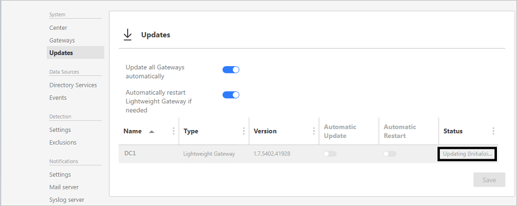

---
# required metadata

title: What's new in ATA version 1.7 | Microsoft Docs
description: Lists what was new in ATA version 1.7 along with known issues
keywords:
author: rkarlin
ms.author: rkarlin
manager: mbaldwin
ms.date: 10/25/2016
ms.topic: article
ms.prod:
ms.service: advanced-threat-analytics
ms.technology:
ms.assetid: be9ee613-4eb3-40f1-8973-e7f0a707ff57

# optional metadata

#ROBOTS:
#audience:
#ms.devlang:
ms.reviewer: 
ms.suite: ems
#ms.tgt_pltfrm:
#ms.custom:

---

# What's new in ATA version 1.7
These release notes provide information about known issues in this version of Advanced Threat Analytics.

## What's new in the ATA 1.7 update?
The update to ATA 1.7 provides improvements in the following areas:

-   New & updated detections

-   Role-based access control

-   Support for Windows Server 2016 and Windows Server Core

-   User experience improvements

-   Minor changes

### New & updated detections

- **Reconnaissance using Directory Services Enumeration**
As part of the reconnaissance phase, attackers gather information about the entities in the network using different methods. Directory services enumeration using the SAM-R protocol enables attackers to obtain the list of users and groups in a domain and understand the interaction between the different entities. 

- **Pass-the-Hash Enhancements**
To enhance Pass-the-Hash detection, we added additional behavioral models for the authentication patterns of entities. These models enable ATA to correlate entity behavior with suspicious NTLM authentications, and differentiate real Pass-the-Hash attacks from the behavior of false positive scenarios.

- **Pass-the-Ticket Enhancements**
To successfully detect advanced attacks in general and Pass-the-Ticket in particular, the correlation between an IP address and the computer account must be accurate. This is a challenge in environments where IP addresses change rapidly by design (for example Wi-Fi networks and multiple virtual machines sharing the same host). To overcome this challenge and improve the accuracy of the Pass-the-Ticket detection, ATA’s Network Name Resolution (NNR) mechanism was improved significantly to reduce false-positives.

- **Abnormal Behavior Enhancements**
In ATA 1.7, NTLM authentication data was added as a data source for the abnormal behavior detections, providing the algorithms with broader coverage of entity behavior in the network. 

- **Unusual Protocol Implementation Enhancements**
ATA now detects unusual protocol implementation in the Kerberos protocol, along with additional anomalies in the NTLM protocol. Specifically, these new anomalies for Kerberos are commonly used in Over-pass-the-Hash attacks.

### Infrastructure

- **Role based access control**
Role-Based Access Control (RBAC) capability. ATA 1.7 includes three roles: ATA Administrator, ATA Analyst and ATA Executive.

- **Support for Windows Server 2016 and Windows Server Core**
ATA 1.7 supports the deployment of Lightweight Gateways on domain controllers running Server Core for Windows Server 2012 and Server Core for Windows Server 2012 R2. Additionally, this release supports Windows Server 2016 both for the ATA Center and ATA Gateway components.

### User Experience
- **Configuration Experience**
In this release, the ATA configuration experience was redesigned for a better user experience and to better support of environments with multiple ATA Gateways. This release also introduces the ATA Gateway update page for simpler, better management of automatic updates for the various Gateways.

## Known issues
The following known issues exist in this version.

### Gateway automatic update may fail
**Symptoms:** In environments with slow WAN links, the ATA Gateway update may reach the timeout for the update (100 seconds) and fail to complete successfully.
In the ATA Console, the ATA Gateway will have the status of "Updating (downloading package)" for a long amount of time and it eventually fails.
**Workaround:** To work around this issue, download the latest ATA Gateway package from the ATA Console, and update the ATA Gateway manually.

 > [!IMPORTANT]
 Automatic certificate renewal for the certificates used by ATA is not supported. The use of these certificates may cause ATA to stop functioning when the certificate is automatically renewed. 

### No browser support for JIS encoding
**Symptoms:** The ATA Console may not function as expected on browsers using JIS encoding
**Workaround:** Change the browser’s encoding to Unicode UTF-8.
 
### Dropped port mirror traffic when using VMware

Dropped port mirror traffic alerts when using lightweight gateway on VMware.

If you are using domain controllers on VMware virtual machines, you might receive alerts about **Dropped port mirrored network traffic**. This might happens because of a configuration mismatch in VMware. 
To avoid these alerts, you can check that the following settings are set to 0 or Disabled in the virtual machine:  

- TsoEnable
- LargeSendOffload(IPv4)
- IPv4 TSO Offload

Also, consider disabling IPv4 Giant TSO Offload. For more information consult your VMware documentation.

### Automatic Gateway update fail when updating to 1.7 update 1

When updating from ATA 1.7 to ATA 1.7 update 1, both the automatic ATA Gateway update process and the manual installation of Gateways using the Gateway package may not work as expected.
This issue will occur if the certificate used by the ATA Center was changed prior to updating ATA.
To verify this issue, review the **Microsoft.Tri.Gateway.Updater.log** on the ATA Gateway and look for the following exceptions:
**System.Net.Http.HttpRequestException: An error occurred while sending the request. ---> System.Net.WebException: The underlying connection was closed: An unexpected error occurred on a send. ---> System.IdentityModel.Tokens.SecurityTokenValidationException: Failed to validate certificate thumbprint**

In order to resolve this issue, after changing the certificate, from an elevated command prompt, browse to the following location: **%ProgramFiles%\Microsoft Advanced Threat Analytics\Center\MongoDB\bin** 
and run the following:

1. Mongo.exe ATA (ATA must be capitalized) 

2. CenterThumbprint=db.SystemProfile.find({_t:"CenterSystemProfile"}).toArray()[0].Configuration.SecretManagerConfiguration.CertificateThumbprint;

3. db.SystemProfile.update({_t:"ServiceSystemProfile"},{$set:{"Configuration.ManagementClientConfiguration.ServerCertificateThumbprint":CenterThumbprint}}, {multi: true})

## Minor changes

- ATA is now using OWIN instead of IIS for the ATA Console.
- If the ATA Center service is down you will not be able to access the ATA Console.
- Short-term Lease subnets are no longer necessary due to changes in the ATA NNR.

## See Also
[Check out the ATA forum!](https://social.technet.microsoft.com/Forums/security/home?forum=mata)

[Update ATA to version 1.7 - migration guide](ata-update-1.7-migration-guide.md)

