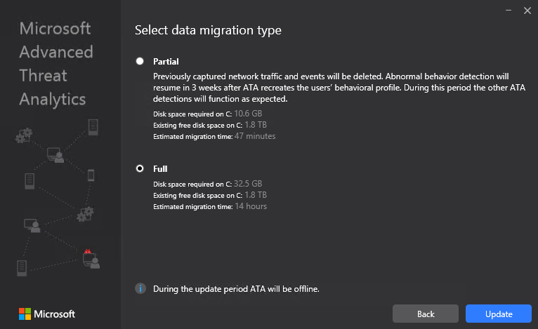
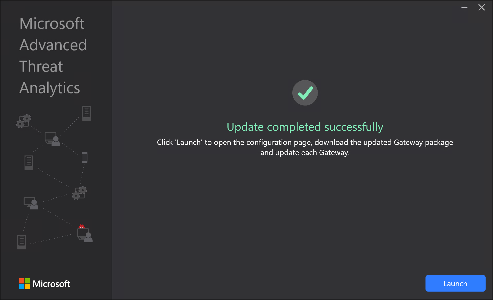

---
# required metadata

title: Advanced Threat Analytics update to 1.8 migration guide | Microsoft Docs
description: Procedures to update ATA to version 1.8
keywords:
author: rkarlin
ms.author: rkarlin
manager: mbaldwin
ms.date: 07/20/2017
ms.topic: conceptual
ms.prod: advanced-threat-analytics
ms.service:
ms.technology:
ms.assetid: e5a9718c-b22e-41f7-a614-f00fc4997682

# optional metadata

#ROBOTS:
#audience:
#ms.devlang:
ms.reviewer: bennyl
ms.suite: ems
#ms.tgt_pltfrm:
#ms.custom:

---

# Updating ATA to version 1.8

> [!NOTE] 
> If ATA is not installed in your environment, download the full version of ATA, which includes version 1.8 and follow the standard installation procedure described in [Install ATA](install-ata-step1.md).

If you already have ATA version 1.7 deployed, this procedure walks you through the steps necessary to update your deployment.

> [!NOTE] 
>  Only ATA version 1.7 Update 1 and 1.7 Update 2 can be updated to ATA version 1.8, any earlier version of ATA can't be directly updated to ATA version 1.8.

Follow these steps to update to ATA version 1.8:

1.  [Download the update version of ATA 1.8 from the Download Center](https://www.microsoft.com/download/details.aspx?id=55536)  or the full version from the [Eval center](http://www.microsoft.com/evalcenter/evaluate-microsoft-advanced-threat-analytics). 
In the migration version, the file can be used only for updating from ATA 1.7. In the version from the Eval center, the same installation file (Microsoft ATA Center Setup.exe) is used for installing a new deployment of ATA and for upgrading existing deployments.

2.  Update the ATA Center

4.  Update the ATA Gateways

    > [!IMPORTANT]
    > Update all the ATA Gateways to make sure ATA functions properly.

### Step 1: Update the ATA Center

1. Back up your database: (optional)

   -   If the ATA Center is running as a virtual machine and you want to take a checkpoint, shut down the virtual machine first.

   -   If the ATA Center is running on a physical server, see the [Disaster recovery](disaster-recovery.md) article for information about backing up the database.

2. Run the installation file, **Microsoft ATA Center Setup.exe**, and follow the instructions on the screen to install the update.

   - On the **Welcome** page, choose your language and click **Next**.

   - If you didn't enable automatic updates in version 1.7, you are prompted to set ATA to use Microsoft Update for ATA to remain up-to-date.  In the Microsoft Update page, select **Use Microsoft Update when I check for updates (recommended)**.
     
     
     This adjusts the Windows settings to enable updates for  ATA. 
    
   - In the **Data migration** screen, select whether you want to migrate all or partial data. If you choose to migrate only partial data, all detections work immediately with the exception of abnormal behavior detection, which takes three weeks to build a complete profile.  
    
   **Partial** data migration takes much less time to install. If you select **Full** data migration, it may take a significant amount of time for the installation to complete. Make sure you look at the estimated amount of time and the required disk space, which are listed on the **Data Migration** screen. These figures depend on the amount of previously captured network traffic you had saved in previous versions of ATA. For example, in the screen below you can see a data migration from a large database:
         
   

   -  Click **Update**. After you click Update, ATA is offline until the update procedure is complete.

3. After the ATA Center update completes successfully, click **Launch** to open the **Update** screen in the ATA console for the ATA Gateways.

   

4. In the **Updates** screen, if you already set your ATA Gateways to automatically update, they update at this point, if not, click **Update** next to each ATA Gateway.
  

  
> [!IMPORTANT] 
> Update all the ATA Gateways to make sure ATA functions properly.
 
> [!NOTE] 
> To install new ATA Gateways, go the **Gateways** screen and click **Download Gateway Setup** to get the ATA 1.8 Gateway installation package and follow the instructions for new Gateway installation as described in [Step 4. Install the ATA Gateway](install-ata-step4.md).

## See Also

- [Check out the ATA forum!](https://social.technet.microsoft.com/Forums/security/home?forum=mata)
