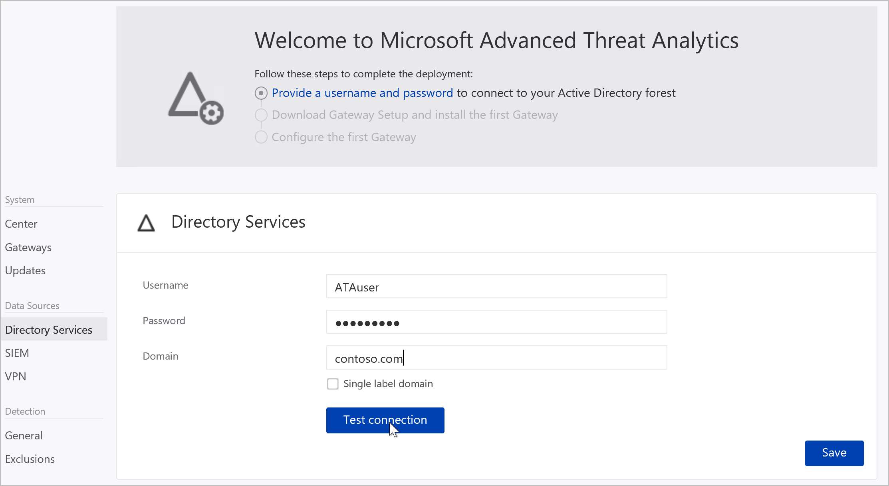

---
# required metadata

title: Install Advanced Threat Analytics - Step 2 | Microsoft Docs
description: Step two of installing ATA helps you configure the domain connectivity settings on your ATA Center server
keywords:
author: mlottner
ms.author: mlottner
manager: rkarlin
ms.date: 12/30/2018
ms.topic: conceptual
ms.prod: advanced-threat-analytics
ms.technology:
ms.assetid: e1c5ff41-d989-46cb-aa38-5a3938f03c0f

# optional metadata

#ROBOTS:
#audience:
#ms.devlang:
ms.reviewer: bennyl
ms.suite: ems
#ms.tgt_pltfrm:
#ms.custom:

---

# Install ATA - Step 2

*Applies to: Advanced Threat Analytics version 1.9*

> [!div class="step-by-step"]
> [« Step 1](install-ata-step1.md)
> [Step 3 »](install-ata-step3.md)

## Step 2. Provide a Username and Password to connect to your Active Directory Forest

The first time you open the ATA Console, the following screen appears:

1.  Enter the following information and click **Save**:

    |Field|Comments|
    |---------|------------|
    |**Username** (required)|Enter the read-only user name, for example: **ATAuser**. **Note:** Do **not** use the UPN format for your username.|
    |**Password** (required)|Enter the password for the read-only user, for example: **Pencil1**.|
    |**Domain** (required)|Enter the domain for the read-only user, for example, **contoso.com**. **Note:** It is important that you enter the complete FQDN of the domain where the user is located. For example, if the user’s account is in domain corp.contoso.com, you need to enter `corp.contoso.com` not contoso.com|

2. You can click **Test connection** to test connectivity to the domain and check that the credentials supplied provide access. This works if the ATA Center has connectivity to the domain. 	

    After it is saved, the welcome message in the Console will change to the following message:

3. In the Console, click **Download Gateway setup and install the first Gateway** to continue.

> [!div class="step-by-step"]
> [« Step 1](install-ata-step1.md)
> [Step 3 »](install-ata-step3.md)

## See Also
## Related Videos
- [ATA Deployment Overview](https://channel9.msdn.com/Shows/Microsoft-Security/Overview-of-ATA-Deployment-in-10-Minutes)
- [Choosing the right ATA Gateway type](https://channel9.msdn.com/Shows/Microsoft-Security/ATA-Deployment-Choose-the-Right-Gateway-Type)

## See Also
- [ATA POC deployment guide](http://aka.ms/atapoc)
- [ATA sizing tool](http://aka.ms/atasizingtool)
- [Check out the ATA forum!](https://social.technet.microsoft.com/Forums/security/home?forum=mata)
- [Configure event collection](configure-event-collection.md)
- [ATA prerequisites](ata-prerequisites.md)
