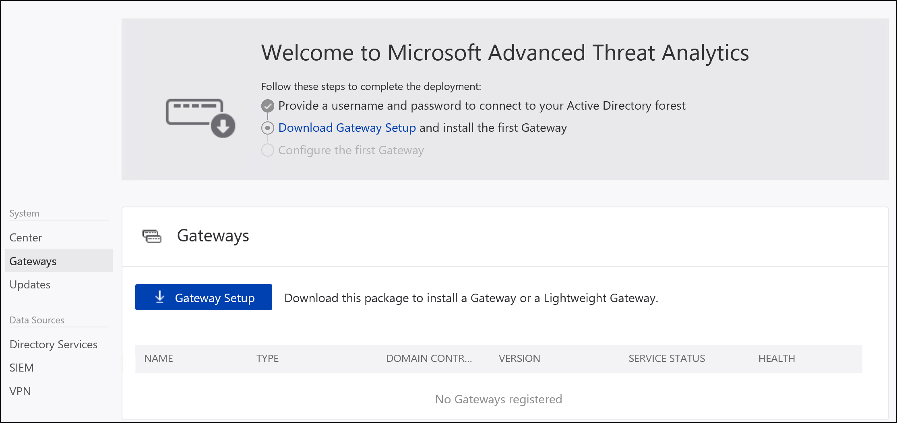

---
# required metadata

title: Install Advanced Threat Analytics - Step 3 | Microsoft Docs
description: Step three of installing ATA helps you download the ATA Gateway setup package.
keywords:
author: rkarlin
ms.author: rkarlin
manager: mbaldwin
ms.date: 06/12/2017
ms.topic: get-started-article
ms.prod:
ms.service: advanced-threat-analytics
ms.technology:
ms.assetid: 7fb024e6-297a-4ad9-b962-481bb75a0ba3

# optional metadata

#ROBOTS:
#audience:
#ms.devlang:
ms.reviewer: bennyl
ms.suite: ems
#ms.tgt_pltfrm:
#ms.custom:

---

*Applies to: Advanced Threat Analytics version 1.7*

# Install ATA - Step 3

>[!div class="step-by-step"]
[« Step 2](install-ata-step2.md)
[Step 4 »](install-ata-step4.md)

## Step 3. Download the ATA Gateway setup package
After configuring the domain connectivity settings you can download the ATA Gateway setup package. The ATA Gateway can be installed on a dedicated server or on a domain controller. If you install it on a domain controller, it will be installed as an ATA Lightweight Gateway. For more information on the ATA Lightweight Gateway, see [ATA Architecture](ata-architecture.md). 

Click Download Gateway Setup in the list of steps at the top of the page to go to the Gateways page.:

> [!NOTE] 
> To reach the Gateway configuration screen later, click the **settings icon** (upper right corner) and select **Configuration**, then, under **System**, click **Gateways**.  

1.  Click **Gateway Setup**.
  
2.  Save the package locally.
3.  Copy the package to the dedicated server or domain controller onto which you are installing the ATA Gateway. Alternatively, you can open the ATA Console from the dedicated server or domain controller and skip this step.

The zip file includes the following:

-   ATA Gateway installer

-   Configuration setting file with the required information to connect to the ATA Center

>[!div class="step-by-step"]
[« Step 2](install-ata-step2.md)
[Step 4 »](install-ata-step4.md)

## See Also

- [Check out the ATA forum!](https://social.technet.microsoft.com/Forums/security/home?forum=mata)
- [Configure event collection](configure-event-collection.md)
- [ATA prerequisites](ata-prerequisites.md)
