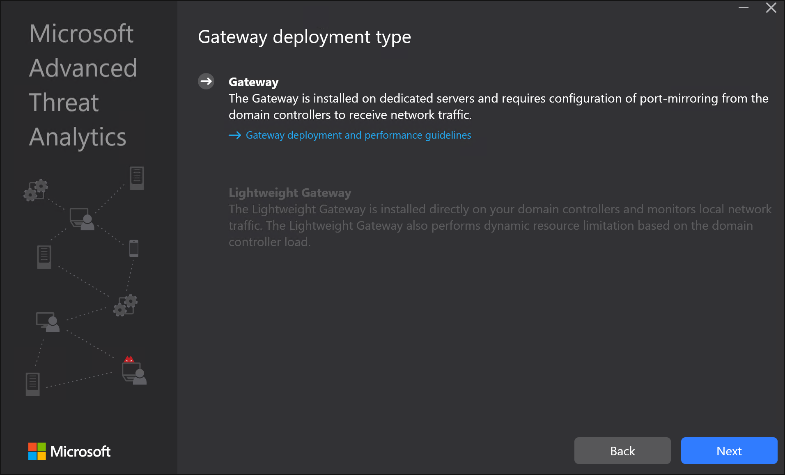
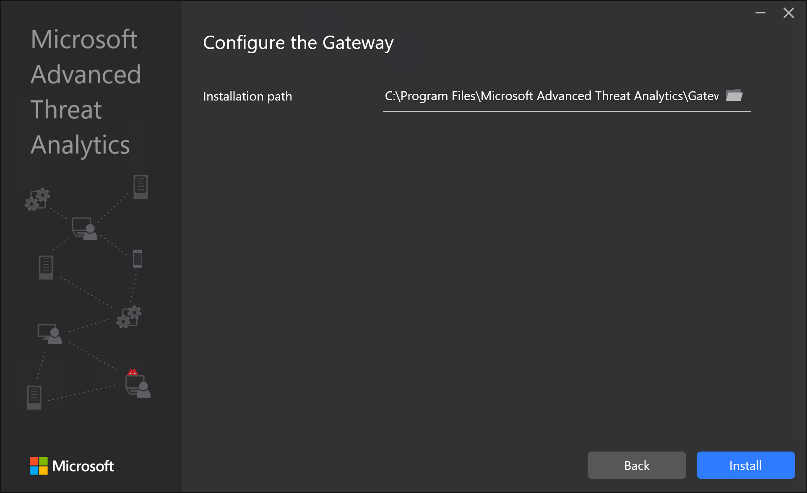
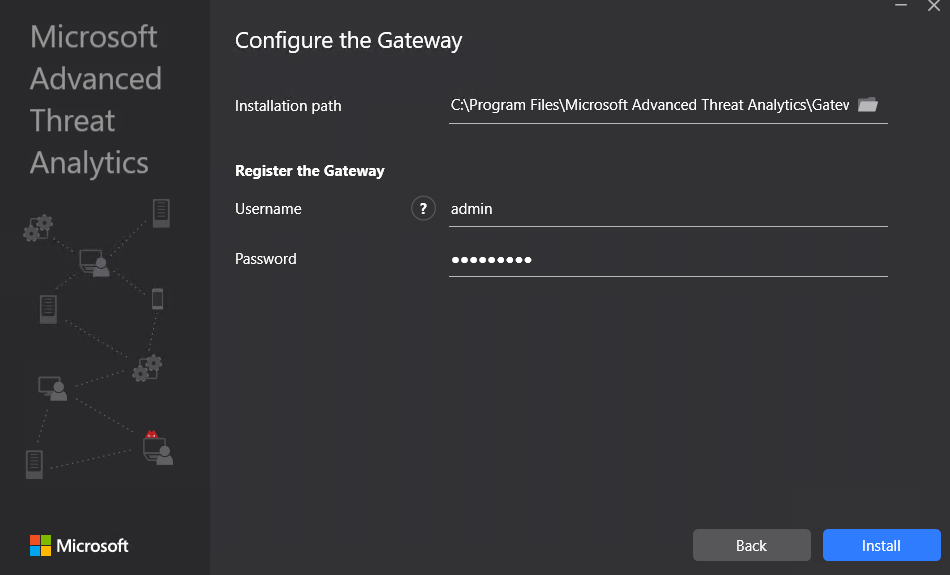

---
# required metadata

title: Install Advanced Threat Analytics - Step 4 | Microsoft Docs
description: Step four of installing ATA helps you to install the ATA Gateway.
keywords:
author: rkarlin
ms.author: rkarlin
manager: mbaldwin
ms.date: 3/21/2018
ms.topic: conceptual
ms.prod: advanced-threat-analytics
ms.service:
ms.technology:
ms.assetid: 6bbc50c3-bfa8-41db-a2f9-56eed68ef5d2

# optional metadata

#ROBOTS:
#audience:
#ms.devlang:
ms.reviewer: bennyl
ms.suite: ems
#ms.tgt_pltfrm:
#ms.custom:

---

*Applies to: Advanced Threat Analytics version 1.9*

# Install ATA - Step 4

> [!div class="step-by-step"]
> [« Step 3](install-ata-step3.md)
> [Step 5 »](install-ata-step5.md)

## Step 4. Install the ATA Gateway

Before installing the ATA Gateway on a dedicated server, validate that port mirroring is properly configured and that the ATA Gateway can see traffic to and from the domain controllers. For more information, see [Validate port mirroring](validate-port-mirroring.md).

> [!IMPORTANT]
> Make sure that [KB2919355](http://support.microsoft.com/kb/2919355/) has been installed.  Run the following PowerShell cmdlet to check if the hotfix is installed:
>
> `Get-HotFix -Id kb2919355`

Perform the following steps on the ATA Gateway server.

1.  Extract the files from the zip file. 
    > [!NOTE] 
    > Installing directly from the zip file fails.
    
1.  Run **Microsoft ATA Gateway Setup.exe** and follow the setup wizard.
    
1.  On the **Welcome** page, select your language and click **Next**.
    
1.  The installation wizard automatically checks if the server is a domain controller or a dedicated server. If it is a domain controller, the ATA Lightweight Gateway is installed, if it is a dedicated server, the ATA Gateway is installed. 
    
    For example, for an ATA Gateway, the following screen is displayed to let you know that an ATA Gateway will be installed on your dedicated server:
    
    
    Click **Next**.
    
    > [!NOTE] 
    > If the domain controller or dedicated server does not meet the minimum hardware requirements for the installation, you receive a warning. This does not prevent you from clicking **Next** and proceeding with installation. This might be the right option for installation of ATA in a small lab test environment in which you don't need as much room for data storage. For production environments, it is highly recommended to work with ATA's [capacity planning](ata-capacity-planning.md) guide to make sure your domain controllers or dedicated servers meet the necessary requirements.
    
1.  Under **Configure the Gateway**, enter the following information based on your environment:
    
    
    
    > [!NOTE]
    > When you deploy the ATA Gateway, you do not have to provide credentials. If the ATA Gateway installation fails to retrieve your credentials using single sign-on (for example, this may happen if the ATA Center is not in the domain, if the ATA Gateway isn't in the domain, you do not have ATA admin credentials), you are prompted to provide credentials, as in the following screen: 
    
  
    
   - Installation Path: This is the location where the ATA Gateway is installed. By default this is  %programfiles%\Microsoft Advanced Threat Analytics\Gateway. Leave the default value.
    
1. Click **Install**. The following components are installed and configured during the installation of the ATA Gateway:
    
    -   KB 3047154 (for Windows Server 2012 R2 only)
    
        > [!IMPORTANT]
        > -   Do not install KB 3047154 on a virtualization host (the host that is running the virtualization, it is fine to run it on a virtual machine). This may cause port mirroring to stop working properly. 
        > -   Do not install Message Analyzer, Wireshark, or other network capture software on the ATA Gateway. If you need to capture network traffic, install and use Microsoft Network Monitor 3.4.
    
    -   ATA Gateway service
    -   Microsoft Visual C++ 2013 Redistributable
    -   Custom Performance Monitor data collection set
    
1.  After the installation completes, for the ATA Gateway, click **Launch** to open your browser and log in to the ATA Console, for the ATA Lightweight Gateway, click **Finish**.

> [!div class="step-by-step"]
> [« Step 3](install-ata-step3.md)
> [Step 5 »](install-ata-step5.md)

## Related Videos
- [ATA Deployment Overview](https://channel9.msdn.com/Shows/Microsoft-Security/Overview-of-ATA-Deployment-in-10-Minutes)
- [Choosing the right ATA Gateway type](https://channel9.msdn.com/Shows/Microsoft-Security/ATA-Deployment-Choose-the-Right-Gateway-Type)

## See Also
- [ATA POC deployment guide](http://aka.ms/atapoc)
- [ATA sizing tool](http://aka.ms/atasizingtool)
- [Check out the ATA forum!](https://social.technet.microsoft.com/Forums/security/home?forum=mata)
- [Configure event collection](configure-event-collection.md)
- [ATA prerequisites](ata-prerequisites.md)

