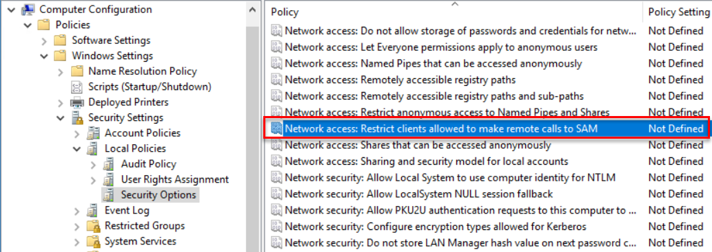
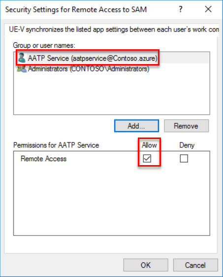

---
# required metadata

title: Configure SAM-R to enable lateral movement path detection in Advanced Threat Analytics | Microsoft Docs
description: Describes how to configure SAM-R to enable lateral movement path detection in Advanced Threat Analytics (ATA)
keywords:
author: rkarlin
ms.author: rkarlin
manager: mbaldwin
ms.date: 4/25/2018
ms.topic: get-started-article
ms.prod:
ms.service: advanced-threat-analytics
ms.technology:
ms.assetid: 7597ed25-87f5-472c-a496-d5f205c9c391

# optional metadata

#ROBOTS:
#audience:
#ms.devlang:
ms.reviewer: itargoet
ms.suite: ems
#ms.tgt_pltfrm:
#ms.custom:

---

*Applies to: Advanced Threat Analytics version 1.9*

# Install ATA - Step 9

>[!div class="step-by-step"]
[« Step 8](install-ata-step7.md)

## Step 9. Configure SAM-R required permissions

The [lateral movement path](use-case-lateral-movement-path.md) detection relies on queries that identify local admins on specific machines. These queries are performed using the SAM-R protocol, via the ATA Service account created in [Step 2. Connect to AD](install-ata-step2.md).
 
To ensure that Windows clients and servers allow the ATA service account to perform this SAM-R operation, a modification to your **Group policy** must be made that adds the ATA service account in addition to the configured accounts listed in the **Network access** policy.

1. Locate the policy:

 - Policy Name:	Network access - Restrict clients allowed to make remote calls to SAM
 - Location: Computer configuration, Windows settings, Security settings, Local policies, Security options
  
  

2. Add the ATA service to the list of approved accounts able to perform this action on your modern Windows systems.
 
  

3. The **ATA Service** (the ATA service created during installation) now has the proper privileges to perform SAMR in the environment.

For more on SAM-R and this Group Policy, see the [Network access: Restrict clients allowed to make remote calls to SAM](https://docs.microsoft.com/windows/security/threat-protection/security-policy-settings/network-access-restrict-clients-allowed-to-make-remote-sam-calls).

>[!div class="step-by-step"]
[« Step 8](install-ata-step7.md)

## See Also
- [ATA POC deployment guide](http://aka.ms/atapoc)
- [ATA sizing tool](http://aka.ms/atasizingtool)
- [Check out the ATA forum!](https://social.technet.microsoft.com/Forums/security/home?forum=mata)
- [Configure event collection](configure-event-collection.md)
- [ATA prerequisites](ata-prerequisites.md)
