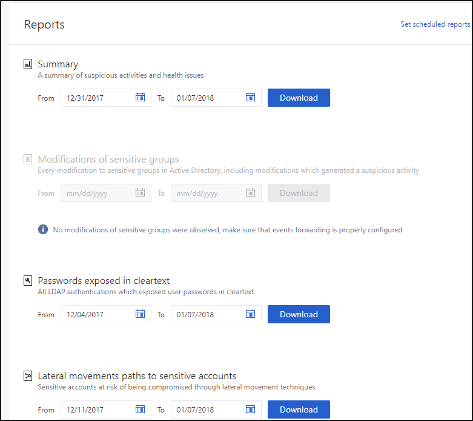
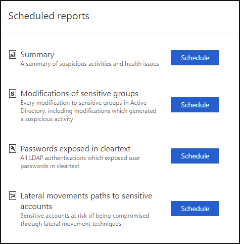
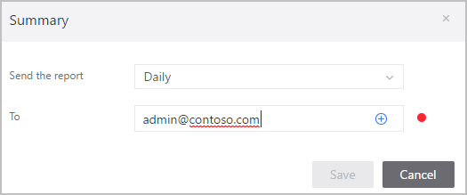

---
# required metadata

title: Working with ATA Reports | Microsoft Docs
description: Describes how you can generate reports in ATA to monitor your network.
keywords:
author: rkarlin
ms.author: rkarlin
manager: mbaldwin
ms.date: 06/12/2017
ms.topic: article
ms.prod:
ms.service: advanced-threat-analytics
ms.technology:
ms.assetid: 38ea49b5-cd5e-43e5-bc39-5071f759633b

# optional metadata

#ROBOTS:
#audience:
#ms.devlang:
ms.reviewer: bennyl
ms.suite: ems
#ms.tgt_pltfrm:
#ms.custom:

---

*Applies to: Advanced Threat Analytics version 1.8*

# ATA Reports

The ATA reports section in the console enables you to generate reports that provide you with system status information, both system health and a report of the suspicious activities detected in your environment.

To access the reports page, click the report icon in the menu bar: .
The reports that are available are: 
- Summary report: The Summary report presents a dashboard of the status in the system. You can view three tabs - one for a **Summary** of what was detected on your network, **Open suspicious activities** that lists the suspicious activities you should take care of, and **Open health issues** that lists ATA system health issues you should take care of. The suspicious activities listed are broken down by type, as are the health issues. 
- Modification to sensitive groups: This report lists every time a modification is made to sensitive groups (such as admins).

There are two ways to generate a report: either on demand or by scheduling a report to be sent to your email periodically.

To generate a report on demand:

1. In the ATA console menu bar, click the report icon in the menu bar: .
2. Under either **Summary** or **Modifications to sensitive groups**, set the **From** and **To** dates and click **Download**. 

To set a scheduled report:
 
1. In the **Reports** page, click **Set scheduled reports**, or in the ATA Console configuration page, under Notifications and Reports, click **Scheduled reports**.

2. Click **Schedule** next to **Summary** or **Modification to sensitive groups** to set the frequency and email address for delivery of the reports, and click the plus sign next to the email addresses to add them, and click **Save**.

> [!NOTE]
> Scheduled reports are delivered by email and can only be sent if you have already configured an email server under **Configuration** and then, under Notifications and Reports, select **Mail server**.

## See Also
- [ATA prerequisites](ata-prerequisites.md)
- [ATA capacity planning](ata-capacity-planning.md)
- [Configure event collection](configure-event-collection.md)
- [Configuring Windows event forwarding](configure-event-collection.md#configuring-windows-event-forwarding)
- [Check out the ATA forum!](https://social.technet.microsoft.com/Forums/security/home?forum=mata)
