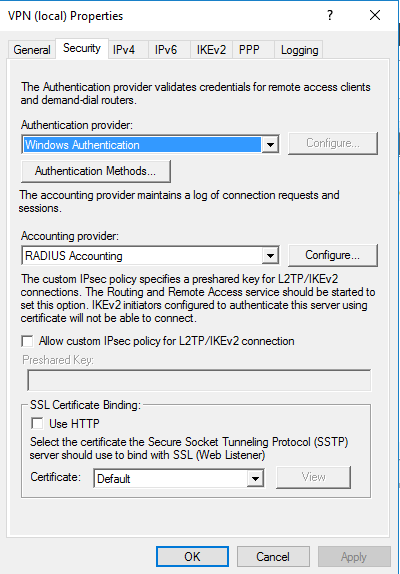
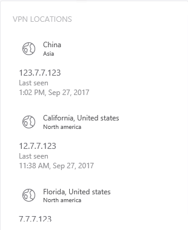

---
# required metadata

title: Configuring VPN Integration with Microsoft Advanced Threat Analytics | Microsoft Docs
description: This article describes the process for configuring VPN integration with Microsoft Advanced Threat Analytics.
keywords:
author: rkarlin
ms.author: rkarlin
manager: mbaldwin
ms.date: 10/29/2017
ms.topic: article
ms.prod:
ms.service: advanced-threat-analytics
ms.technology:
ms.assetid: 7d54d68d-a976-4a44-92bf-0b26b72b9764

# optional metadata

#ROBOTS:
#audience:
#ms.devlang:
ms.reviewer: bennyl
ms.suite: ems
#ms.tgt_pltfrm:
#ms.custom:

---

*Applies to: Advanced Threat Analytics version 1.8*

# Configuring VPN integration with Microsoft Advanced Threat Analytics

Microsoft Advanced Threat Analytics (ATA) version 1.8 can collect accounting information from VPN solutions. When configured, the user's profile page will include information from the VPN connections, such as the IP addresses and locations where connections originated. This will complement the investigation process by providing additional information on user activity.

ATA integrates with your VPN solution by listening to RADIUS accounting events forwarded to the ATA Gateways. This mechanism is based on standard RADIUS Accounting ([RFC 2866](https://tools.ietf.org/html/rfc2866)), and the following VPN vendors are supported:

-	Microsoft
-	F5
-	Check Point
-	Cisco ASA

## Prerequisites

To enable VPN integration make sure you set the following:

-	Open port UDP 1813 on your ATA Gateways and ATA Lightweight Gateways.

-	Connect the ATA Center to the Internet so that it can query the location of incoming IP addresses.

In the example below, we use Microsoft Routing and Remote Access Server (RRAS) to describe the VPN configuration process.

If you’re using a 3rd party VPN solution, consult their documentation for instructions on how to enable RADIUS Accounting.
 
## Step 1: Configure RADIUS Accounting on the VPN system

Perform the following on your RRAS server.
 
1.	Open the Routing and Remote Access console.
2.	Right-click the server name and click **Properties**.
3.	In the **Security** tab, under **Accounting provider**, select **RADIUS Accounting** and click **Configure**.

    

4.	Type the name of the closest ATA Gateway or ATA Lightweight Gateway, and make sure the default port, 1813, is configured. Click **Change** and type a new shared secret string of alphanumeric characters that you can remember. You will need to fill it out later in your ATA Configuration.

5.	In the **Add RADIUS Server** window, check the **Send RADIUS Account On and Accounting Off messages** box and then click **OK** on all open dialog boxes.
 
     

## Step 2: Configure ATA to accept RADIUS accounting
 
1.	In the ATA console, open the ATA Configuration page and go to **VPN**.
 
      

2.	Turn **Radius Accounting** on, and type the **Shared Secret** you configured previously on your RRAS VPN Server. Then click **Save**.
 
Your setup is complete, and you will now see VPN activity in the users' profile page:
 
   

 
This information can be used to investigate a potential breach. You will be able to see any user who connected from a suspicious location.
 

## See Also
- [Working with suspicious activities](working-with-suspicious-activities.md)
- [Check out the ATA forum!](https://social.technet.microsoft.com/Forums/security/home?forum=mata)
