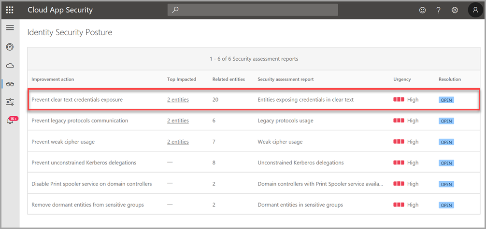
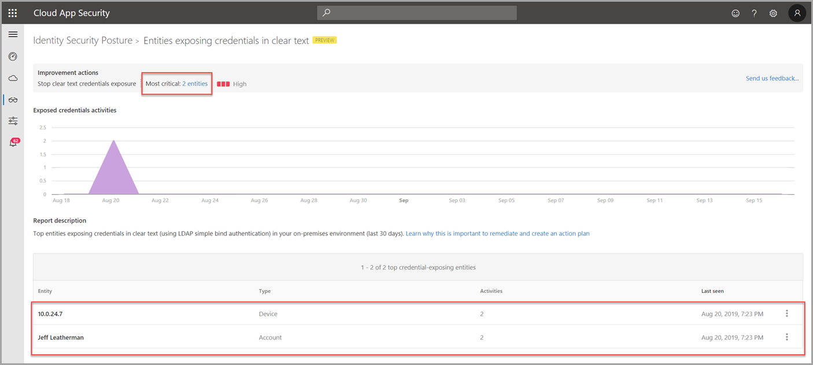

---
# required metadata

title: Azure Advanced Threat Protection clear text exposure assessment | Microsoft Docs
description: This article provides an overview of Azure ATP's clear text exposure identity security posture assessment report.
keywords:
author: mlottner
ms.author: mlottner
manager: rkarlin
ms.date: 07/08/2019
ms.topic: conceptual
ms.collection: M365-security-compliance
ms.service: azure-advanced-threat-protection
ms.assetid: 124957bb-5882-4fcf-bab2-b74b0c69571d

# optional metadata

#ROBOTS:
#audience:
#ms.devlang:
ms.reviewer: itargoet
ms.suite: ems
#ms.tgt_pltfrm:
#ms.custom:

---

# Security assessment: Prevent clear text credentials exposure 

## What information does the prevent clear text security assessment provide? 

This security assessment monitors your traffic for any entities exposing credentials in clear text and alerts you to the current exposure risks (most impacted entities) in your organization with suggested remediation. 

## Why is clear text credential exposure risky?  
Entities exposing credentials in clear text are risky not only for the exposed entity in question, but for your entire organization.  

The increased risk is because unsecure traffic such as LDAP simple-bind is highly susceptible to interception by attacker-in-the-middle attacks. These types of attacks result in malicious activities including credential exposure, in which an attacker can leverage credentials for malicious purposes. 

## How do I use this security assessment to improve my organizational security posture? 

1. Review the security assessment for impacted entities. 
    
1. Research why those entities are using LDAP in clear text. 
1. Remediate the issues and stop the exposure. 
1. After confirming remediation, we recommend you require domain controller level LDAP signing. To learn more about LDAP server signing, see [Domain controller LDAP server signing requirements](https://docs.microsoft.com/windows/security/threat-protection/security-policy-settings/domain-controller-ldap-server-signing-requirements). 
 

## Next steps
- [Azure ATP activities filtering in Cloud App Security](atp-activities-filtering-mcas.md)
- [Check out the Azure ATP forum!](https://aka.ms/azureatpcommunity)
