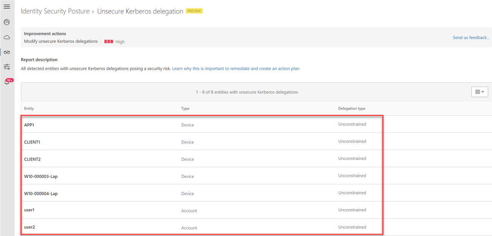

---
# required metadata

title: Azure Advanced Threat Protection unconstrained Kerberos identity security posture assessment | Microsoft Docs
description: This article provides an overview of Azure ATP's unconstrained Kerberos identity security posture assessment reports.
keywords:
author: mlottner
ms.author: mlottner
manager: rkarlin
ms.date: 09/15/2019
ms.topic: conceptual
ms.collection: M365-security-compliance
ms.service: azure-advanced-threat-protection
ms.assetid: 7eea354b-7a50-40d9-bfa7-dcccaef23179

# optional metadata

#ROBOTS:
#audience:
#ms.devlang:
ms.reviewer: itargoet
ms.suite: ems
#ms.tgt_pltfrm:
#ms.custom:

---

# Security assessment: Unsecure Kerberos delegation - preview

## What is Kerberos delegation? 

Kerberos delegation is a delegation setting that allows applications to request end-user access credentials to access resources on behalf of the originating user.  

## What risk does unsecure Kerberos delegation pose to an organization? 

Unsecure Kerberos delegation gives an entity the ability to impersonate you to any other chosen service. For example, imagine you have an IIS website, and the application pool account is configured with unconstrained delegation. The IIS website site also has Windows Authentication enabled, allowing native Kerberos authentication, and the site uses a back-end SQL Server for business data. With your Domain Admin account, you browse to the IIS website and authenticate to it. The website, using unconstrained delegation is able to get a service ticket from a domain controller to the SQL service, and do so in your name.

The main issue with Kerberos delegation is that you need to trust the application to always do the right thing. Malicious actors can instead force the application to do the wrong thing. If you are logged on as **domain admin**, the site is able to create a ticket to whatever other service it wishes, acting as you, the **domain admin**. For example, the site could chose a domain controller, and make changes to the **enterprise admin** group. Similarly, the site could acquire the hash of the KRBTGT account, or download an interesting file from your Human Resources department. The risk is clear and the possibilities with unsecure delegation are nearly endless. 

 
## How do I use this security assessment?

1. Use the report table to discover which of your non-domain controller entities are configured for **unsecure Kerberos delegation**.    
     
1. Take appropriate action on those at-risk users, such as removing their unconstrained attribute or changing it to a more secure constrained delegation.

## Remediation

To learn more about remediating these type of accounts, see [Removing accounts that use unconstrained Kerberos delegation](https://blogs.technet.microsoft.com/389thoughts/2017/04/18/get-rid-of-accounts-that-use-kerberos-unconstrained-delegation/).

## Next steps
- [Azure ATP activities filtering in Cloud App Security](atp-activities-filtering-mcas.md)
- [Check out the Azure ATP forum!](https://aka.ms/azureatpcommunity)
