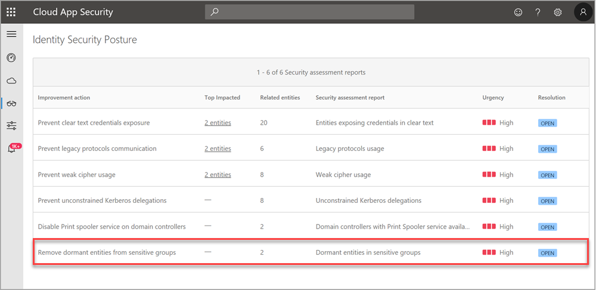
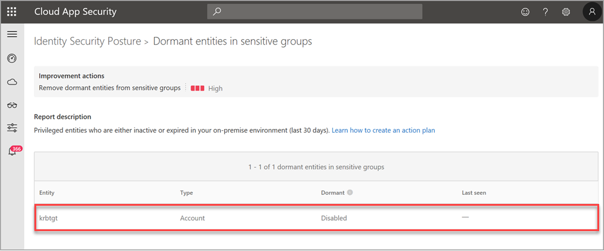

---
# required metadata

title: Azure Advanced Threat Protection dormant entities security assessments | Microsoft Docs
description: This article provides an overview of Azure ATP's dormant entities in sensitive groups identity security posture assessment report.
keywords:
author: mlottner
ms.author: mlottner
manager: rkarlin
ms.date: 07/08/2019
ms.topic: conceptual
ms.collection: M365-security-compliance
ms.service: azure-advanced-threat-protection
ms.assetid: 2fe62047-75ef-4b2e-b4aa-72860e39b4e4

# optional metadata

#ROBOTS:
#audience:
#ms.devlang:
ms.reviewer: itargoet
ms.suite: ems
#ms.tgt_pltfrm:
#ms.custom:

---

# Security assessment: Dormant entities in **sensitive** groups

## What are **sensitive** dormant entities? 
Azure ATP discovers if particular users are **sensitive** along with providing attributes that surface if they are inactive, disabled, or expired. 

However, **Sensitive** accounts can also become *dormant* if they are not used for a period of 180 days. Dormant **sensitive** accounts are targets of opportunity for malicious actors to gain sensitive access to your organization. 

## What risk do dormant entities create in **sensitive** groups? 

Organizations that fail to secure their dormant user accounts leave the door unlocked to their sensitive data safe.  

Malicious actors, much like thieves, often look for the easiest and quietest way into any environment. As easy and quiet path deep into your organization is through **sensitive** user and service accounts that are no longer in use. 

It doesn't matter if the cause is employee turnover or resource mismanagement -skipping this step leaves your organization's most [sensitive entities](sensitive-accounts.md) vulnerable and exposed.   

## How do I use this security assessment? 
1. Use the report table to discover which of your sensitive accounts are dormant. 
     
1. Take appropriate action on those user accounts by removing their privileged access rights or by deleting the account.  

## See Also
- [Azure ATP activities filtering in Cloud App Security](atp-activities-filtering-mcas.md)
- [Check out the Azure ATP forum!](https://aka.ms/azureatpcommunity)
