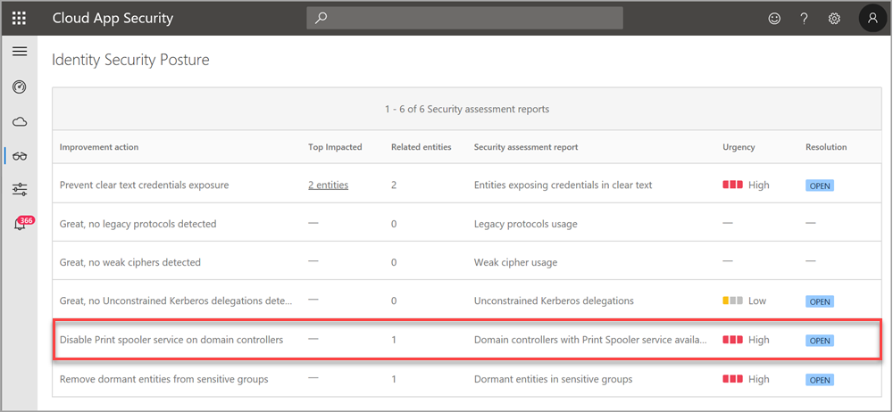
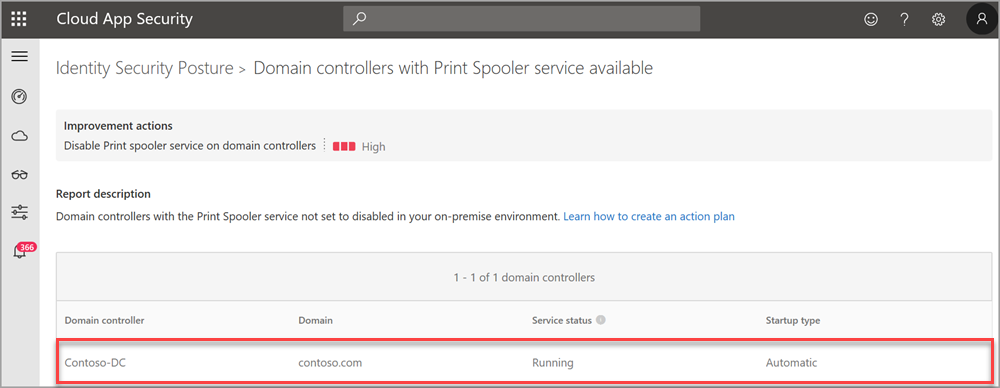

---
# required metadata

title: Azure Advanced Threat Protection Print spooler identity security posture assessments | Microsoft Docs
description: This article provides an overview of Azure ATP's Print spooler identity security posture assessment reports.
keywords:
author: mlottner
ms.author: mlottner
manager: rkarlin
ms.date: 07/08/2019
ms.topic: conceptual
ms.collection: M365-security-compliance
ms.service: azure-advanced-threat-protection
ms.assetid: 1a7d9525-8923-4dae-af51-02a68aa61644

# optional metadata

#ROBOTS:
#audience:
#ms.devlang:
ms.reviewer: itargoet
ms.suite: ems
#ms.tgt_pltfrm:
#ms.custom:

---
# Security assessment: Domain controllers with Print Spooler service available

 
## What is the **Print spooler** service? 

Print spooler is a software service that manages printing processes. The spooler accepts print jobs from computers and makes sure that printer resources are available. The spooler also schedules the order in which print jobs are sent to the print queue for printing. In the early days of personal computers, users had to wait until files printed before performing other actions. Thanks to modern print spoolers, printing now has minimal impact on user productivity.

## What risks does the **Print spooler** service on domain controllers introduce? 

While seemingly harmless, any authenticated user can remotely connect to a domain controllers print spooler service, and request an update on new print jobs. In addition, users can tell the domain controller to send the notification to the system with [unconstrained delegation](atp-mcas-ispm-unconstrained-kerberos.md). These actions test the connection and expose the domain controller computer account credential (**Print spooler** is owned by SYSTEM). 

Due to the possibility for exposure, domain controllers and Active Directory  admin systems need to have the **Print spooler** service disabled. The recommended way to do this is using a Group Policy Object (GPO). 

While this security assessment focuses on domain controllers, any server is potentially at risk to this type of attack.

## How do I use this security assessment? 
1. Use the report table to discover which of your domain controllers has the **Print spooler** service enabled.   
     
1. Take appropriate action on the at-risk domain controllers and actively remove the Print spooler service either manually, through GPO or other types of remote commands.

## Remediation

Fix this specific issue by disabling the Print Spooler service on all servers that don’t require it and ensure there are no accounts with unconstrained delegation configured.
  

## Next steps
- [Azure ATP activities filtering in Cloud App Security](atp-activities-filtering-mcas.md)
- [Check out the Azure ATP forum!](https://aka.ms/azureatpcommunity)