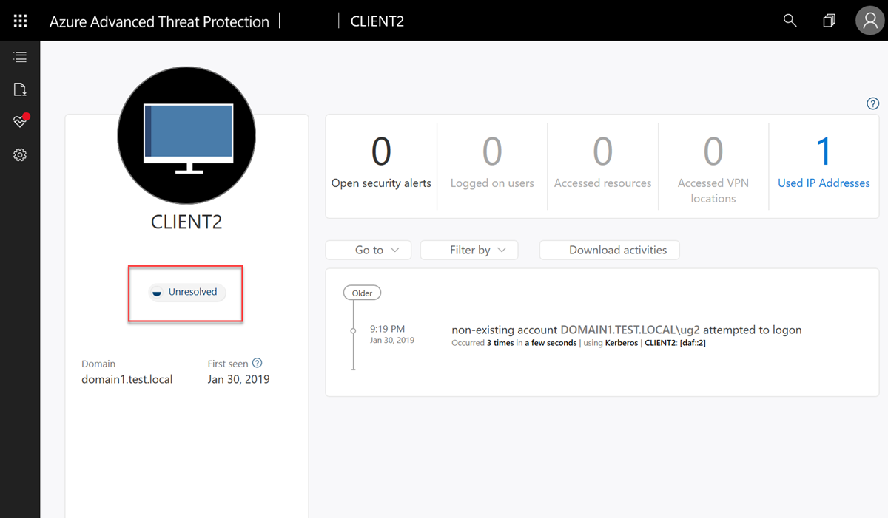
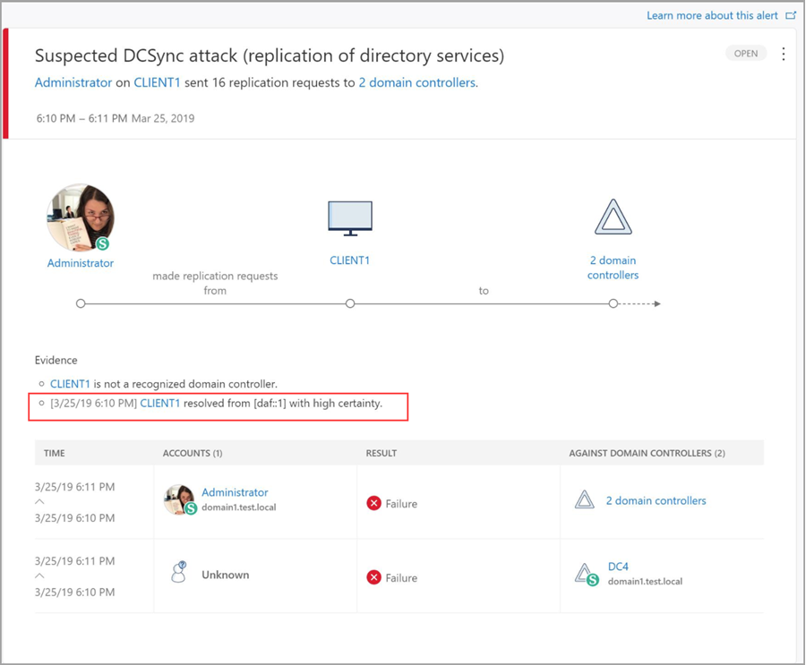
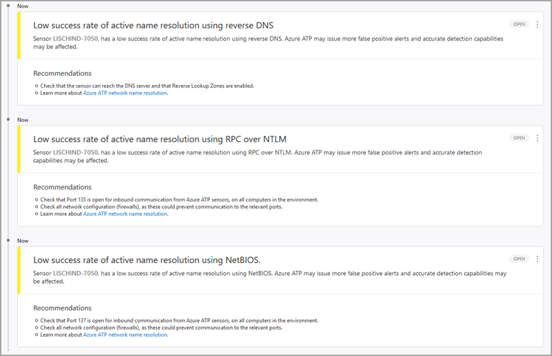

---
# required metadata
title: Azure Advanced Threat Protection Network Name Resolution
description: This article provides an overview of Azure ATP's Advanced Network Name Resolution functionality and uses.
keywords:
author: shsagir
ms.author: shsagir
manager: rkarlin
ms.date: 10/22/2019
ms.topic: conceptual
ms.collection: M365-security-compliance
ms.service: azure-advanced-threat-protection
ms.assetid: 1ac873fc-b763-41d7-878e-7c08da421cb5

# optional metadata

#ROBOTS:
#audience:
#ms.devlang:
ms.reviewer: itargoet
ms.suite: ems
#ms.tgt_pltfrm:
#ms.custom:

---

# What is Network Name Resolution?

Network Name Resolution or (NNR) is a main component of  Azure ATP functionality. Azure ATP captures activities based on network traffic, Windows events, and ETW - these activities normally contain IP data. 

Using NNR, Azure ATP is able to correlate between raw activities (containing IP addresses), and the relevant computers involved in each activity. Based on the raw activities, Azure ATP profiles entities, including computers, and generates security alerts for suspicious activities.

To resolve IP addresses to computer names, Azure ATP sensors query the IP address for the computer name "behind" the IP, using one of the following methods:

- NTLM over RPC (TCP Port 135)
- NetBIOS (UDP port 137)
- RDP (TCP port 3389) - only the first packet of **Client hello**
- Queries the DNS server using reverse DNS lookup of the IP address (UDP 53)

> [!NOTE]
> No authentication is performed on any of the ports.

Azure ATP evaluates and determines the device operating system based on network traffic. After retrieving the computer name, the Azure ATP sensor checks Active Directory and uses TCP fingerprints to see if there is a correlated computer object with the same computer name. Using TCP fingerprints helps identify unregistered and non-Windows devices, aiding in your investigation process. 
When the Azure ATP sensor finds the correlation, the sensor associates the IP to the computer object. 

In cases where no name is retrieved, an **unresolved computer profile by IP** is created with the IP and the relevant detected activity.

NNR data is crucial for detecting the following threats:

- Suspected identity theft (pass-the-ticket)
- Suspected DCSync attack (replication of directory services)
- Network mapping reconnaissance (DNS)

To improve your ability to determine if an alert is a **True Positive (TP)** or **False Positive (FP)**, Azure ATP includes the degree of certainty of computer naming resolving into the evidence of each security alert. 
 
For example, when computer names are resolved with  **high certainty** it increases the confidence in the resulting security alert as a **True Positive** or **TP**. 

The evidence includes the time, IP and computer name the IP was resolved to. When the resolution certainty is **low**, use this information to investigate and verify which device was the true source of the IP at this time. 
After confirming the device, you can then determine if the alert is a **False Positive** or **FP**, similar to the following examples:

- Suspected identity theft (pass-the-ticket) – the alert was triggered for the same computer.
- Suspected DCSync attack (replication of directory services) – the alert was triggered from a domain controller.
- Network mapping reconnaissance (DNS) – the alert was triggered from a DNS Server.

    

### Prerequisites
|Protocol|    Transport|    Port|    Device|    Direction|
|--------|--------|------|-------|------|
|NTLM over RPC|    TCP    |135|    All devices on the network|    Inbound|
|NetBIOS|    UDP|    137|    All devices on the network|    Inbound|
|DNS|    UDP|    53|    Domain controllers|    Outbound|
|

When port 3389 is opened on devices in the environment, the Azure ATP sensor using it for network name resolution purposes.
Opening port 3389 **is not a requirement**, it is only an additional method that can provide the computer name if the port is already opened for other purposes.

To make sure Azure ATP is working ideally and the environment is configured correctly, Azure ATP checks the resolution status of each Sensor and issues a health alert per method, providing a list of the Azure ATP sensors with low success rate of active name resolution using each method.

> [!NOTE]
> To disable an optional NNR method in Azure ATP to fit the needs of your environment, open a support call. 

Each health alert provides specific details of the method, sensors, the problematic policy as well as configuration recommendations.

### Configuration recommendations

- RPC over NTLM:
    - Check that TCP Port 135 is open for inbound communication from Azure ATP Sensors, on all computers in the environment.
    - Check all network configuration (firewalls), as this can prevent communication to the relevant ports.

- NetBIOS:
    - Check that UDP Port 137 is open for inbound communication from Azure ATP Sensors, on all computers in the environment.
    - Check all network configuration (firewalls), as this can prevent communication to the relevant ports.
- Reverse DNS:
    - Check that the Sensor can reach the DNS server and that Reverse Lookup Zones are enabled.

## See Also
- [Azure ATP prerequisites](atp-prerequisites.md)
- [Configure event collection](configure-event-collection.md)
- [Check out the ATP forum!](https://aka.ms/azureatpcommunity)
