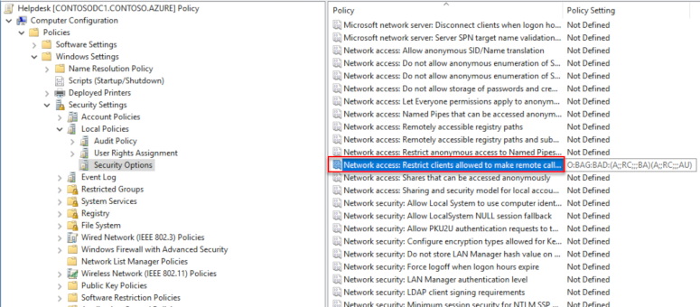
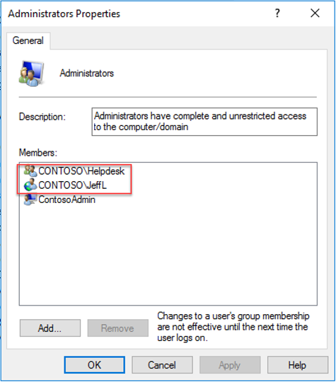
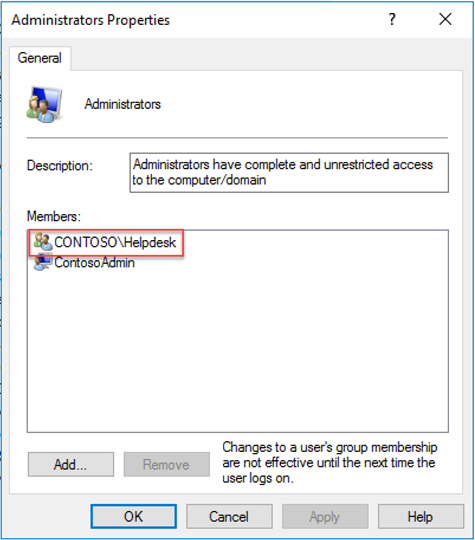

---
# required metadata

title: Azure ATP security alert tutorial | Microsoft Docs
description: In this tutorial you set up an Azure ATP test lab for simulating threats for detection by Azure ATP.
ms.service: azure-advanced-threat-protection
ms.topic: tutorial
author: mlottner
ms.author: mlottner
ms.date: 01/22/2018

# optional metadata

# ms.custom
ms.reviewer: itargoet
# ms.subservice
# ROBOTS
# Customer intent: As an Azure ATP user, I want to simulate threats in a lab so that I can see some of Azure ATP's capabilities.
---

# Tutorial: Setup an ATP security alert lab 

The purpose of the Azure ATP Security Alert lab tutorial is to illustrate **Azure ATP**'s capabilities in identifying and detecting suspicious activities and potential attacks against your network. This four part tutorial explains how to install and configure a working environment to test against some of Azure ATP's *discrete* detections. The lab focuses on Azure ATP’s *signature*-based capabilities and doesn't include advanced machine-learning, user or entity based behavioral detections (these require a learning period with real network traffic of up to 30 days).

In this tutorial you will: 

> [!div class="checklist"]
> * Set up your [server and computers](#Servers-and-Computers)
> * Configure Active Directory with [users and groups](#Users-and-Groups-Active-Directory-Setup)
> * Set up and configure [Azure ATP](#Azure-ATP-Setup)
> * Setup [local policies](#Local-Policies-Setup) for your server and computers
> * [Mimic a management scenario](#Helpdesk-Simulation) using a scheduled task

<!--When your lab setup is complete, use Azure ATP Security Alert playbooks for testing:

- [Reconnaissance playbook](atp-playbook-reconnaissance.md)
- [Lateral Movement playbook](atp-playbook-lateral-movement.md)
- [Domain Dominance playbook](atp-playbook-domain-dominance.md)
-->
## Prerequisites

1. An [Azure ATP instance](install-atp-step1.md)
2. [A lab domain controller and 2 lab workstations](#Servers-and-Computers)
3. [Download](install-atp-step3.md) and [install Azure ATP sensor version 2.56 or newer](install-atp-step4.md) on your lab's domain controller


<!--
### Setup steps
1. Set up your [Servers and Computers](#Servers-and-Computers). 
1. Configure Active Directory with [users and groups](#Users-and-Groups-Active-Directory-Setup).
1. Set up and configure [Azure ATP](#Azure-ATP-Setup), including setup of [local policies](#Local-Policies-Setup) for your servers and computers. 
1. [Mimic a management scenario](#Helpdesk-Simulation) using a Scheduled Task.   
-->

## Recommendations

We recommend following the lab setup instructions as closely as possible. The closer your lab is to the suggested lab setup, the easier it will be to follow the Azure ATP testing procedures. After the lab setup is complete, you'll be ready to get started with the suggested hacking research tools, and Azure ATP's detections.

Your complete lab setup should look as similar as possible to the following diagram:


## Servers and computers

This table details the computers, and the configurations needed. IP addresses are provided for reference purposes only so you can easily follow along. 

In the examples for these tutorials, the Forest NetBIOS name is **CONTOSO.AZURE**.

|             FQDN     |            OS        |    IP   |                    Purpose                                  |
|------------------------|----------------------|---------|-------------------------------------------------------------|
|ContosoDC1.contoso.azure|Windows Server 2012 R2|10.0.24.4|Domain Controller with the Azure ATP Sensor installed locally|
|VictimPC.contoso.azure |Windows 10            |10.0.24.5|Victim’s PC                                                   |
|AdminPC.contoso.azure  |Windows 10            |10.0.24.6| Domain Admin's PC (sometimes referred to as "Secure Admin Workstation" or "Privileged Admin Workstation")                                                    |        |

## User and Group Active Directory Setup

In this lab, there are 3 main users and 1 service account. The service account is for Azure ATP and is used for both LDAP synchronization purposes *and* [SAMR](https://docs.microsoft.com/en-us/azure-advanced-threat-protection/install-atp-step8-samr).

There's a “Helpdesk” Security Group (SG) of which Ron HelpDesk is a member. This Security Group mimics the Helpdesk, and is paired with a Group Policy Object that gives our Helpdesk members Local Admin rights on the respective computers (shown here). This is used to simulate a realistic administrative model in a production environment.

| Full Name    | SAMAccount | Purpose                                                                                          |
|--------------|------------|--------------------------------------------------------------------------------------------------|
| Jeff Leatherman  | JeffL      | Soon to be a victim of an impressively effective phishing attack                      |
| Ron HelpDesk       | RonHD      | Ron is the “go-to-person” in Contoso’s IT team. RonHD is a member of the “Helpdesk” security group. |
| Samira Abbasi | SamiraA      | At Contoso, this user is our Domain Admin.    |
| Azure ATP Service | AATPService | Azure ATP's service account

## Azure ATP Attack Simulation Playbook Lab Setup

<!-- put this in prereqs
### Azure ATP Environment

This lab was written to support Azure ATP sensor version 2.56 and newer. Verify your sensor version in the Azure ATP portal and upgrade as needed before you begin.

If you haven't created an Azure ATP instance yet, follow the  [installation instructions](https://docs.microsoft.com/azure-advanced-threat-protection/install-atp-step1) to get started. If you already have an instance to use, follow [these instructions](https://docs.microsoft.com/azure-advanced-threat-protection/install-atp-step4) to install the Azure ATP sensor on your domain controller (in this lab, the domain controller is called ContosoDC).  
-->

### ContosoDC

#### Hydrate Active Directory Users

To simplify the lab, we automated the process to create ficticious users and groups in Active Directory. You can choose to use or modify this script to hydrate your own lab Active Directory environment or do it manually.

As SamiraA (Domain Admin), on ContosoDC, run the following to hydrate our Active Directory Users:

``` PowerShell
$SamiraASecurePass = ConvertTo-SecureString -String 'NinjaCat123' -AsPlainText -Force
$ronHdSecurePass = ConvertTo-SecureString -String 'FightingTiger$' -AsPlainText -Force
$jefflSecurePass = ConvertTo-SecureString -String 'Password$fun' -AsPlainText -Force
$AATPService = ConvertTo-SecureString -String 'Password123!@#' -AsPlainText -Force

# Create new AD user SamiraA and add her to the domain admins group
New-ADUser -Name SamiraA -DisplayName "Samira Abbasi" -PasswordNeverExpires $true -AccountPassword $samiraASecurePass -Enabled $true
Add-ADGroupMember -Identity "Domain Admins" -Members SamiraA

# Create new AD user RonHD, create new AD security group Helpdesk, add RonHD to Helpdesk group
New-ADUser -Name RonHD -DisplayName "Ron Helpdesk" -PasswordNeverExpires $true -AccountPassword $ronHdSecurePass -Enabled $true
New-ADGroup -Name Helpdesk -GroupScope Global -GroupCategory Security
Add-ADGroupMember -Identity "Helpdesk" -Members "RonHD"

# Create new AD user JeffL
New-ADUser -Name JeffL -DisplayName "Jeff Leatherman" -PasswordNeverExpires $true -AccountPassword $jefflSecurePass -Enabled $true

# Create new AD user Azure ATP Service
New-ADUser -Name AatpService -DisplayName "Azure ATP/ATA Service" -PasswordNeverExpires $true -AccountPassword $AATPService -Enabled $true
```

Take particular note of the "AATPService" user which will be our service account for Azure ATP.

#### Configure SAM-R Capabilities

To allow the Azure ATP Service to perform SAM-R enumeration correctly and build Lateral Movement paths, you'll need to edit the SAM policy. 

Find your SAM policy under:  

_**Policies \> Windows Settings \> Security Settings \> Local Policies \> Security Options\> “Network access: Restrict clients allowed to make remote calls to SAM”**_



For detailed configuration instructions, see [SAM setup](https://docs.microsoft.com/azure-advanced-threat-protection/install-atp-step8-samr). For more information on SAMR, [click here](https://docs.microsoft.com/windows/device-security/security-policy-settings/network-access-restrict-clients-allowed-to-make-remote-sam-calls).

#### Add sensitive group
    
Adding the "Helpdesk" Security Group as a *Sensitive* group will enable you to leverage the [Lateral Movement Graph](https://docs.microsoft.com/en-us/azure-advanced-threat-protection/use-case-lateral-movement-path) feature of Azure ATP during the lab.

To add the "Helpdesk" to the Sensitive Groups in Azure ATP:


Tagging highly sensitive users and groups who aren't necessarily Domain Admins but do have privileges across numerous resources is a best practice.

### Azure ATP Lab (Basic) Setup checklist
| Step    | Action | Status                                                                                         |
|--------------|------------|--------------------------------------------------------------------------------------------------|
| 1  | Azure ATP Sensor installed on ContosoDC      |                    - [ ]  |
| 2    | Azure ATP service account privileges configured correctly for SAMR      | - [ ] |
| 3 | Helpdesk security group added as *Sensitive* group     | - [ ]   |


When your checklist status is completed, the Azure ATP basic lab setup is finished. The next step to complete your lab setup is to complete local policy setup. 

## Local Policies Setup

To make this lab look active, we will hydrate our VictimPC and AdminPC.

### VictimPC

**VictimPC** has both JeffL and Helpdesk Security Group as members of the local Administrators group. In addition, like in many IT teams, JeffL is an Administrator on his own device (**VictimPC**). This setup is by design and is explained in the [Help Desk Simulation](#helpdesk-simulation) story.

Setup local policies by running the automated PowerShell script, as the local administrator:

``` PowerShell
Add-LocalGroupMember -Group "Administrators" -Member "Contoso\JeffL"
Add-LocalGroupMember -Group "Administrators" -Member "Contoso\Helpdesk"
```

Inspect the Administrators group on **VictimPC**, making sure it appears to have at least Helpdesk and JeffL as members:



#### <a name="helpdesk-simulation"></a> Simulate Helpdesk Support

To simulate a _working_ and _managed_ network, create a Scheduled Task on the **VictimPC** machine to run the "cmd.exe" process as **RonHD**.

1. From an _elevated PowerShell console_ on VictimPC run the following code:

``` PowerShell
$action = New-ScheduledTaskAction -Execute 'cmd.exe'
$trigger = New-ScheduledTaskTrigger -AtLogOn
$runAs = 'Contoso\RonHD'
$ronHHDPass = 'FightingTiger$'
Register-ScheduledTask -TaskName "RonHD Cmd.exe - AATP SA Playbook" -Trigger $trigger -User $runAs -Password $ronHHDPass -Action $action
```

2. Sign in to the machine as *JeffL*. The Cmd.exe process will start in context of RonHD after logon, simulating Helpdesk managing the machine.  

#### Turn off antivirus on VictimPC

For test purposes, turn off any antivirus solutions running in the lab environment. This ensures focus is on Azure ATP during these exercises and not focusing on antivirus evasion techniques.

> [!Important]
> Without doing this phase first you will be unable to download some of the tools in the next section.  In addition, if antivirus is enabled after the attack tools are stagged, you will need to redownload the tools after disabling antivirus again.

####  Stage Hacker tools

> [!WARNING]
> The following tools are presented for research purposes only. Microsoft does **not** own these tools and Microsoft cannot and does not guarantee or warranty their behavior. These tools should be run in a test lab environment **only**.

To run the Azure ATP Security Alert playbooks, the following tools are needed.

| Tool                   | URL
|------------------------|---------------------------------------------------------------------------------|
| Mimikatz               | [GitHub - Mimikatz](https://github.com/gentilkiwi/mimikatz)
| PowerSploit            | [GitHub - PowerSploit](https://github.com/PowerShellMafia/PowerSploit)
| PsExec                 | [Microsoft Docs](https://docs.microsoft.com/en-us/sysinternals/downloads/psexec)
| NetSess                | [JoeWare Tools](http://www.joeware.net/freetools)

We thank the authors of these research tools for enabling the community to better understand the cyber risks and impacts.

### AdminPC

**AdminPC** needs to add **Helpdesk** to their local Administrators group. Do this manually or use the PowerShell script provided below(recommended). 

1. Add **Helpdesk** to **AdminPC** and *remove* 'Domain Admins' from the Local Admin Group by running the following PowerShell script:

``` PowerShell
Add-LocalGroupMember -Group "Administrators" -Member "Contoso\Helpdesk"
Remove-LocalGroupMember -Group "Administrators" -Member "Domain Admins"
```

This step makes sure that Samira, a Domain Admin, isn't an Administrator of AdminPC. This is a [best practice in credential hygiene](https://docs.microsoft.com/en-us/windows-server/identity/securing-privileged-access/privileged-access-workstations).

2.  After running the script, **Helpdesk** is located in the local **Administrators** > **Members** list of **AdminPC**.


Simulated domain activities are required from SamiraA. Do this manually or use the PowerShell script provided (recommended). 
The PowerShell script provided below accesses the domain controller every 60 seconds. 

1. As **SamiraA**, execute the following in a PowerShell prompt in AdminPC:

``` PowerShell
while ($true){
    Invoke-Expression "dir \\ContosoDC\c$"
    Start-Sleep -Seconds 300
}
```

This will result in simulated network activity as Samira.


## Mission accomplished! 
*Your Azure ATP lab is now ready to use*. 

> [!NOTE]
> There are other ways to simulate a management workflow in the lab,(such as logging in and out of VictimPC with RonHD's account, adding another version of a Scheduled Task, an RDP session, or executing a ‘runas’ in the Command Line). The method used in this set up was chosen knowing that resources must managed (by *something* or *someone*) and management requires local admin privileges. For best results, choose a method that you can automate for lab consistency purposes.


## What's next? 
Test your Azure ATP lab environment using the Azure ATP Security Alert playbooks for each phase of the cyber-attack kill chain.  

* [Azure ATP Reconnaissance playbook](atp-playbook-reconnaissance.md)
* [Azure ATP Lateral Movement playbook](atp-playbook-lateral-movement.md)
* [Azure ATP Domain Dominance playbook](atp-playbook-domain-dominance.md)

## Join the Community

Do you have more questions, or an interest in discussing Azure ATP and related security with others? Join the [Azure ATP Community](https://techcommunity.microsoft.com/t5/Azure-Advanced-Threat-Protection/bd-p/AzureAdvancedThreatProtection) today!

## See Also

* [Azure ATP security alert guide](suspicious-activity-guide.md)
* [Investigate lateral movement paths with Azure ATP](use-case-lateral-movement-path.md)
* [Check out the Azure ATP forum!](https://aka.ms/azureatpcommunity)