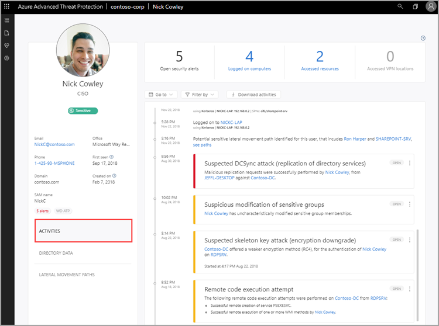
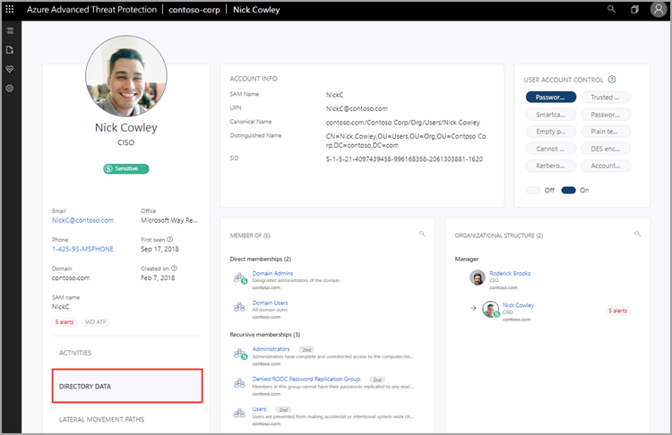

---
# required metadata

title: Working with user profiles in the Azure Advanced Threat Protection portal | Microsoft Docs
description: Describes how to investigate users from the user profiles screen in the Azure ATP portal
keywords:
author: mlottner
ms.author: mlottner
manager: mbaldwin
ms.date: 12/02/2018
ms.topic: conceptual
ms.prod:
ms.service: azure-advanced-threat-protection
ms.technology:
ms.assetid: 17458706-79fb-4c23-aa42-66979164a45f

# optional metadata

#ROBOTS:
#audience:
#ms.devlang:
ms.reviewer: itargoet
ms.suite: ems
#ms.tgt_pltfrm:
#ms.custom:

---

*Applies to: Azure Advanced Threat Protection*

# Understanding entity profiles

The entity profile provides you with a comprehensive entity page designed for a full deep-dive investigation of users, computers, devices, the resources they have access to, and their history. The profile page takes advantage of the new Azure ATP logical activity translator that can look at a group of activities occurring (aggregated up to a minute) and group them into a single logical activity to give you a better understanding of the actual activities of your users.

To access an entity profile page, click on the name of the entity, such as a username, in the suspicious activity timeline.

The left menu provides you with all the Active Directory information available on the entity - email address, domain, first seen date. If the entity is sensitive, it tells you why. For example, is the user tagged as sensitive or the member of a sensitive group?
If it's a sensitive user, you see the icon under the user's name.

## View entity activities

To view all the activities performed by the user, or performed on an entity, click on the **Activities** tab. 

 

By default, the main pane of the entity profile displays a timeline of the entity's activities with a history of up to six months back, from which you can also drill down into the entities accessed by the user, or for entities, users who accessed the entity.

At the top, you can view the summary tiles that give you a quick overview of what you need to understand in a glance about your entity - how many machines the user logged in to, how many resources were accessed, and locations from which a user logged into VPN (if configured). 

Using the **Filter by** button above the activity timeline, you can filter the activities by activity type. You can also filter out a specific (noisy) type of activity. This is helpful for investigation when you want to understand the basics of what an entity is doing in the network. You can also go to a specific date, and you can export the activities as filtered to Excel. The exported file provides a page for directory services changes (things that changed in Active Directory for the account) and a separate page for activities. 

## View directory data

The **Directory data** tab provides the static information available from Active Directory, including user access control security flags. Azure ATP also displays group memberships for the user so that you can tell if the user has a direct membership or a recursive membership. For groups, Azure ATP lists members of the group.

 

In the **User access control** section, Azure ATP surfaces security settings that may need your attentions. You can see important flags about the user, such as if the the user can press enter to bypass the password, and if the user has a password that never expires, etc. 

## View lateral movement paths

By clicking the Lateral movement paths tab, you can view a fully dynamic and clickable map that provides you with a visual representation of the lateral movement paths to and from this user that can be used to infiltrate your network.

The map provides you with a list of how many hops between computers or users an attacker would have to and from this user to compromise a sensitive account, and if the user has a sensitive account, you can see how many resources and accounts are directly connected.

If a potential LMP was not detected for the entity during the past two days, the graph does not display. Select a different date using **View a different date** to view previous lateral movement paths graphs discovered for this entity. The [lateral movement path report](reports.md) is always available to provide you with information about the potential lateral movement paths discovered, and can be customized by time.  

For more information, see [Lateral movement paths](use-case-lateral-movement-path.md). 

 

## See Also

- [Investigate lateral movement paths with Azure ATP](use-case-lateral-movement-path.md)
- [Check out the Azure ATP forum!](https://aka.ms/azureatpcommunity)