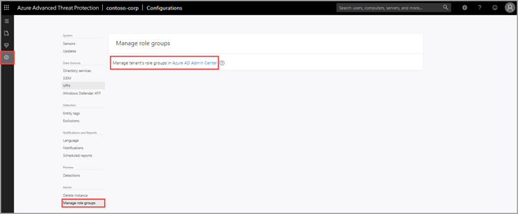

---
# required metadata

title: Install Azure Advanced Threat Protection | Microsoft Docs
description: First step to install Azure ATP involves creating the instance for your Azure ATP deployment.
keywords:
author: mlottner
ms.author: mlottner
manager: mbaldwin
ms.date: 12/02/2018
ms.topic: conceptual
ms.prod:
ms.service: azure-advanced-threat-protection
ms.technology:
ms.assetid: 15ee7d0b-9a0c-46b9-bc71-98d0b4619ed0

# optional metadata

#ROBOTS:
#audience:
#ms.devlang:
ms.reviewer: itargoet
ms.suite: ems
#ms.tgt_pltfrm:
#ms.custom:

---

*Applies to: Azure Advanced Threat Protection*

# Creating your Azure ATP instance in the Azure ATP portal - Step 1

> [!div class="step-by-step"]
> [Step 2 »](install-atp-step2.md)

This installation procedure provides instructions for creating and managing your Azure ATP instance (previously called a workspace). For information on Azure ATP architecture, see [Azure ATP architecture](atp-architecture.md).

In Azure ATP, you'll have a single instance enabling you to manage multiple forests from a single pane of glass. 

> [!NOTE]
> Currently, Azure ATP data centers are deployed in Europe, North America/Central America/Caribbean and Asia. Your instance is created automatically in the data center that is geographically closest to your AAD. Once created, Azure ATP instances are not movable. 

## Step 1. Enter the Azure ATP portal

After you verified that your network meets the sensor requirements, proceed with the creation of your Azure ATP instance.

> [!NOTE]
>You need to be a global administrator or security administrator on the tenant, to access the Azure ATP portal.

1.  Enter [the Azure ATP portal](https://portal.atp.azure.com).

2.  Log in with your Azure Active Directory user account.

## Step 2. Create your instance

1. Click **Create instance**. 

    

2. Your Azure ATP instance is automatically named with the AAD initial domain name, and allocated to the data center located closest to your AAD and created. 

    

> [!NOTE]
 > To log in to Azure ATP, you'll need to log in with a user assigned an Azure ATP role with rights to access the Azure ATP portal. For more information about role-based access control (RBAC) in Azure ATP, see [Working with Azure ATP role groups](atp-role-groups.md).
 
3. Click **Configuration**, **Manage role groups**, and use the [Azure AD Admin Center](https://docs.microsoft.com/azure/active-directory/active-directory-assign-admin-roles-azure-portal) link to manage your role groups. .

    

- Data retention – previously deleted Azure ATP instances do not appear in the UI. For more information on Azure ATP data retention, see [Aure ATP data security and privacy](atp-privacy-compliance.md).

>[!div class="step-by-step"]
[« Pre-install](atp-prerequisites.md)
[Step 2 »](install-atp-step2.md)

## See Also
- [Azure ATP sizing tool](http://aka.ms/aatpsizingtool)
- [Configure event collection](configure-event-collection.md)
- [Azure ATP prerequisites](atp-prerequisites.md)
- [Check out the Azure ATP forum!](https://aka.ms/azureatpcommunity)
