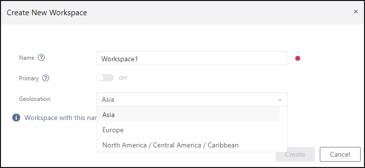

---
# required metadata

title: Install Azure Advanced Threat Protection - Step 1 | Microsoft Docs
description: First step to install Azure ATP involves downloading and installing the Azure ATP cloud service onto your chosen server.
keywords:
author: rkarlin
ms.author: rkarlin
manager: mbaldwin
ms.date: 2/14/2017
ms.topic: get-started-article
ms.prod:
ms.service: azure-advanced-threat-protection
ms.technology:
ms.assetid: 15ee7d0b-9a0c-46b9-bc71-98d0b4619ed0

# optional metadata

#ROBOTS:
#audience:
#ms.devlang:
ms.reviewer: bennyl
ms.suite: ems
#ms.tgt_pltfrm:
#ms.custom:

---

*Applies to: Azure Advanced Threat Protection*

# Creating a workspace in Azure ATP - Step 1

>[!div class="step-by-step"]
[Step 2 »](install-atp-step2.md)

This installation procedure provides instructions for creating and managing a workspace in Azure ATP. For information on Azure ATP architecture, see [Azure ATP architecture](atp-architecture.md).

## Step 1. Enter the Workspace Management Portal

After you verified that your network meets the requirements of the Sensor, you can proceed with the creation of the Azure ATP Workspace.

> [!NOTE]
>In order to access the workspace management portal you need to be a global administrator or security administrator on that tenant.

1.  Enter [the Azure ATP workspace portal](https://portal.atp.azure.com).

2.  Log in with your Azure Active Directory user.

## Step 2. Create a workspace

To successfully log in to Azure ATP, you have to log in with a user who was assigned the proper Azure ATP role to access the Azure ATP workspace portal. 
For more information about role-based access control (RBAC) in Azure ATP, see [Working with Azure ATP role groups](atp-role-groups.md).

1. Log into [portal.atp.azure.com](portal.atp.azure.com).

2. Click **Create workspace**.

3. In the **Create new workspace** dialog, name your workspace, decide whether it's your primary workspace or not, and select a **Geolocation** for your data center.

    

4. Click on the name of the new workspace access the Azure ATP workspace portal for that workspace.

    

5. You can click the **Manage Azure ATP user roles** link to directly access the [Azure Active Directory admin center](https://docs.microsoft.com/azure/active-directory/active-directory-assign-admin-roles-azure-portal) and manage your role groups.

>[!div class="step-by-step"]
[« Pre-install](configure-port-mirroring.md)
[Step 2 »](install-atp-step2.md)

## See Also
- [Azure ATP POC deployment guide](http://aka.ms/atapoc)
- [Azure ATP sizing tool](http://aka.ms/trisizingtool)
- [Configure event collection](configure-event-collection.md)
- [Azure ATP prerequisites](atp-prerequisites.md)

