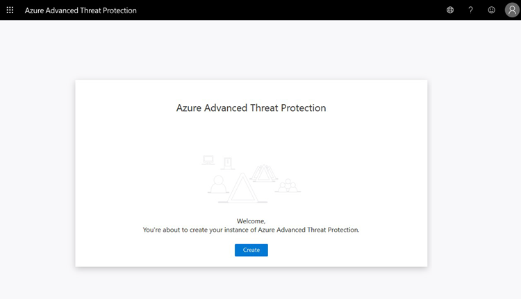
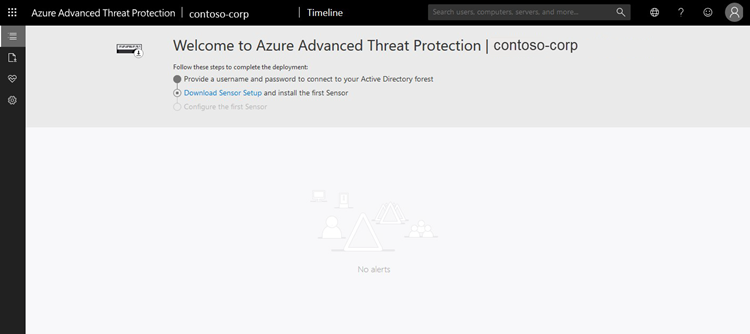

---
# required metadata

title: Create your Azure ATP instance quickstart
description: Quickstart for creating the instance for your Azure ATP deployment which is the first step to install Azure ATP.
keywords:
author: shsagir
ms.author: shsagir
ms.date: 10/31/2019
ms.topic: quickstart
ms.collection: M365-security-compliance
ms.service: azure-advanced-threat-protection

# optional metadata

#ROBOTS:
#audience:
#ms.devlang:
ms.reviewer: itargoet
ms.suite: ems
#ms.tgt_pltfrm:
#ms.custom:

---
# Quickstart: Create your Azure ATP instance

In this quickstart, you'll create your Azure ATP instance in the Azure ATP portal. In Azure ATP, you'll have a single instance, previously called a workspace. A single instance enables you to manage multiple forests from a single pane of glass.

> [!IMPORTANT]
> Currently, Azure ATP data centers are deployed in Europe, North America/Central America/Caribbean and Asia. Your instance is created automatically in the data center that is geographically closest to your Azure Active Directory (Azure AD). Once created, Azure ATP instances aren't movable.

## Prerequisites

- An [Azure ATP license](atp-technical-faq.md#licensing-and-privacy).
- You need to be a [global administrator or security administrator on the tenant](https://docs.microsoft.com/azure/active-directory/users-groups-roles/directory-assign-admin-roles#available-roles) to access the Azure ATP portal.
- Review the [Azure ATP architecture](atp-architecture.md) article.
- Review the [Azure ATP prerequisites](atp-prerequisites.md) article. 

## Sign in to the Azure ATP portal

After you verified that your network meets the sensor requirements, start the creation of your Azure ATP instance.

1. Go to [the Azure ATP portal](https://portal.atp.azure.com)*.

2. Sign in with your Azure Active Directory user account.

* GCC High customers must use the [Azure ATP GCC High](http://portal.atp.azure.us) portal.  

## Create your instance

1. Click **Create instance**. 

    

2. Your Azure ATP instance is automatically named with the Azure AD initial domain name and created in the data center located closest to your Azure AD. 

    

    > [!NOTE]
    > To signin to Azure ATP, you'll need to sign in with a user assigned an Azure ATP role with rights to access the Azure ATP portal. For more information about role-based access control (RBAC) in Azure ATP, see [Working with Azure ATP role groups](atp-role-groups.md).
 
3. Click **Configuration**, **Manage role groups**, and use the [Azure AD Admin Center](https://docs.microsoft.com/azure/active-directory/active-directory-assign-admin-roles-azure-portal) link to manage your role groups.

    

- Data retention – previously deleted Azure ATP instances don't appear in the UI. For more information on Azure ATP data retention, see [Aure ATP data security and privacy](atp-privacy-compliance.md).

## Next steps

> [!div class="step-by-step"]
> [« Prerequisites](atp-prerequisites.md)
> [Step 2 - Connect to Active Directory »](install-atp-step2.md)

## Join the Community

Have more questions, or an interest in discussing Azure ATP and related security with others? Join the [Azure ATP Community](https://aka.ms/azureatpcommunity) today!

