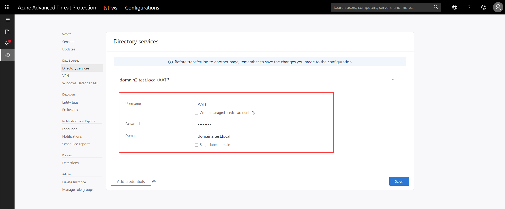

---
# required metadata

title: Connect Azure ATP to Active Directory quickstart | Microsoft Docs
description: Step two of installing Azure ATP helps you configure the domain connectivity settings on your Azure ATP cloud service
author: mlottner
ms.author: mlottner
ms.date: 02/05/2019
ms.topic: conceptual
ms.collection: M365-security-compliance
ms.service: azure-advanced-threat-protection

# optional metadata

#ROBOTS:
#audience:
#ms.devlang:
# ms.reviewer: itargoet
# ms.suite: ems
#ms.tgt_pltfrm:
#ms.custom:

---

# Quickstart: Connect to your Active Directory Forest

In this quickstart, you'll connect Azure ATP to Active Directory (AD) to retrieve data about users and computers. If you're connecting multiple forests, see the [Multi-forest support](atp-multi-forest.md) article.

## Prerequisites

- An [Azure ATP instance](install-atp-step1.md).
- Review the [Azure ATP prerequisites](atp-prerequisites.md) article.
- An **on-premises** AD user account and password with read access to all objects in the monitored domains.

## Provide a username and password to connect to your Active Directory Forest

The first time you open the Azure ATP portal, the following screen appears:

1. Enter the following information and click **Save**:

    |Field|Comments|
    |---------|------------|
    |**Username** (required)|Enter the read-only Active Directory user name. For example: **ATPuser**.  You must use an **on-premises** AD user account. **Don't** use the UPN format for your username.|
    |**Password** (required)|Enter the password for the read-only user. For example: **Pencil1**.|
    |**Domain** (required)|Enter the domain for the read-only user. For example: **contoso.com**. It's important that you enter the complete FQDN of the domain where the user is located. For example, if the user’s account is in domain corp.contoso.com, you need to enter `corp.contoso.com` not contoso.com|

2. In the Azure ATP portal, click **Download sensor setup and install the first sensor** to continue.

## Next steps

> [!div class="step-by-step"]
> [« Step 1 - Create Azure ATP instance](install-atp-step1.md)
> [Step 3 - Download the sensor setup »](install-atp-step3.md)

## Join the Community

Have more questions, or an interest in discussing Azure ATP and related security with others? Join the [Azure ATP Community](https://aka.ms/azureatpcommunity) today!
