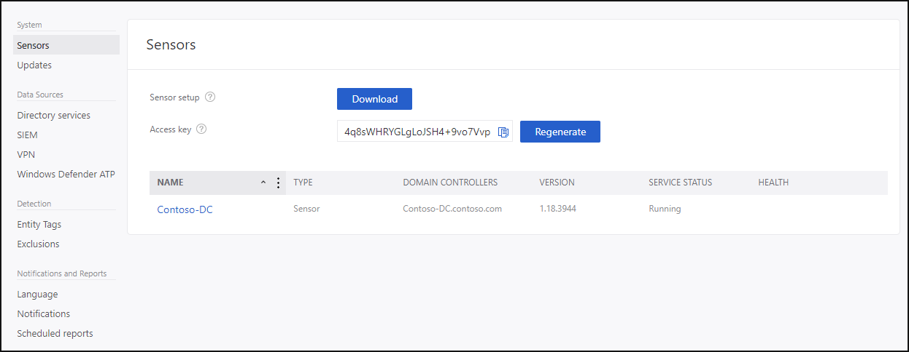

---
# required metadata

title: Install Azure Advanced Threat Protection | Microsoft Docs
description: Step three of installing Azure ATP helps you download the Azure ATP sensor setup package.
keywords:
author: mlottner
ms.author: mlottner
manager: mbaldwin
ms.date: 12/02/2018
ms.topic: get-started-article
ms.prod:
ms.service: azure-advanced-threat-protection
ms.technology:
ms.assetid: 95bb4ec1-841f-41b7-92fe-fbd144085724

# optional metadata

#ROBOTS:
#audience:
#ms.devlang:
ms.reviewer: itargoet
ms.suite: ems
#ms.tgt_pltfrm:
#ms.custom:

---

*Applies to: Azure Advanced Threat Protection*

# Install Azure ATP - Step 3

> [!div class="step-by-step"]
> [« Step 2](install-atp-step2.md)
> [Step 4 »](install-atp-step4.md)

## Step 3. Download the Azure ATP sensor setup package
After configuring the domain connectivity settings, you can download the Azure ATP sensor setup package. The Azure ATP sensor setup package can be installed on a dedicated server or on a domain controller. When installing directly on a domain controller, it is installed as an Azure ATP sensor, when installing on a dedicated server and using port mirroring, it is installed as Azure ATP standalone sensor. For more information on the Azure ATP sensor, see [Azure ATP Architecture](atp-architecture.md). 

Click **Download** in the list of steps at the top of the page to go to the **Sensor** page.

> [!NOTE] 
> To reach the sensor configuration screen later, click the **settings icon** (upper right corner) and select **Configuration**, then, under **System**, click **sensor**.  

1.  Click **sensor**.
2.  Save the package locally.
3. 	Copy the **Access** **key**. The access key is required for the Azure ATP sensor to connect to your Azure ATP instance. The access key is a one-time-password for sensor deployment, after which all communication is performed using certificates for authentication and TLS encryption. Use the **Regenerate** button if you ever need to regenerate the new access key, you can, and it will not affect any previously deployed sensors, because it is only used for initial registration of the sensor.
4.  Copy the package to the dedicated server or domain controller onto which you are installing the Azure ATP sensor. Alternatively, you can open the Azure ATP portal from the dedicated server or domain controller and skip this step.

The zip file includes the following files:

-   Azure ATP sensor installer

-   Configuration setting file with the required information to connect to the Azure ATP cloud service

> [!div class="step-by-step"]
> [« Step 2](install-atp-step2.md)
> [Step 4 »](install-atp-step4.md)

## See Also

- [Azure ATP sizing tool](http://aka.ms/aatpsizingtool)

- [Configure event collection](configure-event-collection.md)

- [Azure ATP prerequisites](atp-prerequisites.md)

- [Check out the Azure ATP forum!](https://aka.ms/azureatpcommunity)