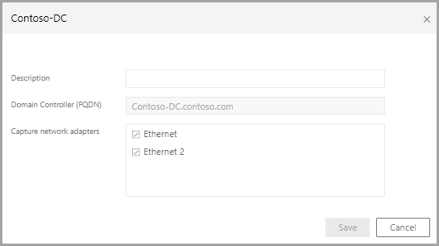
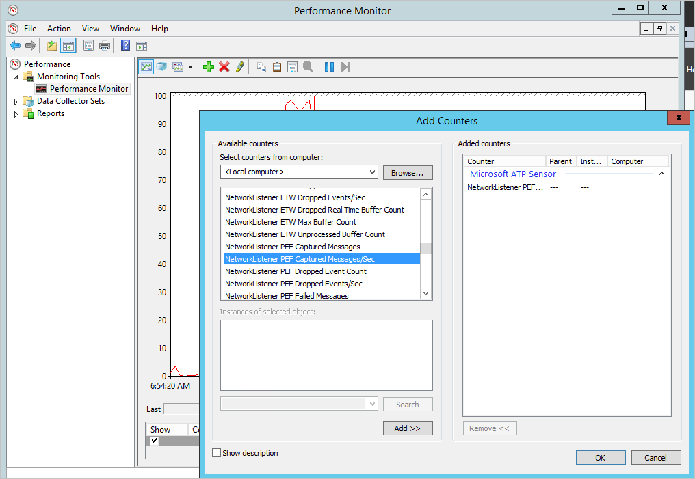

---
# required metadata

title: Install Azure Advanced Threat Protection - Step 5 | Microsoft Docs
description: Step five of installing Azure ATP helps you configure settings for your Azure ATP Standalone Sensor.
keywords:
author: rkarlin
ms.author: rkarlin
manager: mbaldwin
ms.date: 11/7/2017
ms.topic: get-started-article
ms.prod:
ms.service: azure-advanced-threat-protection
ms.technology:
ms.assetid: d7c95f8c-04f8-4946-9bae-c27ed362fcb0

# optional metadata

#ROBOTS:
#audience:
#ms.devlang:
ms.reviewer: bennyl
ms.suite: ems
#ms.tgt_pltfrm:
#ms.custom:

---

*Applies to: Azure Advanced Threat Protection*

# Install Azure ATP - Step 5

>[!div class="step-by-step"]
[« Step 4](install-atp-step4.md)
[Step 6 »](install-atp-step6.md)

## Step 5. Configure the Azure ATP Standalone Sensor settings
After the Azure ATP Standalone Sensor was installed, perform the following steps to configure the settings for the Azure ATP Standalone Sensor.

1.  In the Azure ATP Console, go to **Configuration** and, under **System**, select **Sensors**.
   
     

2.  Click on the Sensor you want to configure and enter the following information:

    

  - **Description**: Enter a description for the Azure ATP Standalone Sensor (optional).
  - **Port Mirrored Domain Controllers (FQDN)** (required for the Azure ATP Standalone Sensor, this cannot be changed for the Azure ATP Sensor): Enter the complete FQDN of your domain controller and click the plus sign to add it to the list. For example,  **dc01.contoso.com**

      The following information applies to the servers you enter in the **Domain Controllers** list:
      - All domain controllers whose traffic is being monitored via port mirroring by the Azure ATP Standalone Sensor must be listed in the **Domain Controllers** list. If a domain controller is not listed in the **Domain Controllers** list, detection of suspicious activities might not function as expected.
      - At least one domain controller in the list should be a global catalog. This enables Azure ATP to resolve computer and user objects in other domains in the forest.

  - **Capture Network adapters** (required):
  - For an Azure ATP Standalone Sensor on a dedicated server, select the network adapters that are configured as the destination mirror port. These receive the mirrored domain controller traffic.
  - For an Azure ATP Sensor, this should be all the network adapters that are used for communication with other computers in your organization.

  - **Domain synchronizer candidate**: Any Azure ATP Standalone Sensor set to be a domain synchronizer candidate can be responsible for synchronization between Azure ATP and your Active Directory domain. Depending on the size of the domain, the initial synchronization might take some time and is resource-intensive. By default, only Azure ATP Sensors are set as Domain synchronizer candidates.
   It is recommended that you disable any remote site Azure ATP Sensors from being Domain synchronizer candidates.
   If your domain controller is read-only, do not set it as a Domain synchronizer candidate. For more information, see [Azure ATP architecture](atp-architecture.md#ata-lightweight-sensors-features).

  > [!NOTE] 
  > It will take a few minutes for the Azure ATP Standalone Sensor service to start the first time after installation because it builds the cache of the network capture parsers.
  > The configuration changes are applied to the Azure ATP Standalone Sensor on the next scheduled sync between the Azure ATP Standalone Sensor and the Azure ATP cloud service.

3. Optionally, you can set the [Syslog listener and Windows Event Forwarding Collection](configure-event-collection.md). 
4. Enable **Update Azure ATP Standalone Sensor automatically** so that in upcoming version releases when you update the Azure ATP cloud service, this Azure ATP Standalone Sensor is automatically updated.

5. Click **Save**.

## Validate installations
To validate that the Azure ATP Standalone Sensor has been successfully deployed, check the following steps:

1.  Check that the service named **Microsoft Azure Advanced Threat Protection Gateway** is running. After you save the Azure ATP Standalone Sensor settings, it might take a few minutes for the service to start.

2.  If the service does not start, review the “Microsoft.Tri.Gateway-Errors.log” file located in the following default folder, “%programfiles%\Microsoft Azure Advanced Threat Protection\Gateway\Logs” and Check [Azure ATP Troubleshooting](troubleshooting-ata-known-errors.md) for help.

3.  If this is the first Azure ATP Standalone Sensor installed, after a few minutes, log into the Azure ATP Console and open the notification pane by swiping the right side of the screen open. You should see a list of **Entities Recently Learned** in the notification bar on the right side of the console.

4.  On the desktop, click the **Microsoft Azure Advanced Threat Protection** shortcut to connect to the Azure ATP Console. Log in with the same user credentials that you used to install the Azure ATP cloud service.
5.  In the console, search for something in the search bar, such as a user or a group on your domain.
6.  Open Performance Monitor. In the Performance tree, click on **Performance Monitor** and then click the plus icon to **Add a Counter**. Expand **Microsoft Azure ATP Standalone Sensor** and scroll down to **Network Listener PEF Captured Messages/Sec** and add it. Then, make sure you see activity on the graph.

    

>[!div class="step-by-step"]
[« Step 4](install-ata-step4.md)
[Step 6 »](install-ata-step6.md)

## Related Videos
- [Azure ATP Deployment Overview](https://channel9.msdn.com/Shows/Microsoft-Security/Overview-of-ATP-Deployment-in-10-Minutes)
- [Choosing the right Azure ATP Standalone Sensor type](https://channel9.msdn.com/Shows/Microsoft-Security/ATP-Deployment-Choose-the-Right-Gateway-Type)

## See Also
- [Azure ATP POC deployment guide](http://aka.ms/atapoc)
- [Azure ATP sizing tool](http://aka.ms/trisizingtool)
- [Check out the Azure ATP forum!](https://social.technet.microsoft.com/Forums/security/home?forum=mata)
- [Configure event collection](configure-event-collection.md)
- [Azure ATP prerequisites](ata-prerequisites.md)

