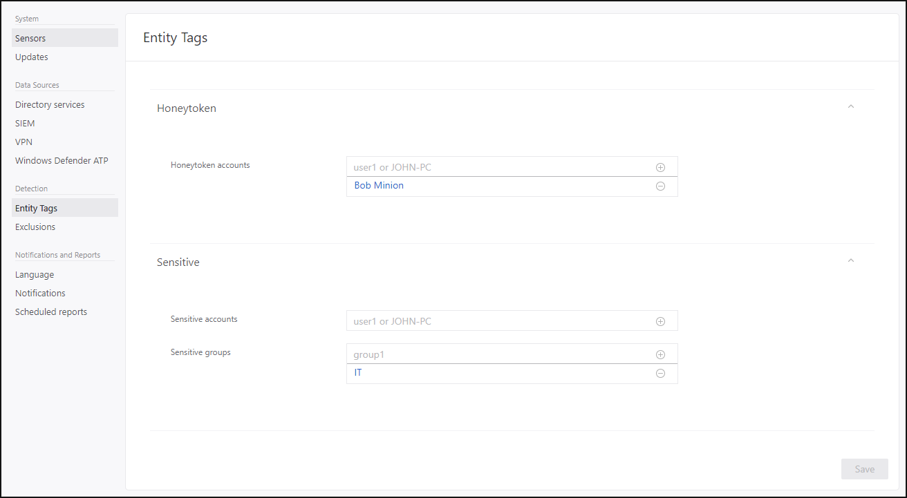

---
# required metadata

title: Install Azure Advanced Threat Protection - Step 8 | Microsoft Docs
description: In the final step of installing ATP, you configure the Honeytoken user.
keywords:
author: rkarlin
ms.author: rkarlin
manager: mbaldwin
ms.date: 11/7/2017
ms.topic: get-started-article
ms.prod:
ms.service: azure-advanced-threat-protection
ms.technology:
ms.assetid: 1ad5e923-9bbd-4f56-839a-b11a9f387d4b

# optional metadata

#ROBOTS:
#audience:
#ms.devlang:
ms.reviewer: bennyl
ms.suite: ems
#ms.tgt_pltfrm:
#ms.custom:

---

*Applies to: Azure Advanced Threat Protection*

# Install Azure ATP - Step 8

>[!div class="step-by-step"]
[« Step 7](vpn-integration-install-step.md)

## Step 8. Configure IP address exclusions and Honeytoken user
Azure ATP enables the exclusion of specific IP addresses or users from a number of detections. 

For example, a **DNS Reconnaissance exclusion** could be a security scanner that uses DNS as a scanning mechanism. The exclusion helps Azure ATP ignore such scanners. An example of a *Pass-the-Ticket* exclusion is a NAT device.    

Azure ATP also enables the configuration of a Honeytoken user, which is used as a trap for malicious actors - any authentication associated with this (normally dormant) account triggers an alert.

To configure this, follow these steps:

1.  From the Azure ATP Console, click on the settings icon and select **Configuration**.

    

2.  Under **Detection**, click **Entity tags**.

2. Under **Honeytoken accounts** enter the Honeytoken account name. The Honeytoken accounts field is searchable and automatically displays entities in your network. Click **Save**.

   

3. Click **Exclusions**. For each type of threat, enter a user account or IP address to be excluded from the detection of these threats and click the *plus* sign. The **Add entity** (user or computer) field is searchable and will autofill with entities in your network. For more information, see [Excluding entities from detections](excluding-entities-from-detections.md)

   

4.  Click **Save**.

Congratulations, you have successfully deployed Microsoft Azure Advanced Threat Protection!

Check the attack time line to view detected suspicious activities and search for users or computers and view their profiles.

Azure ATP starts scanning for suspicious activities immediately. Some activities, such as some of the suspicious behavior activities, is not available until Azure ATP has had time to build behavioral profiles (minimum of three weeks).

To check that Azure ATP is up and running and catching breaches in your network, you can check out the [Azure ATP attack simulation playbook](https://docs.microsoft.com/enterprise-mobility-security/solutions/ata-attack-simulation-playbook).

>[!div class="step-by-step"]
[« Step 7](vpn-integration-install-step.md)

## Related Videos
- [Azure ATP Deployment Overview](https://channel9.msdn.com/Shows/Microsoft-Security/Overview-of-ATP-Deployment-in-10-Minutes)
- [Choosing the right Azure ATP Standalone Sensor type](https://channel9.msdn.com/Shows/Microsoft-Security/ATP-Deployment-Choose-the-Right-Gateway-Type)

## See Also
- [Azure ATP POC deployment guide](http://aka.ms/atapoc)
- [Azure ATP sizing tool](http://aka.ms/trisizingtool)
- [Check out the Azure ATP forum!](https://social.technet.microsoft.com/Forums/security/home?forum=mata)
- [Configure event collection](configure-event-collection.md)
- [Azure ATP prerequisites](ata-prerequisites.md)

