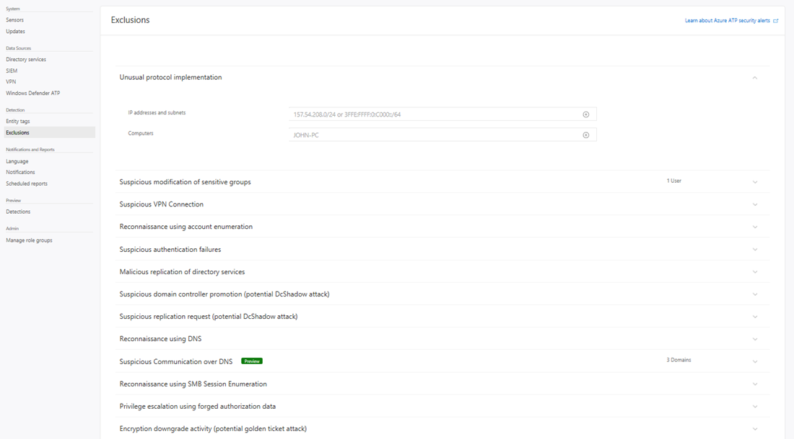

---
# required metadata

title: Install Azure Advanced Threat Protection - Step 7 | Microsoft Docs
description: In the final step of installing Azure ATP, you configure the Honeytoken user.
keywords:
author: rkarlin
ms.author: rkarlin
manager: mbaldwin
ms.date: 2/18/2017
ms.topic: get-started-article
ms.prod:
ms.service: azure-advanced-threat-protection
ms.technology:
ms.assetid: 1ad5e923-9bbd-4f56-839a-b11a9f387d4b

# optional metadata

#ROBOTS:
#audience:
#ms.devlang:
ms.reviewer: itargoet
ms.suite: ems
#ms.tgt_pltfrm:
#ms.custom:

---

*Applies to: Azure Advanced Threat Protection*

# Install Azure ATP - Step 7

>[!div class="step-by-step"]
[« Step 6](install-atp-step6-vpn.md)
[Step 8 »](install-atp-step8-samr.md)

## Step 7. Configure detection exclusions and honeytoken user

Azure ATP enables the exclusion of specific IP addresses or users from a number of detections. 

For example, a **DNS Reconnaissance exclusion** could be a security scanner that uses DNS as a scanning mechanism. The exclusion helps Azure ATP ignore such scanners.  

Azure ATP also enables the configuration of a Honeytoken user, which is used as a trap for malicious actors - any authentication associated with this (normally dormant) account triggers an alert.

To configure this, follow these steps:

1.  From the Azure ATP workspace portal, click on the settings icon and select **Configuration**.

    

2.  Under **Detection**, click **Entity tags**.

3. Under **Honeytoken accounts** enter the Honeytoken account name and click the **+** sign. The Honeytoken accounts field is searchable and automatically displays entities in your network. Click **Save**.

   

4. Click **Exclusions**. For each type of threat, enter a user account or IP address to be excluded from the detection of these threats and click the *plus* sign. The **Add entity** (user or computer) field is searchable and will autofill with entities in your network. For more information, see [Excluding entities from detections](excluding-entities-from-detections.md) and the [suspicious activity guide](suspicious-activity-guide.md).

   

5.  Click **Save**.

Congratulations, you have successfully deployed  Azure Advanced Threat Protection!

Check the attack time line to view detected suspicious activities and search for users or computers and view their profiles.

Azure ATP starts scanning for suspicious activities immediately. Some detections, such as Abnormal Group Modifications, require a learning period and are not available immediately after the deployment of Azure ATP.

>[!div class="step-by-step"]
[« Step 6](install-atp-step6-vpn.md)
[Step 8 »](install-atp-step8-samr.md)

## See Also
- [Azure ATP sizing tool](http://aka.ms/aatpsizingtool)
- [Configure event collection](configure-event-collection.md)
- [Azure ATP prerequisites](atp-prerequisites.md)
- [Check out the ATP forum!](https://aka.ms/azureatpcommunity)
