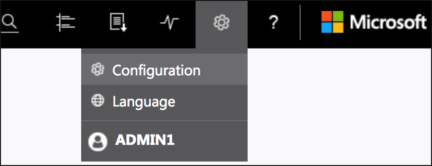

---
# required metadata

title: Change Azure Threat Protection config - domain connectivity password | Microsoft Docs
description: Describes how to change the Domain Connectivity Password on the ATP Standalone Sensor.
keywords:
author: rkarlin
ms.author: rkarlin
manager: mbaldwin
ms.date: 11/7/2017
ms.topic: article
ms.prod:
ms.service: advanced-threat-analytics
ms.technology:
ms.assetid: e7f065fa-1ad1-4e87-bd80-99cc695efbf5

# optional metadata

#ROBOTS:
#audience:
#ms.devlang:
ms.reviewer: bennyl
ms.suite: ems
#ms.tgt_pltfrm:
#ms.custom:

---

*Applies to: Azure Threat Protection*

# Change ATP configuration - domain connectivity password

## Change the domain connectivity password
If you modify the Domain Connectivity Password, make sure that the password you enter is correct. If it is not, the ATP Standalone Sensor service stops running on the ATP Standalone Sensors.

If you suspect that this happened, on the ATP Standalone Sensor, look at the Microsoft.Tri.Gateway-Errors.log file for the following errors:
`The supplied credential is invalid.`

To correct this, follow this procedure to update the Domain Connectivity password on the Azure ATP cloud service:

1.  Open the ATP Console on the Azure ATP cloud service.

2.  Select the settings option on the toolbar and select **Configuration**.

    

3.  Select **Directory Services**.

    

4.  Under **Password**, change the password.

    If the Azure ATP cloud service has connectivity to the domain, use the **Test Connection** button to validate the credentials

5.  Click **Save**.

6.  After changing the password, manually check that the ATP Standalone Sensor service is running on the ATP Standalone Sensor servers.

## See Also
- [Working with the ATP Console](working-with-ata-console.md)
- [Check out the ATP forum!](https://social.technet.microsoft.com/Forums/security/home?forum=mata)
