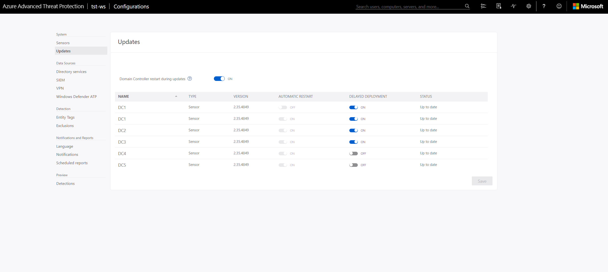

---
# required metadata

title: Update your Azure ATP sensors | Microsoft Docs
description: This describes how to update the sensors in Azure ATP.
keywords:
author: mlottner
ms.author: mlottner
manager: mbaldwin
ms.date: 9/12/2018
ms.topic: conceptual
ms.prod:
ms.service: azure-advanced-threat-protection
ms.technology:
ms.assetid: 603d9e09-a07d-4357-862f-d5682c8bc3dd

# optional metadata

#ROBOTS:
#audience:
#ms.devlang:
ms.reviewer: itargoet
ms.suite: ems
#ms.tgt_pltfrm:
#ms.custom:

---

*Applies to: Azure Advanced Threat Protection*

# Update Azure ATP sensors
It is essential to keep Azure Advanced Threat Protection up to date to enable the best possible protection for your organization.

The Azure ATP service is updated a few times a month with bug fixes, performance improvements, and new detections. Occasionally these updates require a corresponding update to the sensors. 

If you don't update your sensors, they may not be able to communicate with the Azure ATP cloud service, which can result in a degraded service. 

Authentication between your sensors and the Azure cloud service uses strong, certificate-based mutual authentication. 

Each update is tested and validated on all supported operating systems to cause minimal impact to your network and operations.

### Azure ATP sensor update types	

Azure ATP sensors supports two kinds of updates:
- Minor version updates: 
  -	Frequent 
  - Require no MSI install, and no registry changes
  - Azure ATP sensor service restarts
  - Domain controllers and server do not need to be restarted

- Major version updates:
 - Rare
 - May require a restart of domain controllers and servers
 - Contain significant changes 

> [!NOTE]
>- Automatic restart of the sensors (in Major updates) can be controlled in the configuration page. 
> - The Azure ATP sensor always preserves at least 15% of the memory and CPU available. If the service consumes too much memory it is restarted automatically by the Azure ATP sensor updater service.

## Delayed sensor update
To allow a more gradual update process, Azure ATP enables you to set a sensor as a **Delayed update** candidate. 

Ordinarily, sensors update automatically when the Azure ATP cloud service is updated. Sensors set to **Delayed update** will update 24 hours after the initial cloud service update.

This enables you to select specific sensors on which the update is rolled out automatically, and update the rest of your sensors on delay, only after you see that the initial update went smoothly.

> [!NOTE]
> If an error occurs and a sensor does not update, open a support ticket.

To set a sensor to delayed update:

1. From the Azure ATP workspace portal, click on the settings icon and select **Configuration**.
2. Click on the **Updates** tab.
3. In the table row next to each sensor you want to delay, set the **Delayed update** slider to **On**.
4. Click **Save**.
 
## Sensor update process

Every few minutes, Azure ATP sensors check whether they have the latest version. After the Azure ATP cloud service is updated to a newer version, the Azure ATP sensor service starts the update process:

1. The Azure ATP cloud service updates to the latest version.
2. The Azure ATP sensor updater service learns that there is an updated version.
3. Sensors that are not set to **Delayed update** start the update process:
  1. The Azure ATP sensor updater service pulls the updated version from the cloud service (in a cab file format).
  2. The Azure ATP sensor updater validates the file signature.
  3. The Azure ATP sensor updater service extract the cab file to a new folder in the sensor’s installation folder. By default it will be extracted to *C:\Program Files\Azure Advanced Threat Protection Sensor\<version number>*
  4. The Azure ATP sensor updater service restarts the Azure ATP sensor service.
  5. The Azure ATP sensor service points to the new files extracted from the cab file.
  > [!NOTE]
  >A minor update of the sensors doesn’t install an MSI or change any registry values or any system files. Even a pending restart won’t impact the update of the sensors. 
  6. The sensors run based on the newly updated version.
  7. A sensor receives clearance from the Azure cloud service. This can be verified in the **Updates** page.
  8. The next sensor starts the update process. 

4. 24 hours after the Azure ATP cloud service updated, sensors selected for **Delayed update start the update process.

In the event of failure, if the sensor didn’t complete the update process, a relevant monitoring alert is triggered and is sent as a notification.

## See Also

- [Configure event forwarding](configure-event-forwarding.md)
- [Azure ATP prerequisites](atp-prerequisites.md)
- [Check out the ATP forum!](https://aka.ms/azureatpcommunity)