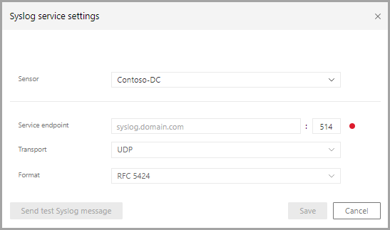

---
# required metadata

title: Setting email notification settings in Azure Advanced Threat Protection | Microsoft Docs
description: Describes how to have Azure ATP notify you (by email or by Azure ATP event forwarding) when it detects suspicious activities 
keywords:
author: mlottner
ms.author: mlottner
manager: mbaldwin
ms.date: 10/04/2018
ms.topic: conceptual
ms.prod:
ms.service: azure-advanced-threat-protection
ms.technology:
ms.assetid: a2d29c9c-7ecb-4804-b74b-fde899b28648

# optional metadata

#ROBOTS:
#audience:
#ms.devlang:
ms.reviewer: itargoet
ms.suite: ems
#ms.tgt_pltfrm:
#ms.custom:

---

*Applies to: Azure Advanced Threat Protection*

# Integrate with Syslog

Azure ATP can notify you when it detects suspicious activities and issues security alerts as well as health alerts by sending the notification to your Syslog server. If you enable Syslog notifications, you can set the following:

1.  Before configuring Syslog notifications, work with your SIEM admin to find out the following information:

    -   FQDN or IP address of the SIEM server

    -   Port on which the SIEM server is listening

    -   What transport to use: UDP, TCP, or TLS (Secured Syslog)

    -   Format in which to send the data RFC 3164 or 5424

2.  Enter the workspace URL.

3.  Enter your Azure Active Directory user name and password and click **Log in**.

4.  Select the settings option on the toolbar and select **Configuration**.

    

5.  Click **Notifications**, and then, under **Syslog notifications** click **Configure** and enter the following information:

    |Field|Description|
    |---------|---------------|
    |sensor|Select a designated sensor to be responsible for aggregating all the Syslog events and forwarding them to your SIEM server.|
    |Service endpoint|FQDN of the Syslog server and optionally change the port number (default 514)|
    |Transport|Can be UDP, TCP, or TLS (Secured Syslog)|
    |Format|This is the format that Azure ATP uses to send events to the SIEM server - either RFC 5424 or RFC 3164.|

 

6. You can select which events to send to your Syslog server. Under **Syslog notifications**, specify which notifications should be sent to your Syslog server - new security alerts, updated security alerts, and new health issues.

## See Also

- [Working with sensitive accounts](sensitive-accounts.md)
- [Check out the Azure ATP forum!](https://aka.ms/azureatpcommunity)