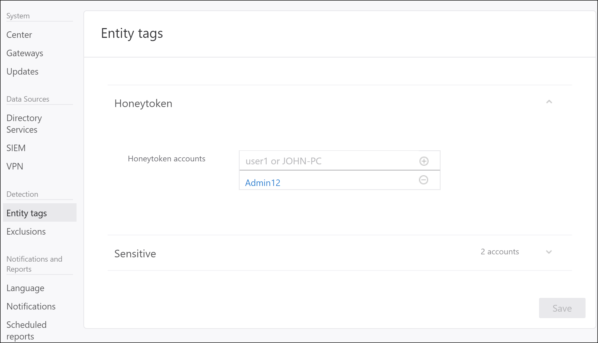

---
# required metadata

title: Tag sensitive accounts with Azure ATP | Microsoft Docs
description: Describes how to tag sensitive accounts using Azure Advanced Threat Protection (ATP) 
keywords:
author: rkarlin
ms.author: rkarlin
manager: mbaldwin
ms.date: 2/14/2018
ms.topic: article
ms.prod:
ms.service: azure-advanced-threat-protection
ms.technology:
ms.assetid: 43e57f87-ca85-4922-8ed0-9830139fe7cb

# optional metadata

#ROBOTS:
#audience:
#ms.devlang:
ms.reviewer: bennyl
ms.suite: ems
#ms.tgt_pltfrm:
#ms.custom:

---

*Applies to: Azure Advanced Threat Protection version 1.9*

# Working with sensitive accounts

## Sensitive groups

The following list of groups are considered Sensitive by Azure ATP. Any entity that is a member of these groups is considered sensitive:

-	Administrators
-	Power Users
3.	Account Operators
4.	Server Operators
5.	Print Operators
6.	Backup Operators
7.	Replicators
8.	Remote Desktop Users 
9.	Network Configuration Operators 
10.	Incoming Forest Trust Builders
11.	Domain Admins
12.	Domain Controllers
13.	Group Policy Creator Owners 
14.	Read Only Domain Controllers 
15.	Enterprise Read-only Domain Controllers 
16.	Schema Admins 
17.	Enterprise Admins

## Tagging sensitive accounts

In addition to these groups, you can manually tag groups or accounts as sensitive to enhance detections. This is important because Some Azure ATP detections, such as sensitive group modification detection and lateral movement path, rely on which groups and accounts are considered sensitive. You can manually tag other users or groups as sensitive, such as board members, company executives, director of sales, etc, and Azure ATP will consider them sensitive.

1.  In the Azure ATP workspace portal, click the **Configuration** cog in the menu bar.

2.  Under **Detection** click **Entity tags**.

    

3.  In the **Sensitive** section, type the name of the **Sensitive accounts** and **Sensitive groups** and then click **+** sign to add them.

    

4. Click **Save**.

    
## See also

- [Working with suspicious activities](working-with-suspicious-activities.md)