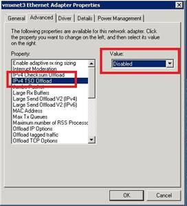

---
# required metadata

title: Troubleshooting Azure ATP known issues | Microsoft Docs
description: Describes how you can troubleshoot issues in Azure ATP.
keywords:
author: mlottner
ms.author: mlottner
manager: mbaldwin
ms.date: 10/04/2018
ms.topic: conceptual
ms.prod:
ms.service: azure-advanced-threat-protection
ms.technology:
ms.assetid: 23386e36-2756-4291-923f-fa8607b5518a

# optional metadata

#ROBOTS:
#audience:
#ms.devlang:
ms.reviewer: itargoet
ms.suite: ems
#ms.tgt_pltfrm:
#ms.custom:

---

# Troubleshooting Azure ATP Known Issues 

## Deployment log location
 
The Azure ATP deployment logs are located in the temp directory of the user who installed the product. In the default installation location, it can be found at: C:\Users\Administrator\AppData\Local\Temp (or one directory above %temp%). For more information, see [Troubleshooting ATP using logs](troubleshooting-atp-using-logs.md)

## Proxy authentication problem presents as a licensing error

If during sensor installation you receive the following error:  **The sensor failed to register due to licensing issues.**

Deployment log entries: 
[1C60:1AA8][2018-03-24T23:59:13]i000: 2018-03-25 02:59:13.1237 Info  InteractiveDeploymentManager ValidateCreateSensorAsync returned [\[]validateCreateSensorResult=LicenseInvalid[\]]
[1C60:1AA8][2018-03-24T23:59:56]i000: 2018-03-25 02:59:56.4856 Info  InteractiveDeploymentManager ValidateCreateSensorAsync returned [\[]validateCreateSensorResult=LicenseInvalid[\]]
[1C60:1AA8][2018-03-25T00:27:56]i000: 2018-03-25 03:27:56.7399 Debug SensorBootstrapperApplication Engine.Quit [\[]deploymentResultStatus=1602 isRestartRequired=False[\]]
[1C60:15B8][2018-03-25T00:27:56]i500: Shutting down, exit code: 0x642

**Cause:**

In some cases, when communicating via a proxy, during authentication it might respond to the Azure ATP sensor with error 401 or 403 instead of error 407. The Azure ATP sensor will interpret error 401 or 403 as a licensing issue and not as a proxy authentication issue. 

**Resolution:**

Ensure that the sensor can browse to *.atp.azure.com through the configured proxy without authentication. For more information see, [Configure proxy to enable communication](configure-proxy.md).

## Azure ATP sensor NIC teaming issue 

If you attempt to install the ATP sensor on a machine configured with a NIC Teaming adapter, you receive an installation error. If you want to install the ATP sensor on a machine configured with NIC teaming, follow these instructions:

If you have not yet installed the sensor:

1.	Download Npcap from [https://nmap.org/npcap/](https://nmap.org/npcap/).
2.	Uninstall WinPcap, if it was installed.
3.	Install Npcap with the following options: loopback_support=no & winpcap_mode=yes
4.	Install the sensor package.

If you already installed the sensor:

1.	Download Npcap from [https://nmap.org/npcap/](https://nmap.org/npcap/).
2.	Uninstall the sensor.
3.	Uninstall WinPcap.
4.	Install Npcap with the following options: loopback_support=no & winpcap_mode=yes
5.	Reinstall the sensor package.

## Windows Defender ATP integration issue

Azure Advanced Threat Protection enables you to integrate Azure ATP with Windows Defender ATP. See [Integrate Azure ATP with Windows Defender ATP](integrate-wd-atp.md) for more information. 

## VMware virtual machine sensor issue

If you have an Azure ATP sensor on VMware virtual machines, you might receive the monitoring alert **Some network traffic is not being analyzed**. This happens because of a configuration mismatch in VMware.

To resolve the issue:

Set the following settings to **0** or **Disabled** in the virtual machine's NIC configuration: TsoEnable, LargeSendOffload, TSO Offload, Giant TSO Offload.
> [!NOTE]
> For Azure ATP sensors, you only need to disable **IPv4 TSO Offload** under the NIC configuration.

 

## See Also
- [Azure ATP prerequisites](atp-prerequisites.md)
- [Azure ATP capacity planning](atp-capacity-planning.md)
- [Configure event collection](configure-event-collection.md)
- [Configuring Windows event forwarding](configure-event-forwarding.md)
- [Check out the Azure ATP forum!](https://aka.ms/azureatpcommunity)