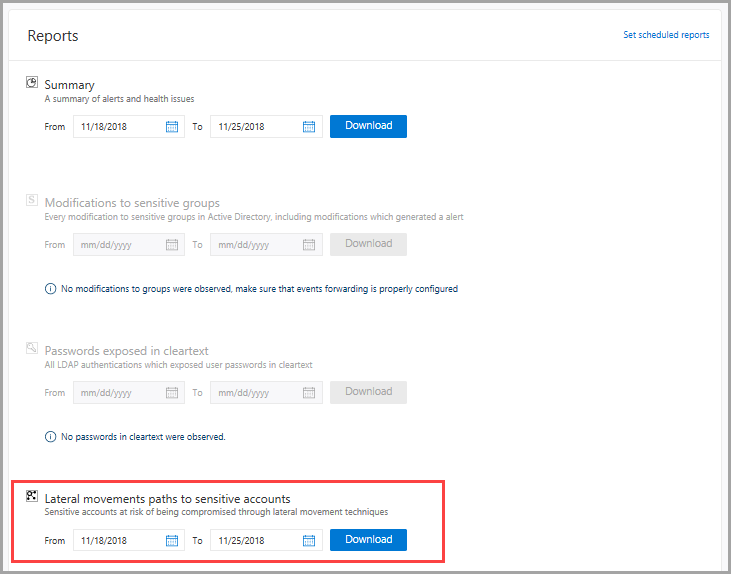
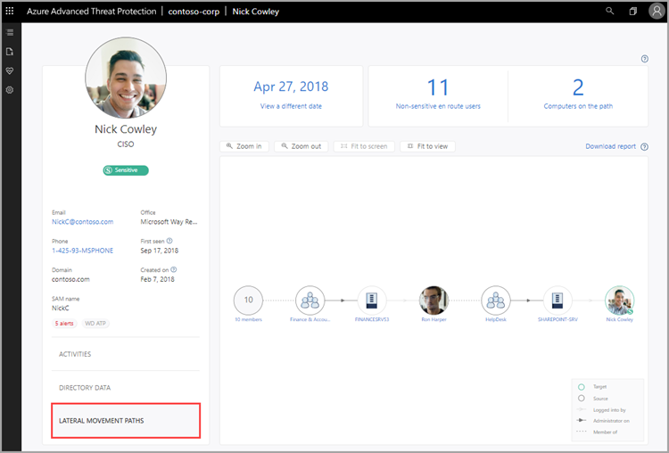

---
# required metadata

title: Investigating lateral movement path attacks with ATP | Microsoft Docs
description: This article describes how to detect lateral movement path attacks with Azure Threat Protection (ATP).
keywords:
author: rkarlin
ms.author: rkarlin
manager: mbaldwin
ms.date: 1/21/2018
ms.topic: article
ms.prod:
ms.service: advanced-threat-analytics
ms.technology:
ms.assetid: de15c920-8904-4124-8bdc-03abd9f667cf

# optional metadata

#ROBOTS:
#audience:
#ms.devlang:
ms.reviewer: bennyl
ms.suite: ems
#ms.tgt_pltfrm:
#ms.custom:

---

*Applies to: Azure Threat Protection version 1.9*

# Investigating lateral movement paths with ATP

ATP can help you prevent attacks that use lateral movement paths. Even when you do your best to protect your sensitive users, your admins have complex passwords that they change frequently, their machines are hardened, and their data is stored securely, attackers can still use lateral movement paths, moving across your network between users and computers until they hit the virtual security jackpot: your sensitive admin account credentials.

## What is a lateral movement path?

Lateral movement is when an attacker proactively uses non-sensitive accounts to gain access to sensitive accounts. They can use any of the methods described in the [Suspicious activity guide](suspicious-activity-guide.md) to gain the initial non-sensitive password and then use a tool, like Bloodhound, to understand who the administrators are in your network and which machines they accessed. They can then take advantage of the data available to attackers on your domain controllers to know who has which accounts and access to which resources and files, and can steal the credentials of other users (sometimes sensitive users) stored on the computers they have already accessed, and then laterally move to more and more users and resources until they attain admin privileges in your network. 

ATP enables you to take pre-emptive action on your network to prevent attackers from succeeding at lateral movement.

## Discovery your at-risk sensitive accounts

To discover which sensitive accounts in your network are vulnerable because of their connection to non-sensitive accounts or resources, follow these steps. To secure your network from lateral movement attacks, ATP works from the end backward, meaning that ATP gives you a map that starts from your privileged accounts and then shows you which users and devices are in the lateral path of these users and their credentials.

1. In the ATP console menu, click the reports icon .

2. Under **Lateral movements paths to sensitive accounts**, if there are no lateral movement paths found, the report is grayed out. If there are lateral movement paths, then the dates of the report automatically select the first date when there is relevant data. 

 

3. Click **Download**.

3. The Excel file that is created provides you with details about your sensitive accounts that are at risk. The **Summary** tab provides graphs that detail the number of sensitive accounts, computers, and averages for at-risk resources. The **Details** tab provides a list of the sensitive accounts that you should be concerned about.

## Investigate

Now that you know which sensitive accounts are at risk, you can deep dive in ATP to learn more and take preventative measures.

1. In the ATP console, look at the user whose account is listed as vulnerable in the **Lateral movements paths to sensitive accounts** report, for example, Samira Abbasi. You an also search for the Lateral movement badge that's added to the entity profile when the entity is in a lateral movement path  or .

2. In the user profile page that opens, click the **Lateral movement paths** tab.

3. The diagram that is displayed provides you with a map of the possible paths to your sensitive user. The graph shows connections that have been made over the last two days, so the exposure is fresh.

4. Review the graph to see what you can learn about exposure of your sensitive user's credentials. For example, in this map, Samira Abbasi you can follow the **Logged into by** gray arrows to see where Samira logged in with her privileged credentials. In this case, Samira's sensitive credentials were saved on the computer REDMOND-WA-DEV. Then, see which other users logged into which computers that created the most exposure and vulnerability. You can see this by looking at the **Administrator on** black arrows to see who has admin privileges on the resource. In this example, everyone in the group Contoso All has the ability to access user credentials from that resource.  

 

## Preventative best practices

- The best way to prevent lateral movement is to make sure that sensitive users use their administrator credentials only when logging into hardened computers. In the example, make sure that if Samira needs access to REDMOND-WA-DEV, she logs in with a username and password other than her admin credentials.

- It is also recommended that you make sure that no one has unnecessary administrative permissions. In the example, you should check to see if everyone in Contoso All really needs admin rights on REDMOND-WA-DEV.

- It's always a good idea to make sure people only have access to necessary resources. As you can see in the example, Oscar Posada significantly widens Samira's exposure. Is it necessary that he be included in Contoso All? Are there subgroups that you could create to minimize exposure?

## See Also
- [Working with suspicious activities](working-with-suspicious-activities.md)
- [Check out the ATP forum!](https://social.technet.microsoft.com/Forums/security/home?forum=mata)
