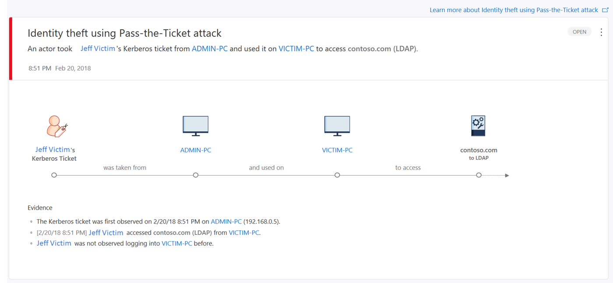

---
# required metadata

title: What is Azure Advanced Threat Protection (ATP)? | Microsoft Docs
description: Explains what Azure Advanced Threat Protection (ATP) is and what kinds of suspicious activities it can detect
keywords:
author: rkarlin
ms.author: rkarlin
manager: mbaldwin
ms.date: 2/1/2018
ms.topic: article
ms.prod:
ms.service: azure-advanced-threat-protection
ms.technology:
ms.assetid: 2d14d0e9-1b03-4bcc-ae97-8fd41526ffc5

# optional metadata

#ROBOTS:
#audience:
#ms.devlang:
ms.reviewer: bennyl
ms.suite: ems
#ms.tgt_pltfrm:
#ms.custom:

---

*Applies to: Azure Advanced Threat Protection*

# What is Azure Advanced Threat Protection?
Azure Advanced Threat Protection (ATP) is a cloud service that helps protect your enterprise hybrid environments from multiple types of advanced targeted cyber attacks and insider threats.

## How Azure ATP works

Azure ATP leverages a proprietary network parsing engine to capture and parse network traffic of multiple protocols (such as Kerberos, DNS, RPC, NTLM, and others) for authentication, authorization, and information gathering. This information is collected by Azure ATP via either:

- 	Deploying Azure ATP sensors directly on your domain controllers
- 	Port mirroring from Domain Controllers and DNS servers to the Azure ATP Standalone Sensor

Azure ATP takes information from multiple data-sources, such as logs and events in your network, to learn the behavior of users and other entities in the organization and build a behavioral profile about them.
Azure ATP can receive events and logs from:

- 	SIEM Integration
- 	Windows Event Forwarding (WEF)
-   Directly from the Windows Event Collector (for the Sensor)
-   RADIUS Accounting from VPNs

For more information on Azure ATP architecture, see [Azure ATP Architecture](atp-architecture.md).

## What does Azure ATP do?

Azure ATP technology detects multiple suspicious activities, focusing on several phases of the cyber-attack kill chain including:

- 	Reconnaissance, during which attackers gather information on how the environment is built, what the different assets are, and which entities exist. They generally building their plan for the next phases of the attack.
- 	Lateral movement cycle, during which an attacker invests time and effort in spreading their attack surface inside your network.
- 	Domain dominance (persistence), during which an attacker captures the information allowing them to resume their campaign using various sets of entry points, credentials, and techniques. 

These phases of a cyber attack are similar and predictable, no matter what type of company is under attack or what type of information is being targeted.
Azure ATP searches for three main types of attacks: Malicious attacks, abnormal behavior, and security issues and risks.

**Malicious attacks** are detected deterministically as well as via abnormal behavior analytics. The full list of known attack types includes:

- 	Pass-the-Ticket (PtT)
- 	Pass-the-Hash (PtH)
- 	Overpass-the-Hash
- 	Forged PAC (MS14-068)
- 	Golden Ticket
- 	Malicious replication
- 	Directory Service Enumeration
-	SMB Session Enumeration
-	DNS Reconnaissance
-	Horizontal Brute Force 
-	Vertical Brute Force
-	Skeleton Key
-	Unusual Protocol
-	Encryption Downgrade
-	Remote execution
-	Malicious Service Creation

Azure ATP detects these suspicious activities and surfaces the information in the Azure ATP workspace portal including a clear view of Who, What, When and How. As you can see, by monitoring this simple, user-friendly dashboard, you are alerted that Azure ATP suspects that a Pass-the-Ticket attack was attempted on Client 1 and Client 2 computers in your network.

 

Azure ATP also detects **security issues and risks**, including:

- 	Weak protocols
- 	Known protocol vulnerabilities
-   [Lateral movement path to sensitive accounts](use-case-lateral-movement-path.md)

# What threats does Azure ATP look for?

Azure ATP provides detection for the following various phases of an advanced attack: reconnaissance, credential compromise, lateral movement, privilege escalation, domain dominance, and others. These detections are aimed at detecting advanced attacks and insider threats before they cause damage to your organization.

The detection of each phase results in several suspicious activities relevant for the phase in question, where each suspicious activity correlates to different flavors of possible attacks.
These phases in the kill-chain where Azure ATP currently provides detections are highlighted in the following image:

For more information, see [Working with suspicious activities](working-with-suspicious-activities.md) and the [Azure ATP suspicious activity guide](suspicious-activity-guide.md).

## What's next?

-   For more information about how Azure ATP fits into your network: [Azure ATP architecture](atp-architecture.md)

-   To get started deploying ATP: [Install ATP](install-atp-step1.md)

## See Also
- [Azure ATP frequently asked questions](atp-technical-faq.md)
- [Check out the ATP forum!](https://aka.ms/azureatpcommunity)