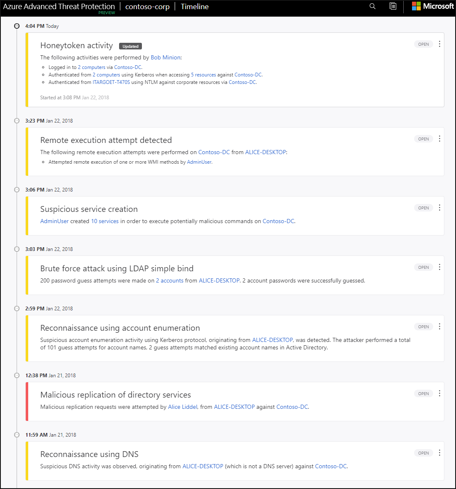
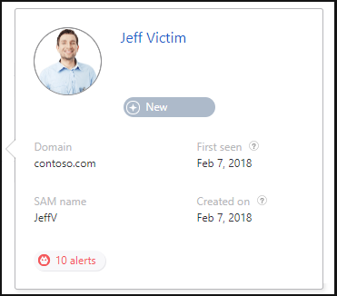

---
# required metadata

title: Understanding the Azure Advanced Threat Protection console | Microsoft Docs
description: Describes how to log into the Azure ATP console and the components of the console
keywords:
author: rkarlin
ms.author: rkarlin
manager: mbaldwin
ms.date: 1/15/2018
ms.topic: article
ms.prod:
ms.service: azure-advanced-threat-protection
ms.technology:
ms.assetid: 4ba46d60-3a74-480e-8f0f-9a082d62f343

# optional metadata

#ROBOTS:
#audience:
#ms.devlang:
ms.reviewer: bennyl
ms.suite: ems
#ms.tgt_pltfrm:
#ms.custom:

---

*Applies to: Azure Advanced Threat Protection*

# Working with the Azure ATP Console

Use the Azure ATP console to monitor and respond to suspicious activity detected by ATP.

Typing the `?` key provides keyboard shortcuts for Azure ATP Portal accessibility. 

## Enabling access to the Azure ATP Console
To successfully log in to the Azure ATP Console, you have to log in with a user who was assigned the proper Azure ATP role to access the Azure ATP Console. 
For more information about role-based access control (RBAC) in ATP, see [Working with Azure ATP role groups](ata-role-groups.md).

## Logging into the Azure ATP Console

>[!NOTE]
 > Starting with Azure ATP 1.8, the log in process to the Azure ATP Console is accomplished using single sign-on.

1. In the Azure ATP cloud service server, click the **Microsoft Azure ATP Console** icon on the desktop or open a browser and browse to the Azure ATP Console.

    

 >[!NOTE]
 > You can also open a browser from either the Azure ATP cloud service or the Azure ATP Standalone Sensor and browse to the IP address you configured in the Azure ATP cloud service installation for the Azure ATP Console.    

2.  If the computer on which the Azure ATP cloud service is installed and the computer from which you are trying to access the Azure ATP Console are both domain joined, Azure ATP supports single sign-on integrated with Windows authentication - if you've already logged on to your computer, Azure ATP uses that token to log you into the Azure ATP Console. You can also log in using a smartcard. Your permissions in Azure ATP correspond with your [administrator role](ata-role-groups.md).

 > [!NOTE]
 > Make sure to log on to the computer from which you want to access the Azure ATP Console using your Azure ATP admin username and password. Alternatively, you can run your browser as a different user or log out of Windows and log on with your Azure ATP admin user. To prompt the Azure ATP Console to ask for credentials, access the console using an IP address and you are prompted to enter credentials.

3. To log in using SSO, make sure the Azure ATP console site is defined as a local intranet site in your browser and that you access it using a shortname or a localhost.

> [!NOTE]
> In addition to logging each suspicious activity and health alert, every configuration change you make in the Azure ATP Console is audited in the Windows Event Log on the Azure ATP cloud service machine, under **Applications and services log** and then **Microsoft ATP**. Each login to the Azure ATP console is audited as well.    Configuration affecting the Azure ATP Standalone Sensor is also logged in the Windows Event Log of the Azure ATP Standalone Sensor machine. 

## The Azure ATP Console

The Azure ATP Console provides you a quick view of all suspicious activities in chronological order. It enables you to drill into details of any activity and perform actions based on those activities. The console also displays alerts and notifications to highlight problems with the Azure ATP network or new activities that are deemed suspicious.

These are the key elements of the Azure ATP console.

### Attack time line

This is the default landing page you are taken to when you log in to the Azure ATP Console. By default, all open suspicious activities are shown on the attack time line. You can filter the attack time line to show All, Open, Dismissed or Suppressed suspicious activities. You can also see the severity assigned to each activity.

For more information, see [Working with suspicious activities](working-with-suspicious-activities.md).

### What's new

After a new version of Azure ATP is released, the **What's new** window appears in the top right to let you know what was added in the latest version. It also provides you with a link to the version download.

### Filtering panel

You can filter which suspicious activities are displayed in the attack time line or displayed in the entity profile suspicious activities tab based on Status and Severity.

### Search bar

In the top menu, you can find a search bar. You can search for a specific user, computer, or groups in ATP. To give it a try, just start typing.

### Health Center

The Health Center provides you with alerts when something isn't working properly in your Azure ATP deployment.

Any time your system encounters a problem, such as a connectivity error or a disconnected Azure ATP Standalone Sensor, the Health Center icon lets you know by displaying a red dot. 

### Sensitive groups

The following list of groups are considered **Sensitive** by ATP. Any entity that is a member of these groups is considered sensitive:

- Enterprise Read Only Domain Controllers 
- Domain Admins 
- Domain Controllers 
- Schema Admins,
- Enterprise Admins 
- Group Policy Creator Owners 
- Read Only Domain Controllers 
- Administrators  
- Power Users  
- Account Operators  
- Server Operators   
- Print Operators,
- Backup Operators,
- Replicators 
- Remote Desktop Users 
- Network Configuration Operators 
- Incoming Forest Trust Builders 
- DNS Admins 

### Mini profile

If you hover your mouse over an entity, anywhere in the console where there is a single entity presented, such as a user, or a computer, a mini profile automatically opens displaying the following information if available:

-   Name

-   Picture

-   Email

-   Telephone

-   Number of suspicious activities by severity

## See Also
[Check out the Azure ATP forum!](https://social.technet.microsoft.com/Forums/security/home?forum=mata)
