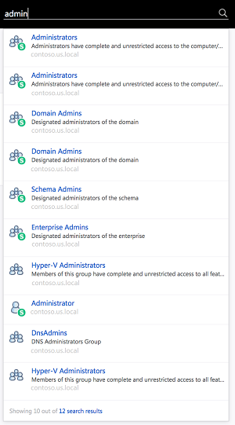
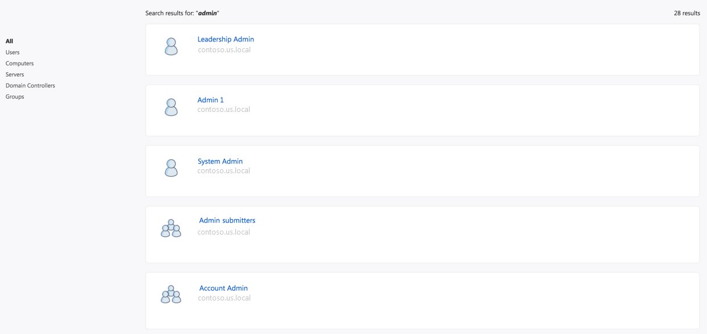

---
# required metadata

title: Understanding the Azure Advanced Threat Protection workspace portal | Microsoft Docs
description: Describes how to log into the Azure ATP workspace portal and the components of the workspace portal
keywords:
author: rkarlin
ms.author: rkarlin
manager: mbaldwin
ms.date: 2/20/2018
ms.topic: article
ms.prod:
ms.service: azure-advanced-threat-protection
ms.technology:
ms.assetid: 4ba46d60-3a74-480e-8f0f-9a082d62f343

# optional metadata

#ROBOTS:
#audience:
#ms.devlang:
ms.reviewer: bennyl
ms.suite: ems
#ms.tgt_pltfrm:
#ms.custom:

---

*Applies to: Azure Advanced Threat Protection*

# Working with the Azure ATP workspace portal

Use the Azure ATP workspace portal to monitor and respond to suspicious activity detected by ATP.

Typing the `?` key provides keyboard shortcuts for Azure ATP workspace portal accessibility. 

## Enabling access to the Azure ATP workspace portal
To successfully log in to the Azure ATP workspace portal, you have to log in with a user who was assigned the proper Azure Active Directory security group to access the Azure ATP workspace portal. 
For more information about role-based access control (RBAC) in Azure ATP, see [Working with Azure ATP role groups](atp-role-groups.md).

## Logging into the Azure ATP workspace portal

1. You can enter the workspace portal either by logging in to the workspace management portal [https://portal.atp.azure.com](https://portal.atp.azure.com) and then selecting the relevant workspace, or browsing to the workspace URL: [https://*workspacename*.atp.azure.com](https://*workspacename*.atp.azure.com).

2.  Azure ATP supports single sign-on integrated with Windows authentication - if you've already logged on to your computer, Azure ATP uses that token to log you into the Azure ATP workspace portal. You can also log in using a smartcard. Your permissions in Azure ATP correspond with your [administrator role](atp-role-groups.md).

 > [!NOTE]
 > Make sure to log on to the computer from which you want to access the Azure ATP workspace portal using your Azure ATP admin username and password. Alternatively, you can run your browser as a different user or log out of Windows and log on with your Azure ATP admin user. 

## The Azure ATP workspace portal

The Azure ATP workspace portal provides you a quick view of all suspicious activities in chronological order. It enables you to drill into details of any activity and perform actions based on those activities. The workspace portal also displays alerts and notifications to highlight problems seen by Azure ATP or new activities that are deemed suspicious.

These are the key elements of the Azure ATP workspace portal.

### Attack time line

This is the default landing page you are taken to when you log in to the Azure ATP workspace portal. By default, all open suspicious activities are shown on the attack time line. You can filter the attack time line to show All, Open, Dismissed or Suppressed suspicious activities. You can also see the severity assigned to each activity.

For more information, see [Working with suspicious activities](working-with-suspicious-activities.md).

### What's new

After a new version of Azure ATP is released, the **What's new** window appears in the top right to let you know what was added in the latest version. It also provides you with a link to the version download.

### Filtering panel

You can filter which suspicious activities are displayed in the attack time line or displayed in the entity profile suspicious activities tab based on Status and Severity.

### Search bar

In the top menu, you can find a search bar. You can search for a specific user, computer, or groups in Azure ATP. To give it a try, just start typing. At the bottom of the search bar, the number of search results found is indicated. 

If you click the number, you can access the search results page in which you can filter results by entity type for further investigation.

### Health center

The Health center provides you with alerts when something isn't working properly in your Azure ATP workspace.

Any time your system encounters a problem, such as a connectivity error or a disconnected Azure ATP Standalone Sensor, the Health Center icon lets you know by displaying a red dot. 

### Sensitive groups

For information on sensitive groups in ATP, see [Working with sensitive groups](tag-sensitive-accounts.md).

### Mini profile

If you hover your mouse over an entity, anywhere in the workspace portal where there is a single entity presented, such as a user, or a computer, a mini profile automatically opens displaying the following information, if available and relevant:

- Name
- Title
- Department
- AD tags
- Email
- Office
- Phone number
- Domain
- SAM name
- Created on – When the entity was created in the Active Directory. If was created before Azure ATP started monitoring it will not be displayed.
- First seen – The first time Azure ATP observed an activity from this entity.
- Last seen - The last time Azure ATP observed an activity from this entity.
- SA badge - Will be displayed if there are suspicious activities associated with this entity.
- WD ATP badge- Will be displayed if there are suspicious activities in Windows Defender ATP associated with this entity.
- Lateral movement paths badge - Will be displayed if there are have been lateral movement paths detected for this entity within the last two days.

## See Also

- [Creating Azure ATP workspaces](atp-workspaces.md)
- [Check out the ATP forum!](https://aka.ms/azureatpcommunity)