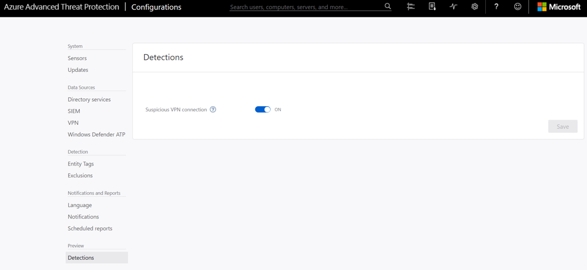

---
# required metadata

title: Working with security alerts in Azure Advanced Threat Protection | Microsoft Docs
description: Describes how to review security alerts issued by Azure ATP
keywords:
author: mlottner
ms.author: mlottner
manager: mbaldwin
ms.date: 10/04/2018
ms.topic: article
ms.prod:
ms.service: azure-advanced-threat-protection
ms.technology:
ms.assetid: a06004bd-9f77-4e8e-a0e5-4727d6651a0f

# optional metadata

#ROBOTS:
#audience:
#ms.devlang:
ms.reviewer: itargoet
ms.suite: ems
#ms.tgt_pltfrm:
#ms.custom:

---

*Applies to: Azure Advanced Threat Protection*

# Working with Security Alerts
This article explains the basics of how to work with Azure Advanced Threat Protection.

## Review security alerts on the attack time line 
After logging in to the Azure ATP portal, you are automatically taken to the open **Security Alerts Time Line**. Security alerts are listed in chronological order with the newest alert on the top of the time line.
Each security alert has the following information:

-   Entities involved, including users, computers, servers, domain controllers, and resources.

-   Times and time frame of the suspicious activities which initiated the security alert.

-   Severity of the alert: High, Medium, or Low.

-   Status: Open, closed, or suppressed.

-   Ability to

    -   Share the security alert with other people in your organization via email.

    -   Export the security alert to Excel.

> [!NOTE]
> -   When you hover your mouse over a user or computer, an entity mini-profile is displayed that provides additional information about the entity and includes the number of security alerts that the entity is linked to.
> -   If you click on an entity, it takes you to the entity profile of the user or computer.

## Preview detections

The Azure ATP research team constantly works on implementing new detections for newly discovered attacks. Because Azure ATP is a cloud service, new detections are released quickly to enable Azure ATP customers to benefit from new detections as soon as possible.

These detections are tagged with a preview badge, to help you identify the new detections and know that they are new to the product. If you turn off preview detections, they will not be displayed in the Azure ATP console - not in the timeline or in entity profiles - and new alerts won’t be opened.

 

By default, preview detections are enabled in Azure ATP. 

To disable preview detections:

1. In the Azure ATP console, click the settings cog.
2. In the left menu, under Preview, click **Detections**.
3. Use the slider to turn the preview detections on and off.
 
 

## Filter security alerts list
To filter the security alert list:

1.  In the **Filter by** pane on the left side of the screen, select one of the following options: **All**, **Open**, **Closed**, or **Suppressed**.

2.  To further filter the list, select **High**, **Medium**, or **Low**.

**Suspicious activity severity**

-   **Low**

    Indicates activities that can lead to attacks designed for malicious users or software to gain access to organizational data.

-   **Medium**

    Indicates activities that can put specific identities at risk for more severe attacks that could result in identity theft or privileged escalation

-   **High**

    Indicates activities that can lead to identity theft, privilege escalation, or other high-impact attacks

## Managing security alerts
You can change the status of a security alert by clicking the current status of the security alert and selecting one of the following **Open**, **Suppressed**, **Closed**, or **Deleted**.
To do this, click the three dots at the top right corner of a specific alert to reveal the list of available actions.

**Security alert status**

-   **Open**: All new security alerts appear in this list.

-   **Close**: Is used to track security alerts that you identified, researched, and fixed for mitigated.

    > [!NOTE]
    > If the same activity is detected again within a short period of time, Azure ATP may reopen a closed alert.

-   **Suppress**: Suppressing an aalert means you want to ignore it for now, and only be alerted again if there's a new instance. This means that if there's a similar alert Azure ATP doesn't reopen it. But if the alert stops for seven days, and is then seen again, you are alerted again.

- **Delete**: If you Delete an alert, it is deleted from the system, from the database and you will NOT be able to restore it. After you click delete, you'll be able to delete all security alerts of the same type.

- **Exclude**: The ability to exclude an entity from raising more of a certain type of alerts. For example, you can set Azure ATP to exclude a specific entity (user or computer) from alerting again for a certain type of activity, such as a specific admin who runs remote code or a security scanner that does DNS reconnaissance. In addition to being able to add exclusions directly on the security alert as it is detected in the time line, you can also go to the Configuration page to **Exclusions**, and for each security alert you can manually add and remove excluded entities or subnets (for example for Pass-the-Ticket). 

> [!NOTE]
> The configuration pages can only be modified by Azure ATP admins.

## See Also

- [Working with the Azure ATP workspace portal](workspace-portal.md)
- [Check out the Azure ATP forum!](https://aka.ms/azureatpcommunity)